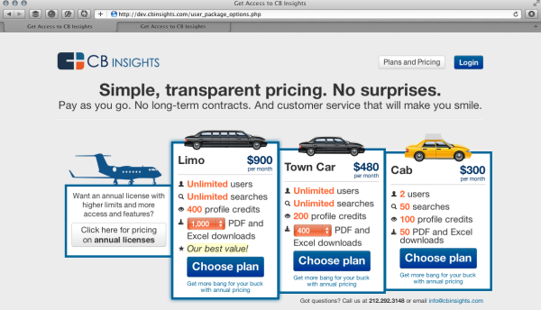

## Summary
[[AnandSanwal]] reflects on early mistakes while building [[CBInsights]], presenting founder work as a messy operating system spanning [[StartupCulture]], [[StartupHiringAtScale]], [[SaaSPricing]], [[FounderLedSales]], [[StartupFocus]], [[CustomerSuccess]], and [[CustomerLedProductDevelopment]]. The article argues that startup execution improved when CB Insights became more explicit about culture, communication, hiring standards, value-based pricing, sales discipline, customer feedback, and focus. The inspected pricing screenshot is substantive evidence because it shows an early, gimmicky pricing page with Limo, Town Car, and Cab plans, low monthly prices, usage limits, an annual-license CTA, and "Our best value!" positioning.

## Key Claims
- Startup culture does not emerge reliably from smart people and customer happiness alone; leaders must actively design norms, feedback loops, onboarding, context sharing, and rituals.
- Hiring mistakes compound when roles are unclear, pressure lowers standards, references are weak, firing is slow, remote work is attempted before workflows mature, or founders expect a new hire to become a savior.
- [[SaaSPricing]] should follow customer value rather than cheapness or cute packaging; CB Insights later raised pricing by more than 10x after realizing low price was the wrong basis of competition.
- [[FounderLedSales]] improved when Sanwal stopped treating sales as a scripted pitch and began asking questions, following up, asking for the sale, qualifying leads, and using customer meetings for market learning.
- Startup marketing works better when teams exploit proven channels, use conversational language, tell the technical story honestly, and proactively reach journalists instead of waiting for distribution partners or vague integrations.
- Product decisions should be driven by customers and credible operators, not fads, competitors, non-customer advice, fear of shipping raw work, or founder ego.
- Founder attention is scarce; poor advisors, manual payroll, bad offices, customer-vendor conflicts, casual VC meetings, networking without objectives, and single opt-in introductions can all become avoidable drag.

## Key Quotes
> "Thought culture would just happen" - Sanwal naming his biggest learning.

> "It's our job to do that." - on customer success and product value.

## Connections
- [[AnandSanwal]] - author reflecting on his own CEO mistakes.
- [[CBInsights]] - company whose early culture, pricing, sales, product, and operations mistakes are described.
- [[StartupCulture]] - the article treats culture as an explicit leadership responsibility.
- [[StartupHiringAtScale]] - the article details role clarity, references, firing speed, hiring pressure, and workflow maturity.
- [[SaaSPricing]] - pricing is reframed from cheap plans and gimmicky packaging toward value-based positioning.
- [[FounderLedSales]] - founder sales evolves from pitching at prospects toward discovery, qualification, follow-up, and asking for the close.
- [[SaaSMarketing]] - conversational brand voice, content cadence, journalist outreach, and technology storytelling become distribution work.
- [[CustomerSuccess]] - CB Insights learned that customers need active help discovering and applying new product capabilities.
- [[CustomerLedProductDevelopment]] - customer meetings, product-team visits, and customer success are treated as product-learning loops.
- [[StartupFocus]] - the source warns against fads, competitors, bad leads, vague integrations, unstructured networking, and unfocused VC meetings.

## Contradictions
- No direct contradictions found. The source qualifies the wiki's startup-scaling material by showing that some lessons pull in opposite directions depending on stage and context: ship earlier but improve requirements, hire carefully but avoid moving too slowly on exceptional candidates, celebrate wins but stay hungry, and use customer feedback without letting non-customers or competitors steer the roadmap.

## Image Notes

- This early CB Insights pricing page shows themed vehicle plans named Limo, Town Car, and Cab, monthly prices of $900, $480, and $300, usage limits, an annual-license callout, and "Our best value!" copy, supporting the article's pricing critique.
- A tiny duplicate/thumbnail of the same pricing screenshot added no separate evidence and was not preserved.
