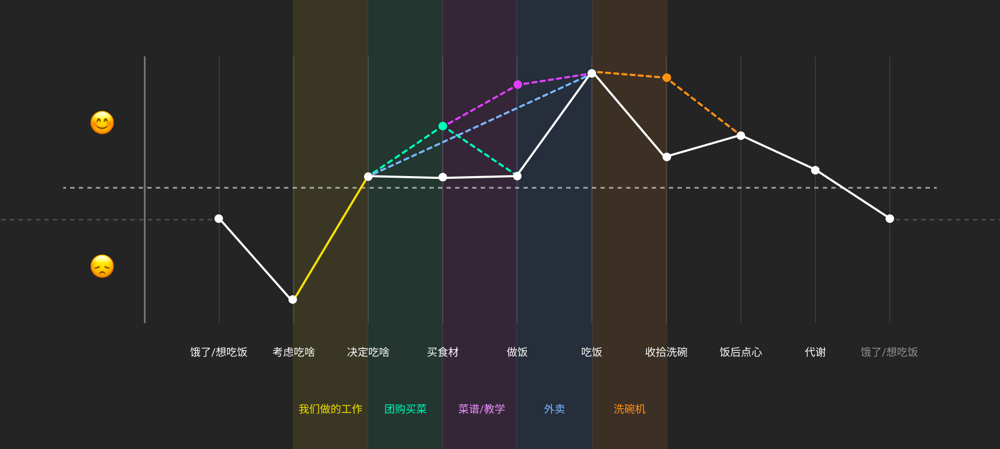
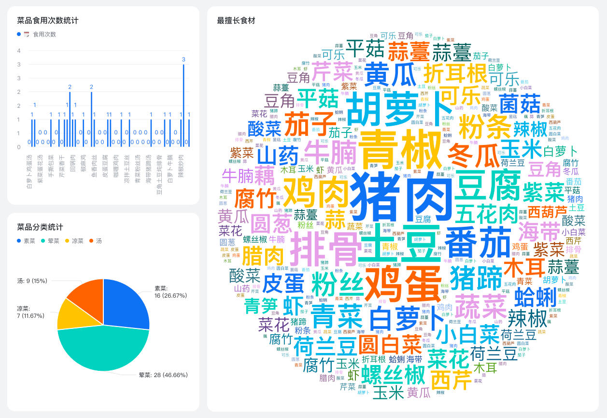
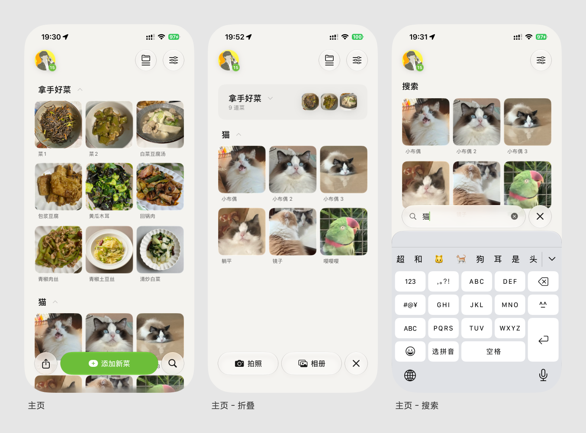
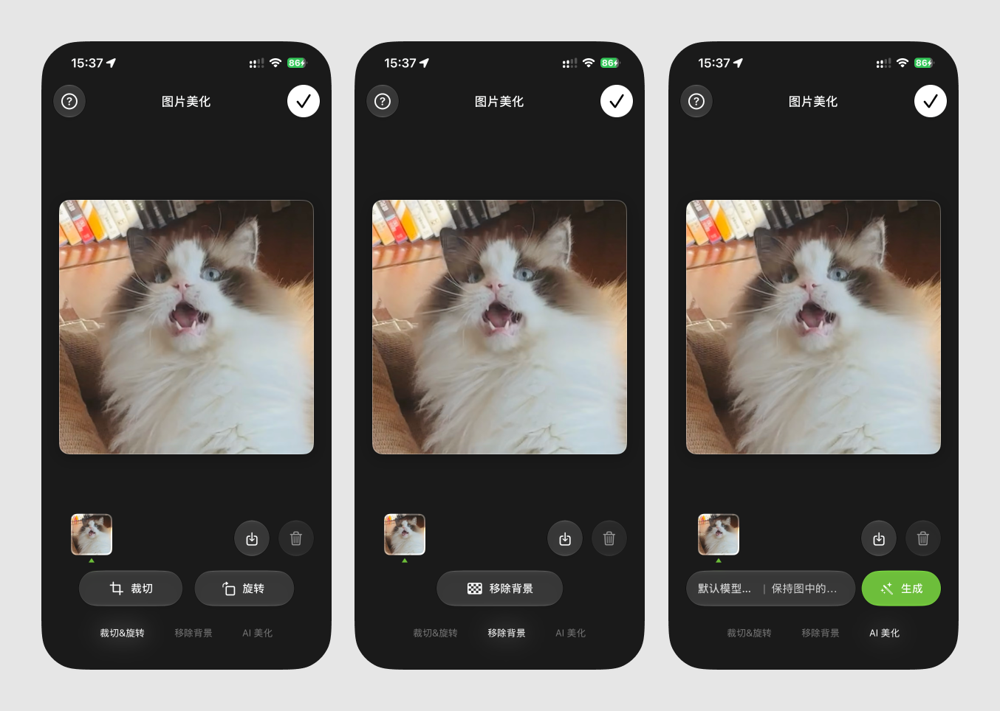
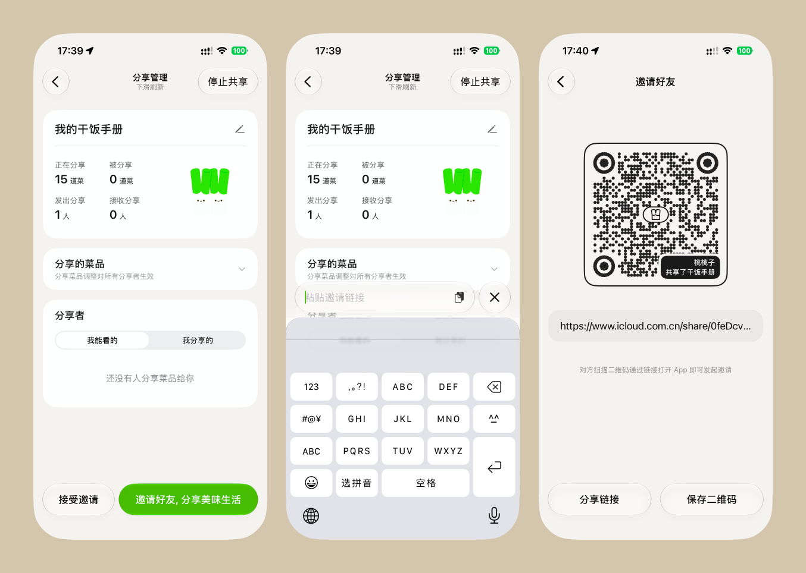
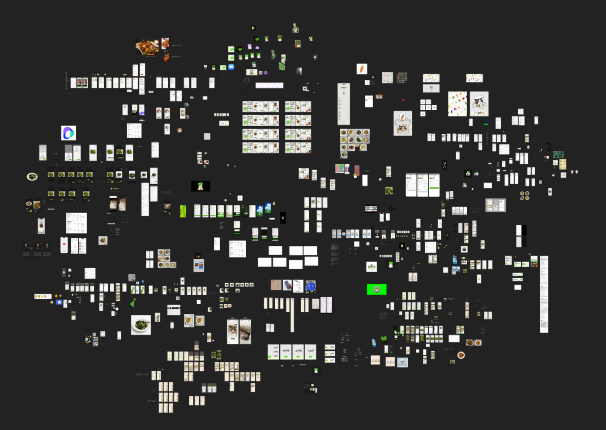
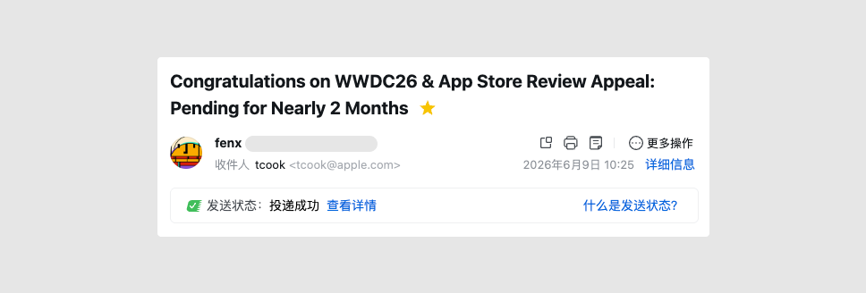

## Summary
[[Fenx]] recounts spending five months of part-time work turning a household need into [[GanFanShouCe|干饭手册]], his first released iOS app: a visual catalog of dishes with grouping, search, ingredient recognition, image editing, iCloud synchronization, sharing, widgets, localization, and paid features. The retrospective pairs an inspiration-led interface tour with a detailed account of failures across SwiftData, CloudKit, image storage, startup timing, StoreKit, localization, and App Review. Its strongest engineering lesson is that apparently automatic platform capabilities still require explicit application-level state, identity, failure, permission, and recovery design. The account documents one creator's unusually broad first app rather than proving that its workflow, architecture, or model choices generalize.

## Key Claims
- The product began with a concrete household memory problem: many dishes were cooked once and then forgotten, while random selection did not efficiently answer “what should we eat?”
- A simple Feishu-table MVP preceded the native app, but image browsing, sharing, and ingredient statistics motivated a more integrated product.
- The released app grew far beyond dish CRUD into AI image and ingredient features, CloudKit sharing, subscriptions, localization, widgets, alternate icons, startup templates, and numerous custom interactions; the author judges the release successful but the unmanaged scope and old-device performance unsuccessful.

- [[InspirationDrivenProductDesign]] shaped the interface: system components provided a baseline, while spontaneous visual experiments produced randomized settings composition, collectible cards, shaders, launch templates, and hidden details. The author also acknowledges that this process is slow, exhausting, difficult to reproduce, and poorly suited to ordinary team iteration.

- [[MobileAppLifecycleEngineering]] failures clustered at system boundaries: a switched SwiftData container left stale `ModelContext` writers; CloudKit supplied no useful per-image progress; external image blobs caused memory pressure; image-version state was incomplete; duplicate user profiles lacked deterministic resolution; and CKShare required explicit zone, permission, and participant-profile architecture.

- UI success messages, membership gating, startup routing, batch AI writes, widget preparation, and account-change prompts all needed to follow confirmed state transitions rather than optimistic assumptions or ambiguous initial values.
- Real-device and TestFlight behavior mattered because simulator timing and local StoreKit configuration did not reproduce CloudKit arrival order, review-device products, or production purchasing prerequisites.
- Continuous use of coding agents accelerated unfamiliar SwiftUI implementation, but the author still micro-managed requirements, tested on devices, supplied domain judgments, and identified graphics terminology and mathematics as a human learning bottleneck.

- App Store release became its own uncertain phase: the first review sat in progress for 35 days; a resubmission also stalled; the author reports receiving feedback the evening he emailed Tim Cook and shipping after two revisions three days later, without evidence that the email caused the response.

## Key Quotes
> “系统能力看起来自动，其实业务要自己兜底。” — on the common pattern behind the app's hardest failures.

> “文章也是一种「存档」。” — on reframing the retrospective and the app itself as records rather than only promotion.

## Connections
- [[Fenx]] — creator, designer, and first-time iOS developer narrating the project.
- [[GanFanShouCe|干饭手册]] — the cooking-memory app whose product, design, engineering, and review history form the case.
- [[MobileAppLifecycleEngineering]] — collects the cross-boundary state, performance, entitlement, synchronization, and release lessons.
- [[InspirationDrivenProductDesign]] — describes the author's spontaneous, exploration-heavy design method and its costs.
- [[VibeCoding]] — coding agents accelerated implementation, while human specification, testing, and learning remained necessary.
- [[FeatureCreep]] — the author explicitly identifies unmanaged demand growth as one reason the project was also a failure.
- [[IOS]] — native platform whose frameworks, visual system, devices, and lifecycle constraints shaped the app.
- [[AppStore]] — distribution and review system that delayed the launch after development was complete.
- [[SoftwareVerification]] — real devices, TestFlight, logs, and confirmed persistence outcomes were needed to catch failures hidden by local success.

## Contradictions
- The author's description of broad scope as failed demand management is consistent with [[FeatureCreep]], but many individual capabilities still supported the app's recording, sharing, or monetization promise; the source does not measure which features users valued or which should have been removed.
- The reported same-day review response after emailing Tim Cook is a temporal association, not evidence that the email caused escalation or approval.
- The favorable comparison among Cursor models reflects one developer's tasks, pricing tier, and 2025–2026 model versions rather than a controlled productivity or quality evaluation.
