## Summary
This [[AnalyticsVidhya]] guide maps digital marketing from owned, paid, and earned media through search and display auctions, publisher and advertiser tooling, tracking tags, programmatic infrastructure, DMP targeting, and [[IdentityResolution]]. Its central analytics argument is that campaign optimization should connect ad exposure and conversion data to customer profitability, while its diagrams show why this requires both data-science skill and operational knowledge of the advertising ecosystem. The material is a useful 2018 conceptual snapshot, not a current product, privacy, or pricing guide.

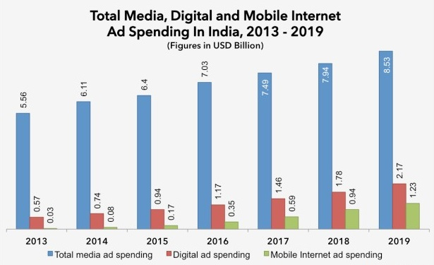

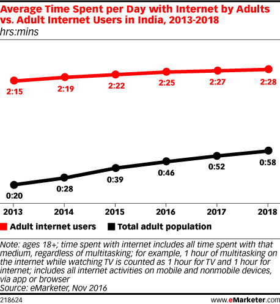

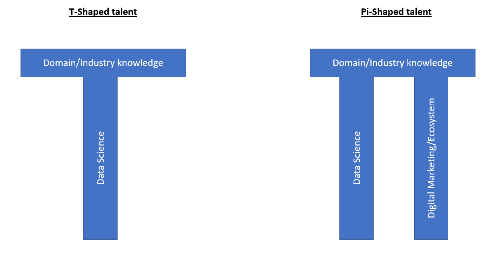

## Key Claims
- Digital media improves change speed, audience specificity, timing, experimentation, and measurement relative to traditional media, but analysts must understand how the channel's data is generated and captured.

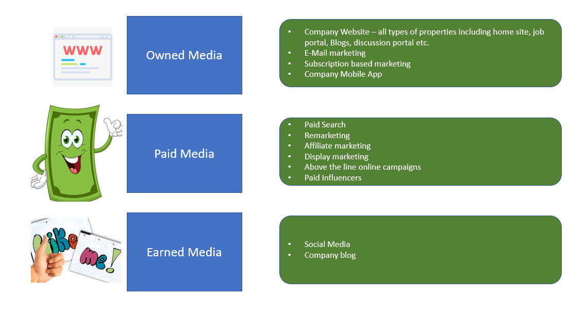

- A campaign should be judged across three connected journeys: exposure from impression to click, conversion from click to goal, and customer value from goal to profit. Optimizing only CTR or conversion can therefore select the wrong customers.

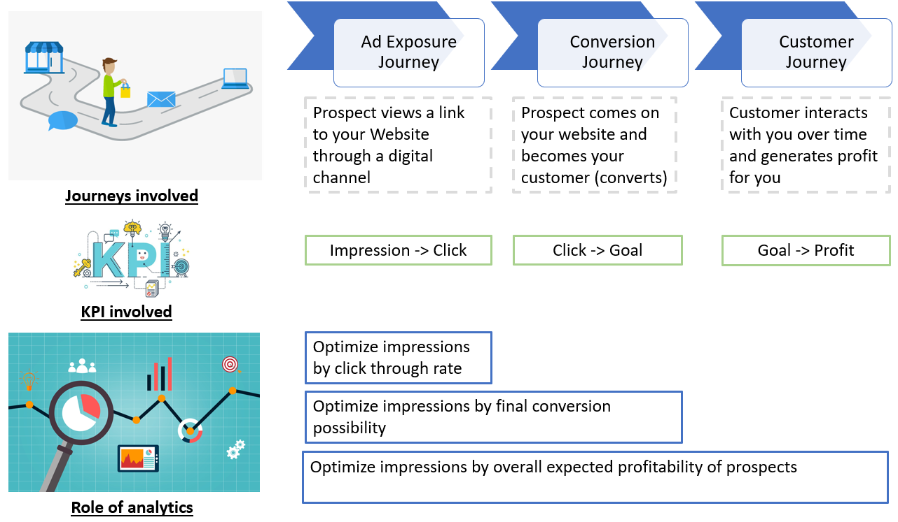

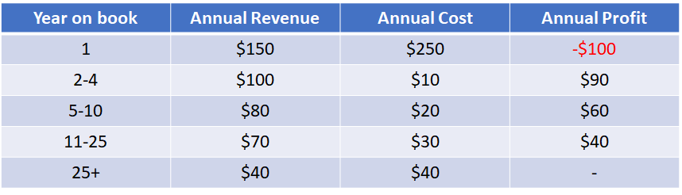

- Search advertising captures explicit intent, while display advertising reaches users in other contexts and is more exposed to low response and subjective multi-touch attribution.

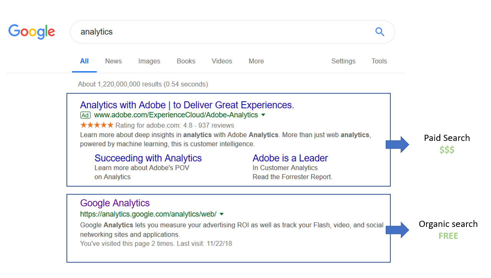

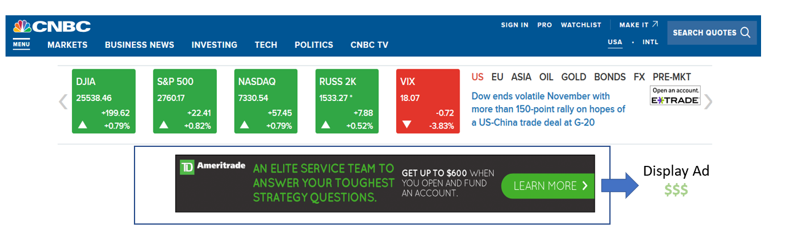

- The source's simplified search-auction model ranks ads by bid times quality score and charges enough to beat the next advertiser, illustrating why relevance can outrank a larger bid.

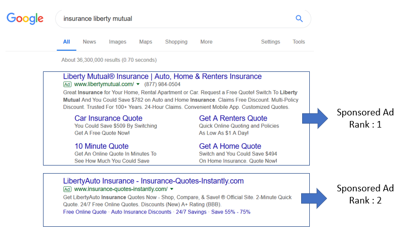

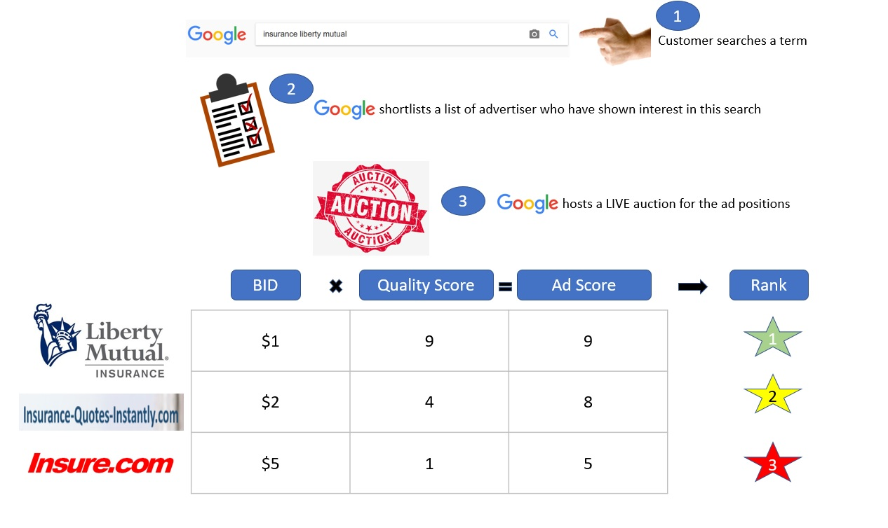

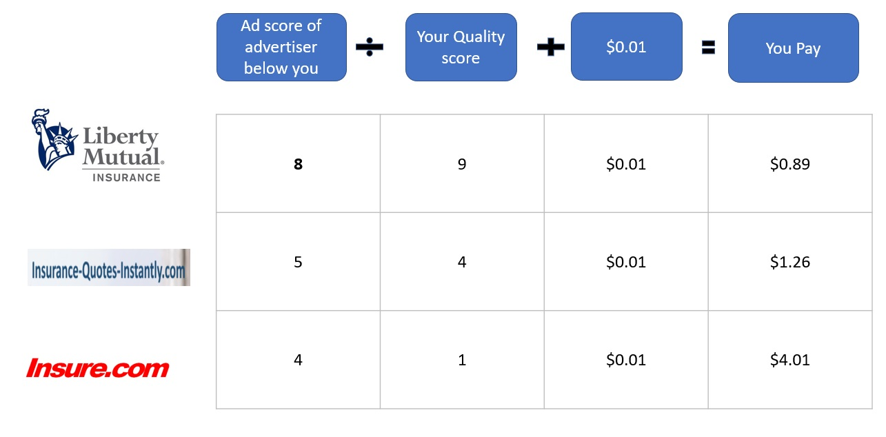

- Advertising infrastructure separates demand and supply roles: advertisers buy through products such as AdWords or DSPs, publishers expose inventory through AdSense or SSPs, and exchanges match them through auctions and priority rules.

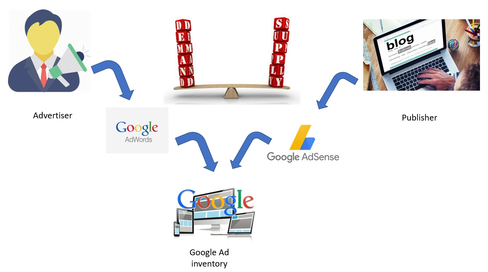

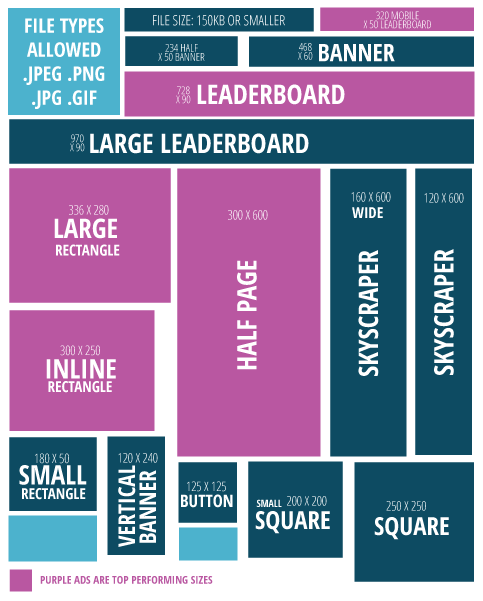

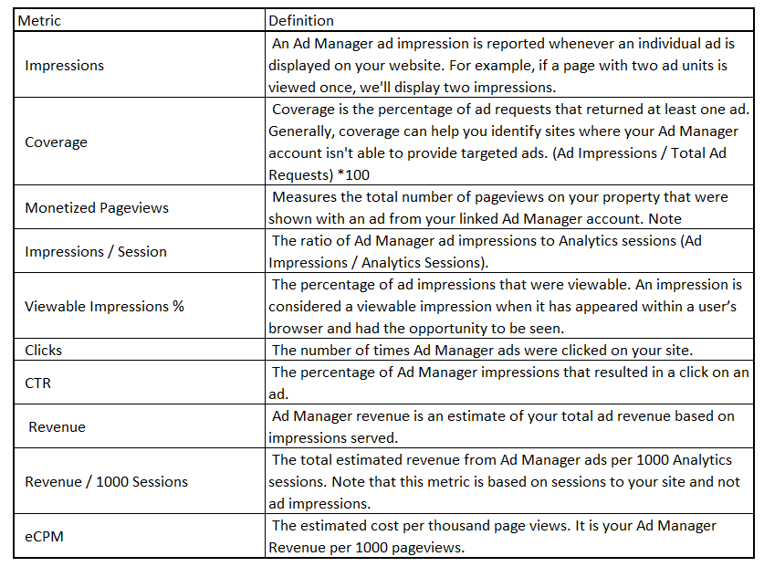

- Publisher analytics becomes actionable by slicing impressions, sessions, CTR, revenue, and revenue per thousand impressions by page category, source, and placement rather than relying on totals.

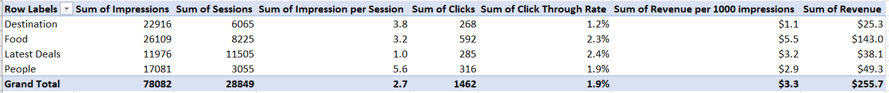

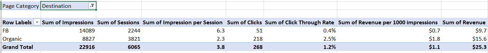

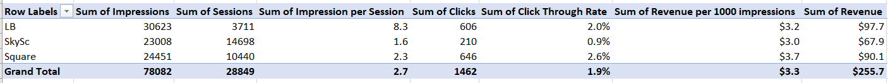

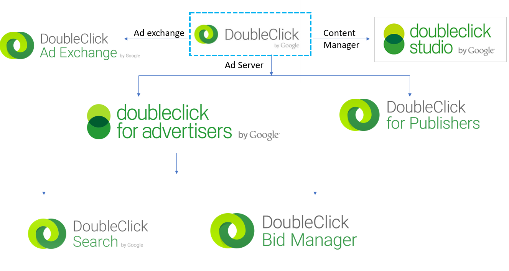

- Cookies, pixels, tag managers, and data layers connect onsite behavior to measurement and audience activation; a tag container centralizes firing rules and the data layer mediates website data for multiple tags.

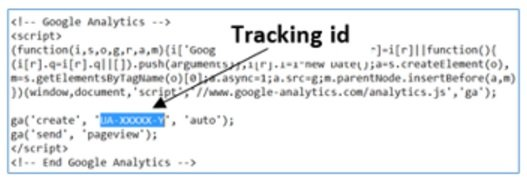

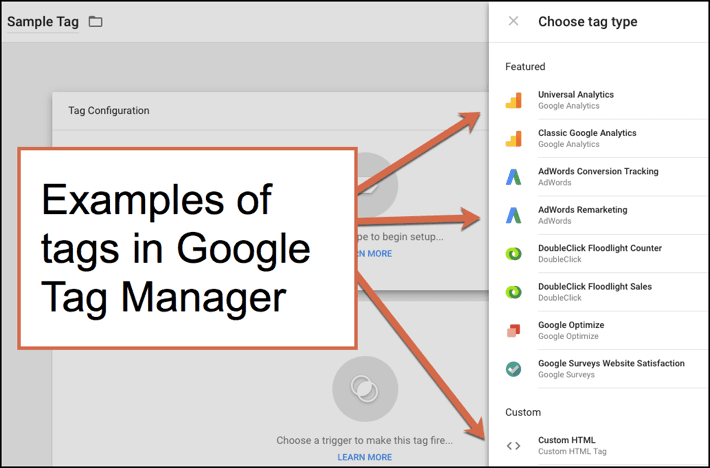

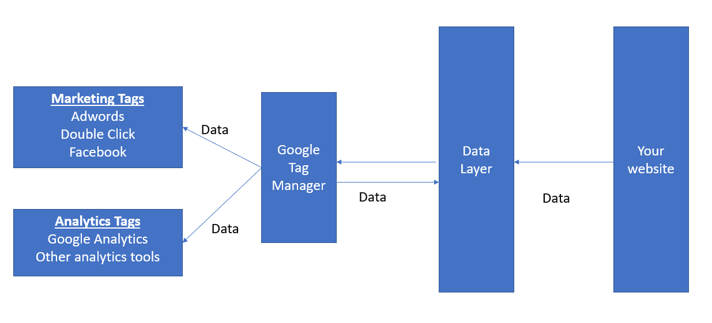

- Display inventory can move from direct and guaranteed deals through preferred access and private auctions to open real-time bidding; DSPs represent buyers, SSPs represent publishers, and exchanges connect the two sides.

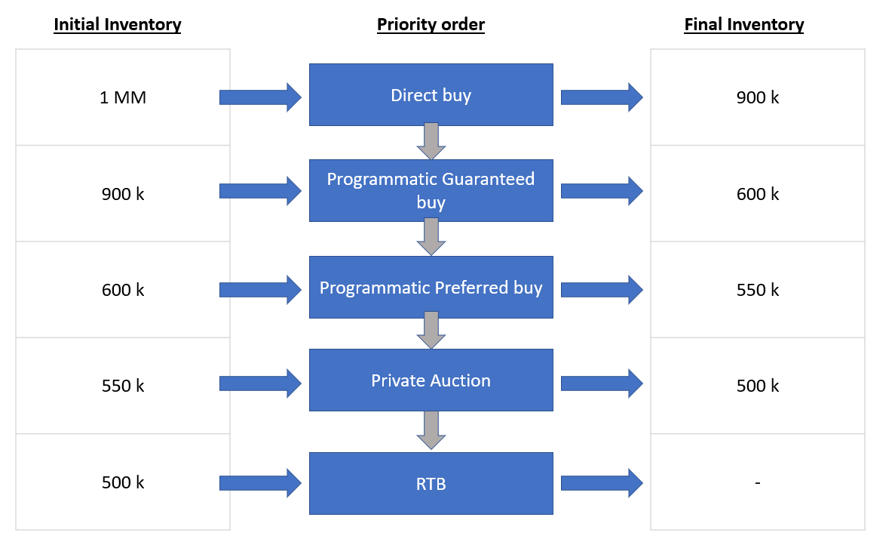

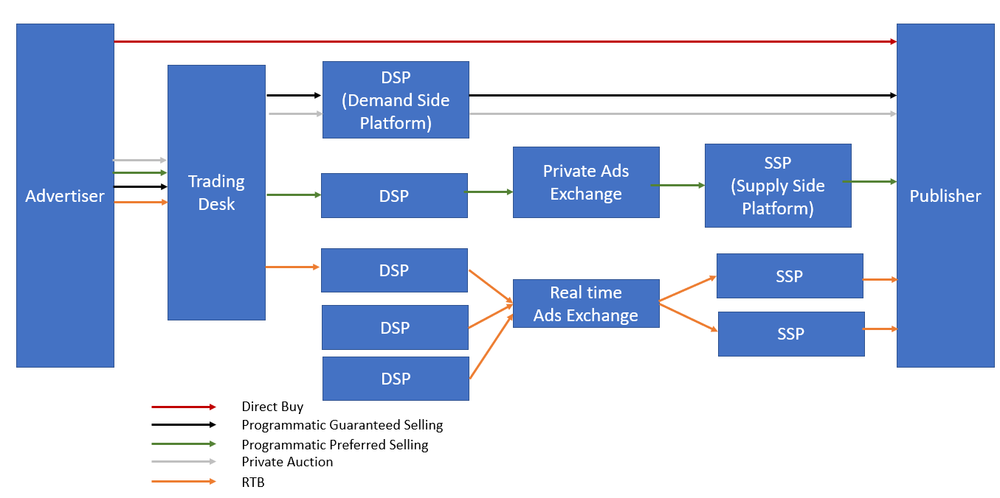

- A [[DataManagementPlatform]] combines first-party and third-party signals into deployable segments, synchronizes identifiers with buying and selling systems, and supports remarketing, lookalikes, suppression, and personalization.
- [[IdentityResolution]] links changing browser identifiers to a more durable person-level identity, increasing continuity while creating a much sharper privacy and governance boundary.

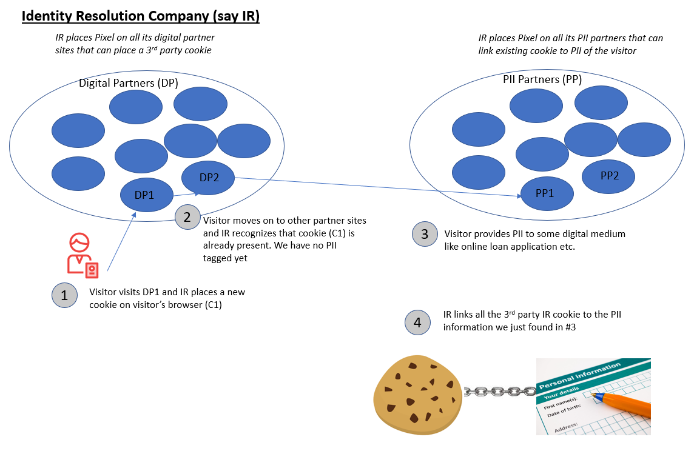

- The source compares [[GoogleAnalytics]] with Adobe Analytics on implementation, cost, integration, remarketing, and support, but the table reflects 2018 product positioning and prices.

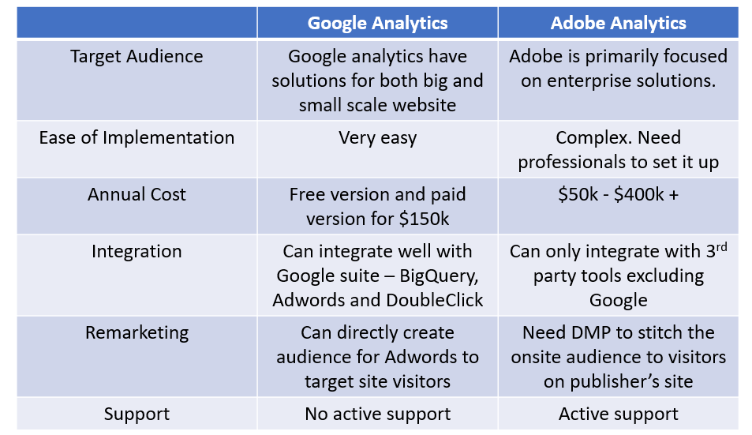

## Key Quotes
> "The barrier between a business person and an analyst becomes very blurry in this space." - on why digital analytics requires domain knowledge as well as data science.

> "Our end objective of a successful campaign is to show ads to only those prospect that have a strong propensity of being a profitable customer." - on connecting acquisition targeting to downstream value.

## Connections
- [[AnalyticsVidhya]] - publisher of the guide and its data-science framing.
- [[AudienceTargeting]] - turns campaign objectives and audience evidence into deployable segments.
- [[DataManagementPlatform]] - combines and activates audience data across the advertising stack.
- [[ProgrammaticAdvertising]] - automates inventory allocation through DSP, SSP, exchange, and auction paths.
- [[IdentityResolution]] - connects browser-level identifiers to durable person-level records.
- [[GoogleAdWords]] - advertiser-side search and display buying product discussed in the guide.
- [[GoogleAnalytics]] - measurement platform compared with Adobe Analytics and connected to tagging workflows.
- [[MarketingAttribution]] - needed when display exposure and later conversion are separated in time and across touches.
- [[CustomerLifetimeValue]] - supplies the profitability objective that can differ from clicks or conversions.
- [[WebAdEconomics]] - broader funding and incentive context for advertiser-publisher intermediation.

## Contradictions
- The guide's auction descriptions and the earlier [[behind-every-great-product-silicon-valley-product-group]] AdWords origin account use different simplified ranking formulas. They are best treated as product-era illustrations of the shared principle that relevance or performance modifies price, not as complete specifications.
- Many named products, prices, reach statistics, third-party-cookie assumptions, and platform relationships are time-bound to 2018. The missing external internet-usage chart returned HTTP 404, so its visual evidence could not be independently inspected; the surrounding prose states the intended growth claim.
