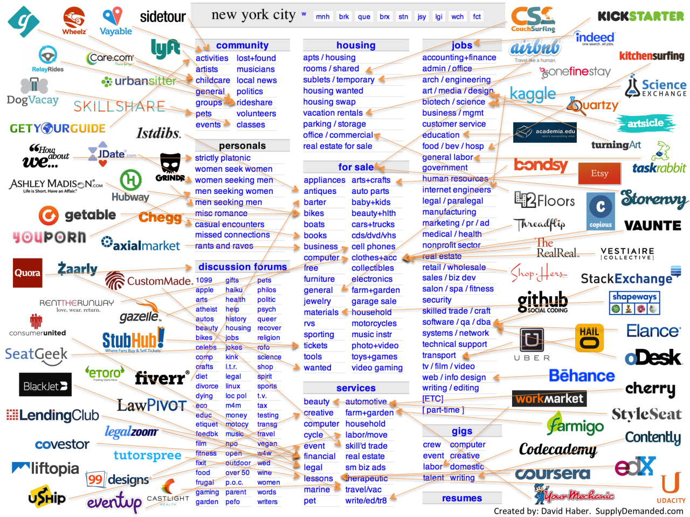
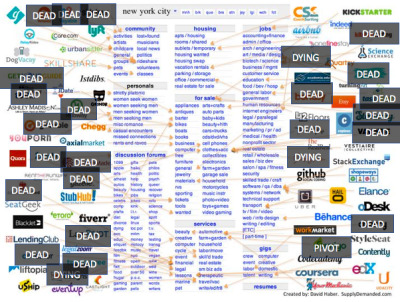
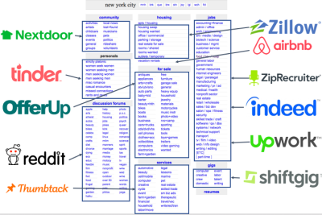

## Summary
[[JoshBreinlinger]] revisits the familiar map of startups unbundling [[Craigslist]] and argues that many narrow vertical marketplaces lacked the transaction frequency or ticket size needed to build durable networks and attractive businesses. His proposed [[MarketplaceRebundling]] outcome is not a return to one universal classifieds site, but consolidation into broad category platforms such as [[OfferUp]], [[Thumbtack]], and [[Upwork]], with [[Airbnb]] as an exception where one large section can support a major standalone company. The three retained diagrams provide the article's central evidence: an original field of narrow entrants, a later map marking many as dead, dying, or pivoted, and a category-level winner map.

## Key Claims
- Unbundling a broad incumbent into a narrowly vertical marketplace is not automatically a durable strategy; the relevant constraints include transaction frequency and transaction value.
- Many startups on the original Craigslist unbundling map had failed, were dying, or had pivoted after five to seven years, according to the article's retrospective diagram.
- Users have limited attention and often need to cross adjacent subcategories, favoring platforms that cover a broad category such as community, forums, personals, classifieds, local services, or jobs.
- The proposed winning structure supports one or two large horizontal platforms within each broad category, rather than dozens of single-use vertical apps.
- [[OfferUp]] and [[Upwork]] are presented as category-horizontal platforms for local commerce and remote work, while [[Thumbtack]] spans multiple home-service needs.
- [[Airbnb]] is the main exception: a single Craigslist section can be large and valuable enough to support a major standalone marketplace.

## Key Quotes
> "vertical isn't always the right solution" - on why category decomposition alone does not establish a viable marketplace.

> "The narrow verticals have died off in favor of horizontal categories." - the article's central retrospective judgment.

> "real people with limited attention units" - on the demand-side convenience argument for category breadth.

## Connections
- [[JoshBreinlinger]] - author advancing the rebundling thesis and investor in two cited examples.
- [[Craigslist]] - broad incumbent and category map used to compare unbundling with later consolidation.
- [[MarketplaceRebundling]] - strategy pattern in which narrow entrants consolidate into broader category platforms.
- [[OfferUp]] - local-commerce example covering multiple kinds of used goods.
- [[Upwork]] - remote-jobs example spanning multiple functions.
- [[Thumbtack]] - local-services example spanning multiple household needs.
- [[Airbnb]] - exception where one high-value Craigslist section can support a very large standalone marketplace.

## Contradictions
- The source qualifies [[build-a-product-that-fits-your-runway-elizabeth-yin]], which uses the same category map to show that broad incumbents contain viable narrow startup wedges. A narrow first product may still be useful, but this retrospective argues that remaining narrow can limit marketplace frequency, network formation, and monetization.
- The claim that each category can support only one or two mega-platforms is a 2017 investor thesis rather than a measured market rule. The author had portfolio exposure to OfferUp and Upwork, the diagrams do not define failure consistently, and the article provides no transaction, retention, revenue, or counterfactual data.

## Image Notes
- The first retained diagram maps dozens of startup logos to Craigslist sections across community, personals, forums, housing, for-sale goods, services, jobs, gigs, and resumes.
- The second retained diagram overlays the same field with "dead," "dying," and "pivot" labels, visually supporting the retrospective failure claim without documenting the classification method.
- The third retained diagram groups proposed winners by broad category: Nextdoor for community, Tinder for personals, OfferUp for classifieds, Reddit for forums, Thumbtack for services, Zillow and Airbnb for housing, ZipRecruiter, Indeed, and Upwork for jobs, and Shiftgig for gigs.
- A smaller copy of the original unbundling map was omitted as a duplicate, and the final 16-pixel image was omitted as a decorative Tumblr avatar.
