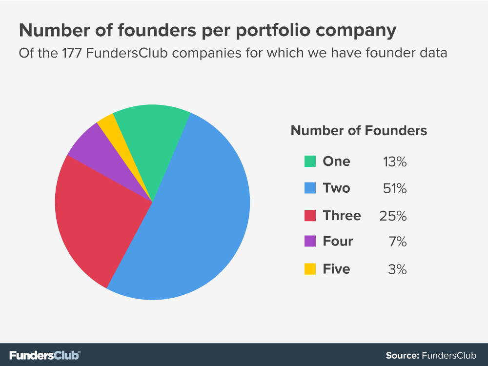

## Summary
[[FundersClub]] presents co-founder fit as a durable operating relationship built from tested trust, complementary capabilities, explicit roles, aligned definitions of success and failure, acceptable equity, recurring private conversation, and public mutual support. The guide combines practitioner anecdotes with unattributed portfolio data, but it does not establish that any one practice causes startup success or substantiate its quoted management-instability statistic with study details.

## Key Claims
- Long shared history can reveal how prospective co-founders respond to strain, but respect for each other's abilities matters more than being best friends.
- Founders should test claimed capability through joint work, deliverables, independent expert assessment, and an early exit option rather than relying on resumes or verbal assurances.
- Complementary skills are useful when they support a shared value system and enable explicit decision ownership instead of creating duplicate authority.
- Co-founders should revisit what success and failure mean, including mission, growth pace, spending, exit timing, and personal motivation, because those definitions can diverge as circumstances change.
- Equity should be discussed after founders have some evidence about working together but early enough to expose incompatibility; vesting protects the company but does not make an unfair-feeling split motivationally safe.
- Recurring time outside routine work and, when affordable, executive coaching can keep relationship maintenance from disappearing as the company grows.
- Co-founders should challenge one another privately while presenting dependable mutual support to employees, boards, and other stakeholders.

FundersClub's chart covers 177 portfolio companies with founder data: 13% had one founder, 51% had two, 25% had three, 7% had four, and 3% had five. It describes this portfolio sample rather than proving that a particular team size performs better.

## Key Quotes
> "opposite skill sets and identical value sets" - Nathan Gilmore's compact test for complementary founder teams.

> "work separately, but always together" - Angela Watts on role separation with continued feedback.

> "you're stuck with your co-founder" - the guide's warning that products and employees may change faster than the founding relationship.

## Connections
- [[FundersClub]] - venture-capital organization publishing the guide and the founder-count portfolio chart.
- [[CoFounderFit]] - central framework for evaluating and maintaining a founding partnership.
- [[CoFounderConflict]] - mistrust, unclear authority, equity resentment, and public undermining are presented as conflict accelerants.
- [[FounderVisionAlignment]] - founders need compatible definitions of mission, growth, risk, spending, exit, success, and failure.
- [[FounderTechnicalCapability]] - non-technical founders are advised to validate a technical candidate through deliverables and trusted expert assessment.
- [[StartupTeamBond]] - recurring private time and dependable mutual support maintain the relationship beyond its initial history.
- [[YCombinator]] - cited for placing unusual weight on founder commitment and relationship history and for advice favoring near-equal founder equity.

## Contradictions
- The guide says complementary or opposite skills can help founders divide responsibilities, but also warns that sharp personal contrast can produce constant conflict; its narrower synthesis is complementary capabilities within compatible values and working norms.
- Its claim that 65% of startups fail because of management-team instability is attributed to Noam Wasserman without a study definition, sample, or direct citation, so it is retained as a reported claim rather than accepted as a measured base rate.
- Its equity advice contains a deliberate timing tension: do not split ownership before learning how the team works, but do not delay long enough for incompatible expectations to remain hidden.
