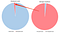

## Summary
[[HenryWard]] presents an [[EShares]] management philosophy built around amplifying strengths, diagnosing mistakes with curiosity, delegating desirable work, personally taking on hard problems, developing employee self-evaluation, and influencing capable leaders rather than commanding them. The essay treats promotion as greater responsibility rather than greater privilege and asks managers to own failures in communication, training, hiring, support, and termination. It is a forceful founder-authored operating doctrine, not comparative evidence that these practices improve performance or make dismissal decisions fair.

## Key Claims
- Managers should reinforce strong work more often than concentrating feedback on the small fraction that went wrong, creating a positive loop around demonstrated strengths.

- Negative feedback should begin with curiosity and the premise that a capable employee tried; a mistake may reveal that the manager communicated the task poorly or did not provide enough training.
- Managers should delegate work they want to do and retain the difficult or undesirable work, both to give employees growth opportunities and to prevent promotion from becoming privilege.
- Prioritization moves from resolving immediate problems to designing systems that prevent their recurrence; Ward frames the former as manager work and the latter as executive work.
- Employees benefit more from learning continuous self-evaluation than from depending on periodic grades or rankings supplied by an institution.
- Once a manager concludes that an employee cannot succeed in the environment, Ward recommends a swift, humane exit and an apology for failures in hiring or support rather than a punitive performance-improvement plan.
- As organizational responsibility rises, formal command becomes less useful: managers of managers need influence, trust, and retained talent because strong lieutenants and their teams have real choice.
- Ward proposes advice-seeking as a management signal: employees asking for advice can indicate empowerment and trust, while managers can model the behavior by asking employees for advice themselves.

## Key Quotes
> "Fixing your employee’s performance starts with fixing your management." - Ward on diagnosing communication and training failures before blaming the employee.

> "Promotion increases responsibility but never privilege." - Ward's summary of eShares' management hierarchy.

## Connections
- [[HenryWard]] - eShares CEO and author of the management FAQ.
- [[EShares]] - company context for the management doctrine and personnel practices.
- [[ManagerialResponsibility]] - central frame connecting feedback, delegation, problem ownership, influence, and exits.
- [[ContinuousWorkplaceFeedback]] - curiosity-led feedback and self-evaluation add a performance-coaching layer to recurring conversations.
- [[CompassionateManagement]] - the essay asks managers to examine their own contribution to failure and conduct exits humanely.
- [[JoshuaMerrill]] - eShares product leader used to illustrate why senior management depends on influence rather than command.

## Contradictions
- The essay's categorical rejection of performance-improvement plans and claim that a manager need not build evidence before firing conflict with fair-process, anti-bias, legal, documentation, and employee-correction needs. Curiosity and humane treatment do not remove the need for clear expectations or accountable decisions.
- Maximizing strengths and correcting harmful work are not mutually exclusive. Safety, ethics, harassment, reliability, and repeated high-impact errors may require prompt corrective feedback even when most work is strong.
- The source treats communication or training as the manager's fault in the focal cases, but performance can also reflect conflicting constraints, health, role mismatch, incentives, misconduct, or choices outside a manager's control.
- Advice-seeking may indicate trust, but it can also reflect uncertainty or dependence; its absence may reflect expertise, culture, workload, personality, or inaccessible management rather than poor empowerment alone.

## Image Notes
- All three unique local assets were opened. The 1,200-pixel title illustration is decorative and its 60-pixel copy is a duplicate thumbnail, so both were omitted.
- The 60×33-pixel comparison graphic was retained because its paired pie charts visually reinforce the article's central contrast between emphasizing mostly good work and emphasizing a small bad share. Its resolution is too low to support any finer quantitative claim beyond the surrounding prose's stated 98%/2% example.
