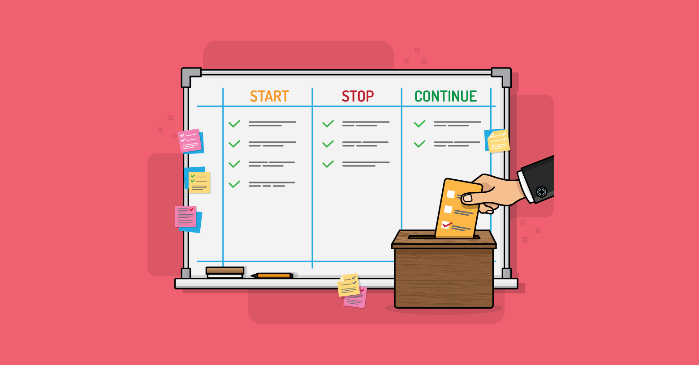

## Summary
[[MountainGoatSoftware]] presents start-stop-continue as a lightweight, action-oriented format for sprint retrospectives. The facilitator gathers proposed behavior changes, varies the elicitation method, uses voting to select at most three priorities, reviews the continue list for habits or obsolete items, and brings the previous session's full list into the next retrospective as optional context.

## Key Claims
- Start items add useful practices, stop items remove inefficient or wasteful behavior, and continue items reinforce changes until they become habits.
- Continue items should be removed once achieved or no longer important so the list does not grow indefinitely.
- Facilitators can vary idea generation among open call-outs, round-robin turns, and focused prompts for one category.
- Voting should begin when idea generation slows; multi-voting lets a team select several behavioral changes without treating every suggestion as a commitment.
- A team should generally choose no more than three priorities because a larger set dilutes attention even when individual changes require little time.
- The next retrospective can display both selected and unselected ideas from the previous session to prompt discussion without forcing the old agenda.
- The format favors direct behavioral commitments over discussion of feelings, while acknowledging that emotional processing may sometimes be necessary.

## Key Quotes
> "The continue list contains items the team would like to continue to emphasize but that are not yet habits." - on using the third category as temporary reinforcement rather than permanent praise.

> "Generally, I'd pick no more than three." - on limiting the number of retrospective priorities.

## Connections
- [[MountainGoatSoftware]] - publication and author identity supplied by the source metadata.
- [[ProductRetrospectives]] - the article's central team-learning practice and start-stop-continue workflow.
- [[AgileSoftwareDevelopment]] - broader iterative software-development context for sprint retrospectives.
- [[TeamFocus]] - limiting selected changes protects attention and makes follow-through more plausible.

## Contradictions
- The article's preference for avoiding discussion of feelings qualifies broader retrospective practice: direct action can be efficient, but excluding emotional or interpersonal evidence may hide psychological-safety, conflict, burnout, or power-dynamic problems that cannot be reduced immediately to a behavior vote.
