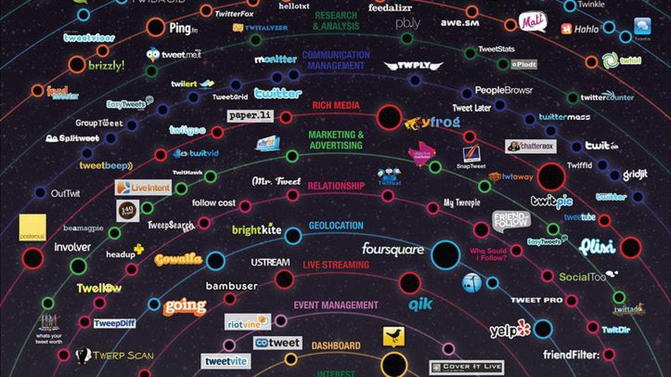

## Summary
[[JasonCosta]] contrasts [[Twitter]]'s early open API and later restrictions with [[Slack]]'s deliberately complementary app ecosystem. The article argues that a public API is a long-term product and governance commitment: providers should decide which experiences they must own, align incentives among users, developers, and the platform, and invest in policy, distribution, communication, and developer success. The Twitter case links business-model change and client consolidation risk to damaged [[DeveloperPlatformTrust]], while Slack is presented as a more aligned but still historical and practitioner-selected comparison.

## Key Claims
- A company should understand its product direction and business model before opening a highly accessible public API, because third-party products create expectations that are costly to reverse.
- Twitter's early API supported a broad client and service ecosystem, reportedly reaching 900,000 registered apps, 600,000 developers, and 13 billion requests per day.
- Twitter's advertising model and need to own the user interface conflicted with third-party clients that replicated its core experience; [[UberMedia]]'s client acquisitions made that conflict look existential rather than merely competitive.
- Twitter API v1.1 restrictions affected only part of the ecosystem but signaled instability broadly enough to erode developer trust.
- Slack's app directory, review process, OAuth scopes, roadmap, customer-feedback board, promotion, and investment fund are presented as mechanisms for steering developers toward complementary applications.
- Healthy API ecosystems create reciprocal value for users, developers, and the provider, and require continuing investment rather than publication alone.
- Providers should reserve strategically essential product surfaces, guide developers toward higher-value complementary work, and reward exemplary integrations with distribution, co-marketing, and appropriate access.

## Key Quotes
> "An API is a contract with external developers" - on why later restrictions carry trust costs.

> "Healthy APIs should drive reciprocal benefits" - the article's test for platform, developer, and user alignment.

## Connections
- [[JasonCosta]] - author comparing Twitter and Slack's historical API strategies.
- [[GGVCapital]] - publication and employer context for the essay.
- [[APIEcosystemGovernance]] - central framework for choosing boundaries, incentives, access, policy, and ecosystem support.
- [[DeveloperPlatformTrust]] - explains why technically limited policy changes can have ecosystem-wide effects.
- [[Twitter]] - cautionary case where an early open API later conflicted with advertising, first-party clients, and consolidation risk.
- [[Slack]] - positive comparison centered on complementary apps, review, distribution, guidance, and funding.
- [[UberMedia]] - client consolidator presented as a possible route to a shadow network outside Twitter's control.
- [[PlatformDistributionDependence]] - third-party developers receive users and opportunity but remain exposed to platform policy and business-model changes.

## Contradictions
- No direct contradiction with existing pages. The source deepens the wiki's Twitter developer-trust critique by explaining the provider-side business-model and control pressures behind API restrictions, while still arguing that those pressures do not remove the need for clear expectations and long-term ecosystem stewardship.
