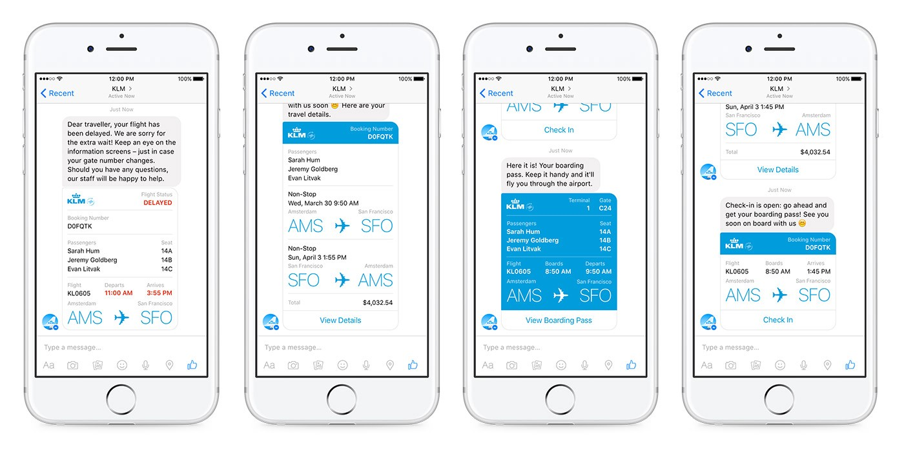
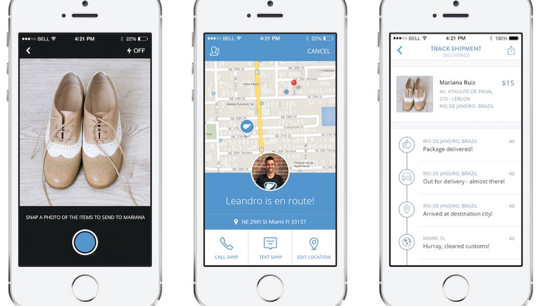

## Summary
[[AaronBatalion]] argues that early Messenger bots were better understood as "micro apps": lightweight services that could reuse a large messaging platform's identity, payment, location, media, support, and distribution capabilities instead of rebuilding native mobile applications. Using [[Shyp]] and a KLM travel flow as examples, the article predicts that richer interfaces and human-plus-software workflows would matter more than pure text or AI. It is a useful record of the optimistic 2016 [[MessagingAsPlatform]] thesis, but later bot-platform evidence qualifies its expectations about app replacement, reach, and conversion.

## Key Claims
- "Bot" understates the category because the proposed product is a focused micro application running inside a much larger platform, not merely an automated text conversation.
- Messenger could supply common mobile primitives such as identity, payment, location, camera input, customer support, and distribution, allowing startups to concentrate on their distinctive service.
- A platform-hosted micro app could reduce cross-platform development and app-store submission work while exposing a service to Facebook's large installed audience.
- One-click entry from a Facebook advertisement into Messenger could remove redirects, installation, password, account-creation, and login steps from acquisition.
- Richer widgets or components were expected to make Messenger services more like compact applications than clunky multiple-choice chat flows.
- Useful experiences could combine natural-language processing, computer vision, audio transcription, SaaS components, and human operators rather than depend on AI alone.
- Facebook had an incentive to support the model because improved startup conversion could increase demand for its advertising products.

The KLM example shows a hybrid Messenger experience built from conversational notices and structured cards for flight status, itinerary details, a boarding pass, and check-in. It supports the article's claim that the proposed category already extended beyond a blank text interface.

The Shyp screens decompose a shipping service into camera input, courier pickup and contact, location, and package tracking. They visually ground the article's argument that a messaging platform could supply much of the surrounding interface while a startup focused on fulfillment.

## Key Quotes
> "micro apps on the backs of massive platforms" - on the category Batalion believed the word "bot" obscured.

> "It's so much more than text and AI." - on combining interfaces, services, models, and people.

## Connections
- [[AaronBatalion]] - author and disclosed early angel investor in Shyp.
- [[Shyp]] - worked example of a focused service assembled from common mobile capabilities and physical fulfillment.
- [[FacebookMessenger]] - host platform expected to provide identity, payment, location, media, support, and distribution.
- [[MessagingAsPlatform]] - central thesis that messaging could become a runtime and acquisition layer for micro apps.
- [[ConversationalUI]] - the article argues for hybrid cards, components, media inputs, and humans rather than pure text conversation.
- [[ProductFlowFriction]] - Messenger entry is presented as a way to remove app-store, installation, signup, and login steps.
- [[Facebook]] - platform owner whose advertising business would benefit if Messenger improved startup conversion.

## Contradictions
- Directly contradicts [[chatbots-a-misleading-term-we-should-stop-using-botnerds-medium]] on category naming: Batalion says "bot" is too narrow and prefers "micro app," while Botnerds calls "bot" the neutral umbrella term and rejects only "chatbot."
- Later [[chatbots-were-the-next-big-thing-what-happened]] and [[chatbots-what-happened-chatbots-life]] qualify the prediction that messaging micro apps could broadly replace native apps: first-wave ecosystems, tools, interfaces, and NLP matured more slowly than expected, while hybrid extensions proved more defensible than wholesale replacement.
- The article asserts development savings, billion-person reach, and conversion improvement without comparative cost, adoption, retention, or revenue data; it also notes that Apple and Android policies could limit apps embedded inside other apps.
