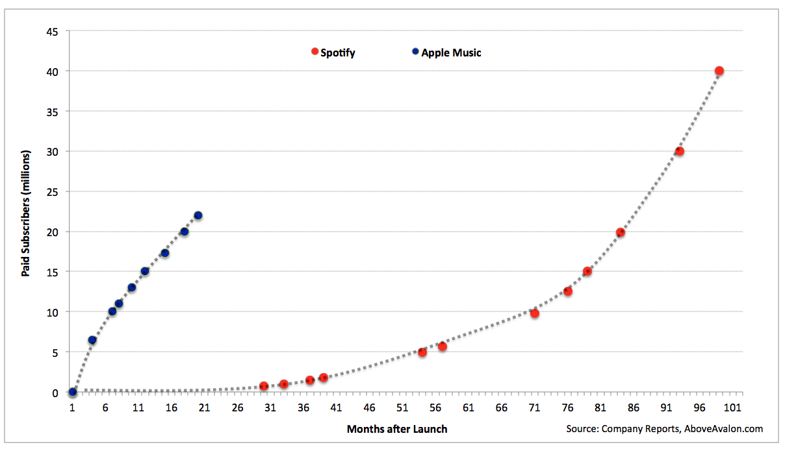

## Summary
[[NeilCybart]] argues that [[Apple]] did not need to acquire [[Netflix]] to build a video strategy because Apple uses acquisitions to fill product-strategy gaps with technology, people, relationships, and ideas rather than to buy revenue or a ready-made business model. The article treats Apple's purchase of Beats and recruitment of [[JimmyIovine]] as the precedent: Apple passed on [[Spotify]] scale, built [[AppleMusic]], and pursued entertainment relevance through industry relationships and experiments that could extend across music, video, and [[IOS]]. The retained chart supports the historical comparison, showing Apple Music reaching about 20 million paid subscribers roughly 17 months after launch while Spotify reached 40 million much later in its lifecycle.

## Key Claims
- [[AcquisitionStrategy]] should begin with a defined product or capability gap; acquiring revenue, subscription scale, or a large content library is not sufficient strategic rationale.
- Apple bought Beats for [[JimmyIovine]]'s music-industry vision, team, and relationships rather than primarily for its headphones revenue or small streaming service.
- The chart and article present [[AppleMusic]]'s first 17 months as evidence that Apple could build paid-streaming scale without buying Spotify, although the comparison uses different service ages and disputed subscriber definitions.
- Buying [[Netflix]] would have added subscription revenue, a new business model, and original programming, but Cybart argues those benefits did not match Apple's product-led acquisition logic.
- Apple's proposed video path was to work with creative people and smaller production companies, test original entertainment ideas, and use its platform rather than own a Netflix-scale catalog.
- [[AppleMusicCulturePlatform]] is framed as a relevance and mindshare strategy: artist relationships, original shows, and iOS integration were meant to make Apple part of cultural conversation, not merely a catalog utility.
- The article's “Apple Studios” proposal is an analyst theory for an internally connected but creatively independent idea incubator, not evidence of an announced Apple organization.

## Key Quotes
> "Instead of buying Spotify, Apple bought Jimmy Iovine." - Cybart's summary of the difference between buying scale and buying a content vision.

> "Apple is searching for another 'Jimmy Iovine.'" - the article's framing of Apple's proposed need in video.

## Connections
- [[NeilCybart]] - author of the 2017 Apple strategy analysis.
- [[AboveAvalon]] - publication context for the article.
- [[Apple]] - company whose acquisition and entertainment strategy is analyzed.
- [[JimmyIovine]] - Beats co-founder whose vision and relationships are presented as the real acquisition target.
- [[AppleMusic]] - evidence that Apple could build subscription scale after acquiring a team and vision rather than a market leader.
- [[Spotify]] - counterfactual acquisition target and paid-music-streaming comparison.
- [[Netflix]] - proposed acquisition target rejected by the article's product-strategy logic.
- [[AcquisitionStrategy]] - central distinction between filling a strategic capability gap and buying revenue or scale.
- [[AppleMusicCulturePlatform]] - relevance, relationships, and mindshare are the proposed bridge from music into video.
- [[StreamingContentEconomics]] - historical subscriber scale and business-model uncertainty shape the comparison.

## Contradictions
- The article's claim that Apple did not seek large content ownership is a 2017 strategic interpretation, not a durable rule; later Apple content investments would need separate evidence and do not retroactively prove that buying Netflix was necessary.
- The chart compares service growth by months after launch but does not make subscriber definitions, promotions, geography, pricing, or market conditions equivalent. It supports a historical growth comparison, not a controlled test of acquisition choices.
