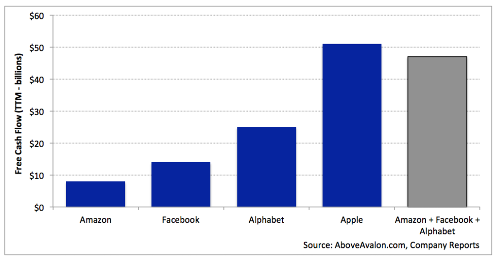

## Summary
[[NeilCybart]] argues that [[Apple]]'s 2017 free-cash-flow advantage came from a coherent [[AppleCashGenerationModel]], not simply the [[IPhone]] or high prices. The model combines product-first decision-making, organizational focus, contract manufacturing, premium hardware monetization, vertical integration, and scale economies that lower costs without making scale the objective. The retained chart materially supports the historical comparison: Apple generated about $51B of trailing-twelve-month free cash flow, roughly $3B more than [[Amazon]], [[Facebook]], and [[Google|Alphabet]] combined.

## Key Claims
- Apple's 2017 cash generation was a portfolio-level outcome: the company led profits across phones, tablets, computers, watches, wireless headphones, and streaming boxes rather than relying only on iPhone revenue.
- [[AppleCashGenerationModel]] rests on three operating tenets: put product quality before financial targets, focus resources on a small number of priorities, and use contract manufacturers to avoid owning a factory network.
- Contract manufacturing and selective capital investment let more operating cash flow become free cash flow, although the source does not isolate how much of the difference this choice caused.
- Apple treats scale as an outcome of desirable products rather than a prerequisite for monetizing data or transactions; scale then improves component costs, availability, and supply-chain leverage.
- Apple monetizes integrated premium experiences through profitable hardware, while Amazon reinvests around retail and Prime and Google/Facebook monetize broad data-capturing services through advertising.
- [[HomePod]] is the article's launch-era illustration: Apple expected hardware margin from a $349 integrated speaker, whereas Echo and prospective Google/Facebook hardware were framed as low-margin distribution for retail, data, or advertising models.
- AI and transportation could require Apple to adapt its monetization model, but Cybart argues that product primacy, focus, and control of key experiences would remain durable principles.

## Key Quotes
> "Apple doesn't view scale as a requirement to achieve success." - Cybart's distinction between Apple's product model and scale-dependent service or retail models.

> "The core tenets that underpin Apple's business model will remain" - the article's conclusion about adaptation beyond the iPhone era.

## Connections
- [[NeilCybart]] - author of the cash-generation and business-model analysis.
- [[AboveAvalon]] - publication context for the Apple strategy argument.
- [[Apple]] - company whose historical cash flow, product portfolio, manufacturing structure, and monetization model are analyzed.
- [[AppleCashGenerationModel]] - synthesis of the article's product-first, focused, asset-light, premium-hardware model.
- [[ApplePricingStrategy]] - competitive pricing and scale economics complicate the claim that Apple's profit leadership comes from overcharging.
- [[AppleServicesMachine]] - Apple Music, Apple Pay, and other services are framed as increasing hardware value rather than replacing the hardware-centered model.
- [[HomePod]] - launch-era case contrasting profitable integrated hardware with subsidized smart-speaker distribution.
- [[ShareBuyback]] - the article connects cash generation to $216B spent on buybacks and dividends since 2012 while net cash still rose.
- [[CorporateGiantFragility]] - the article asks whether AI or transportation could force Apple's model to evolve despite its 2017 strength.
- [[Amazon]] - scale- and reinvestment-dependent retail comparator.
- [[Google]] - data-and-advertising comparator identified as Alphabet in the financial exhibits.
- [[Facebook]] - data-and-advertising comparator.

## Contradictions
- No direct contradiction with the wiki's later Apple sources. The 2017 claim that Apple had the world's best cash-generating business model is a time-bounded comparative judgment, while later pages add Services growth, mature-market constraints, customer-metric gaps, and incumbent fragility.
