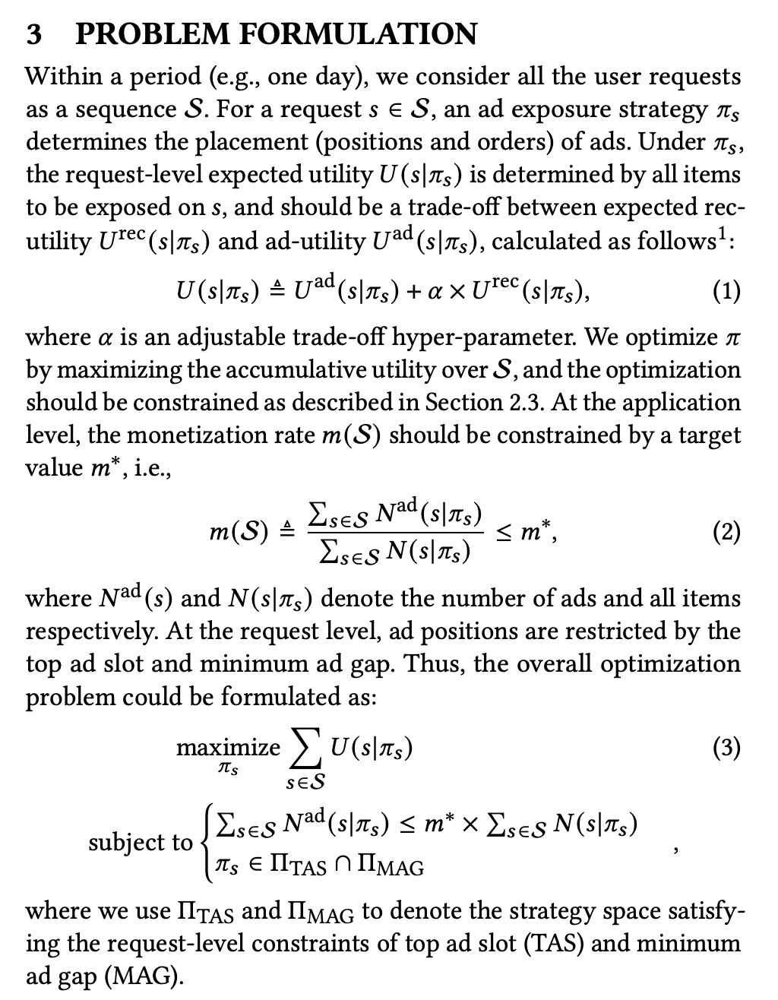
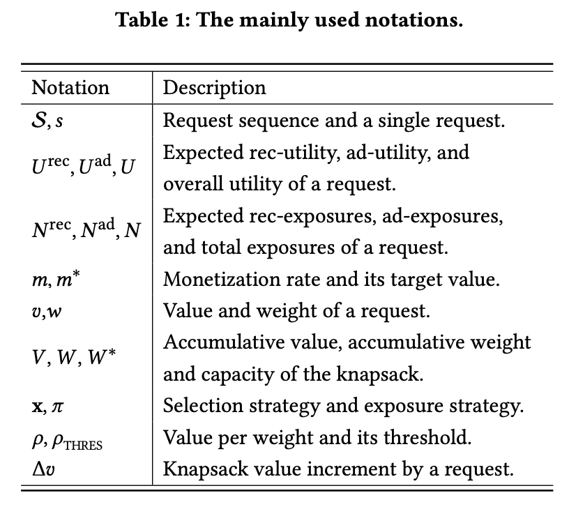
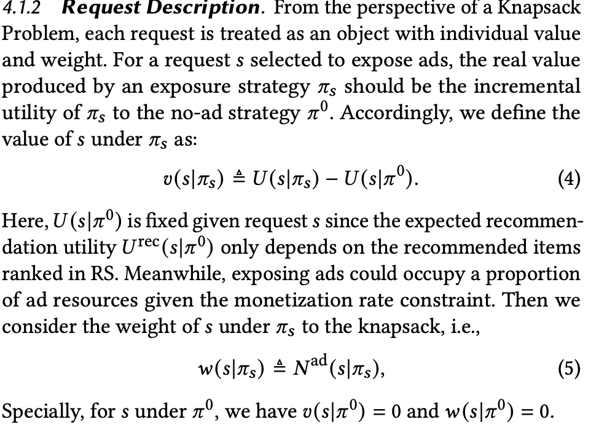
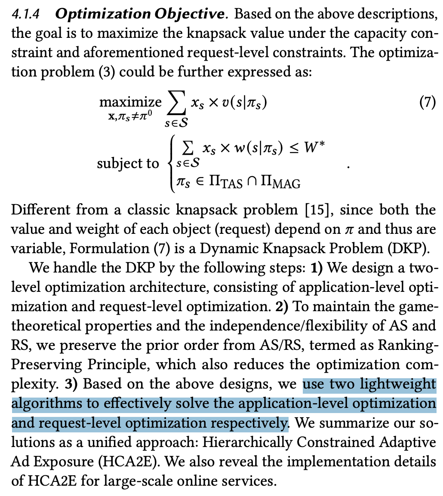
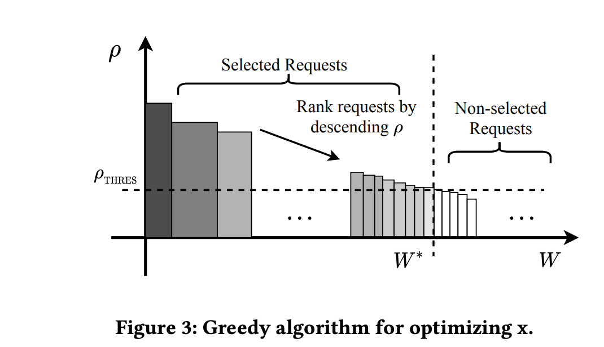
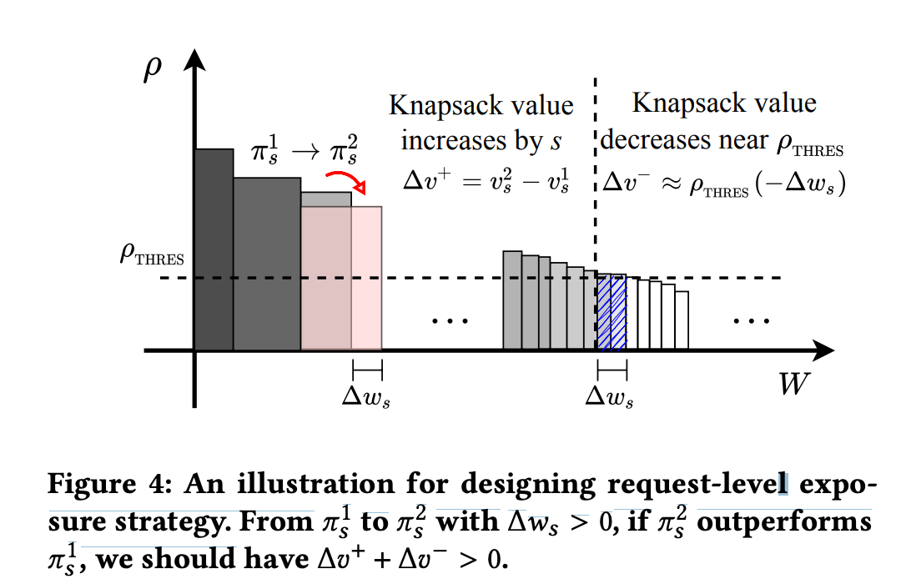
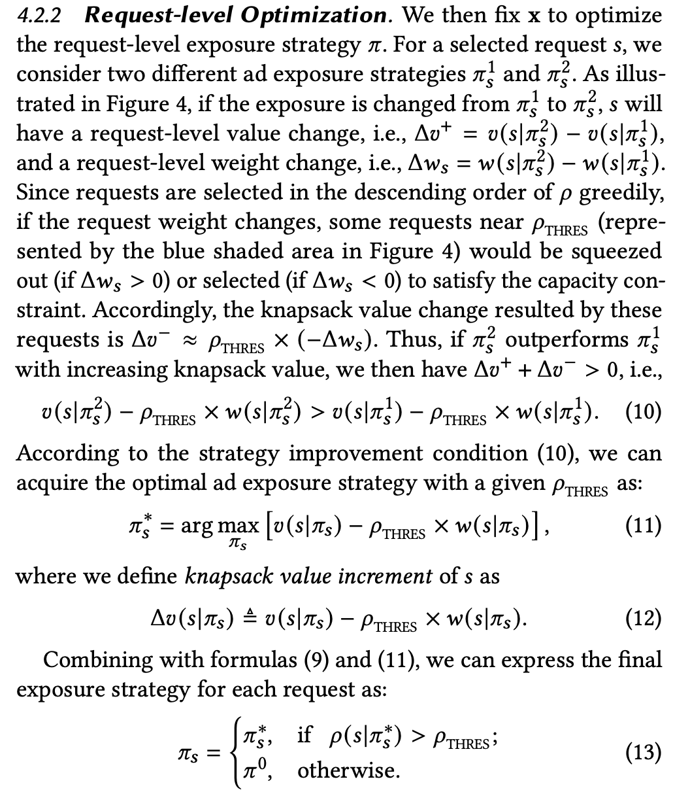
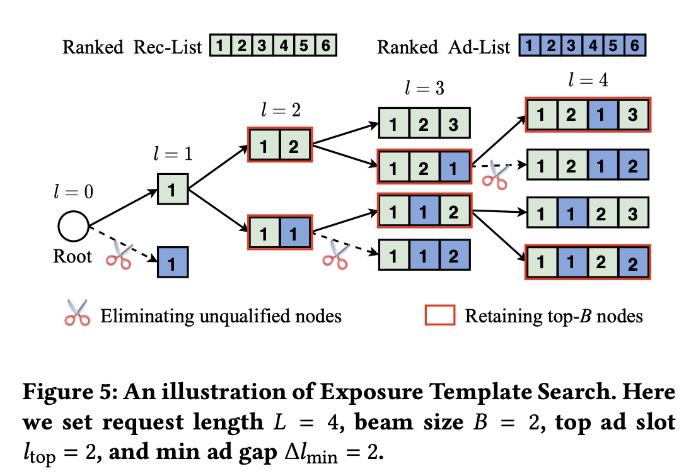
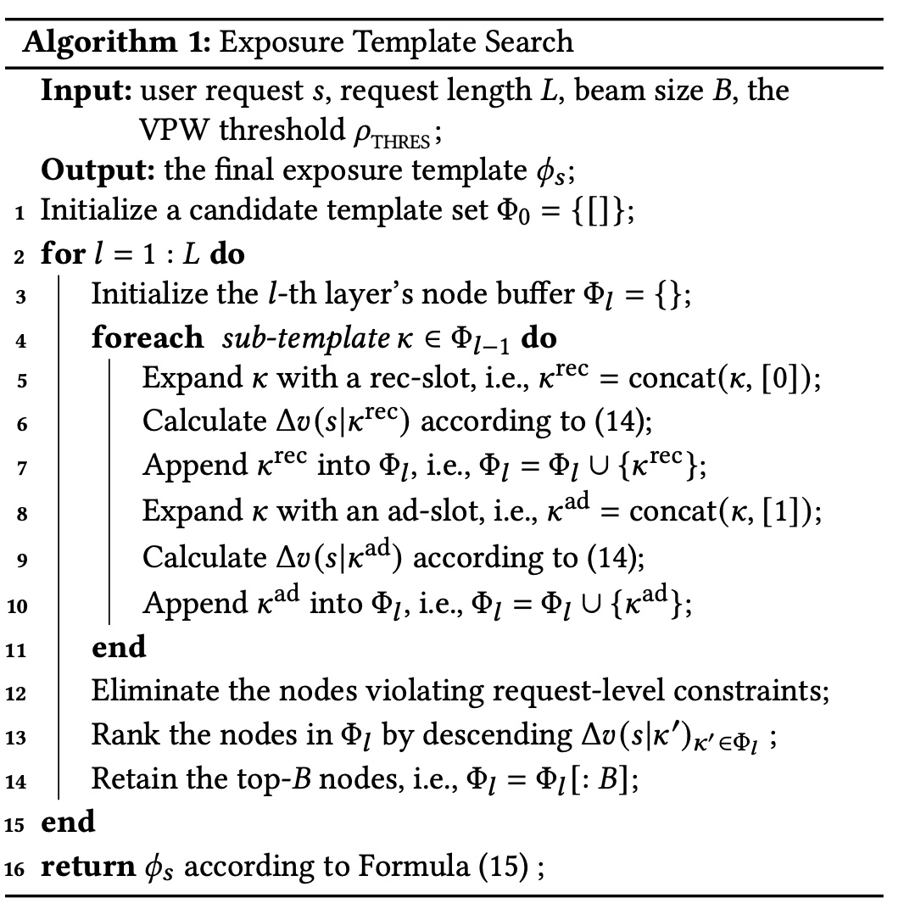
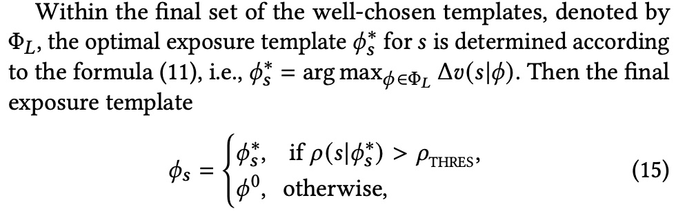

## Summary
[[Wulc]] explains [[AdloadConstrainedMixedRanking]] through the HCA2E paper's hierarchy: a session- or application-level dynamic-knapsack approximation decides which requests may show ads, while request-level beam search chooses an order-preserving ad-placement template. The method combines recommendation and advertising utility, prices each ad slot by a global value-per-weight threshold, and keeps top-ad-slot and minimum-gap constraints inside the search, but its greedy cutoff and threshold-based displacement cost remain approximations rather than a proof of global optimality.

## Key Claims
- The optimization objective combines advertising utility with monetized recommendation utility across a request sequence, subject to an application-level monetization-rate cap and request-level placement constraints.

- The notation separates request value and ad-exposure weight, cumulative knapsack value and capacity, selection and exposure strategies, and a value-per-weight threshold.

- A request's value is its incremental mixed-list utility over the no-ad list, while its weight is the number of ad exposures; this captures both advertising value and the recommendation utility displaced or changed by insertion.

- Because both request value and weight depend on the chosen exposure strategy, the aggregate problem is a dynamic knapsack rather than a fixed-item 0-1 knapsack.

- The application-level approximation ranks requests by value per ad exposure and selects them until capacity, producing a threshold that acts as the opportunity cost of consuming another ad slot.

- When a request strategy consumes more ad capacity, the method approximates the displaced value of marginal requests by the threshold multiplied by the weight change.

- This converts the cross-request choice into the local objective `value - threshold × ad count`; a request uses its best ad template only when its resulting value-per-weight exceeds the threshold.

- Beam search extends order-preserving recommendation and ad queues one slot at a time, removes templates that violate top-slot or minimum-gap rules, and retains the best `B` partial templates.

- The final candidate is the surviving template with the highest threshold-adjusted increment, but the no-ad template wins when the candidate's value-per-weight does not clear the application threshold.

## Key Quotes
> "This is a critical step, transforming a cross-request optimization into one solvable within the current request" - Wulc on replacing the external capacity effect with the application-level threshold.

> "greedy algorithms are not optimal for knapsack problems but are lightweight enough" - explicit efficiency-versus-optimality boundary of the application-level method.

## Connections
- [[Wulc]] - author interpreting the HCA2E paper and adding implementation qualifications.
- [[AdloadConstrainedMixedRanking]] - central hierarchical optimization problem and solution pattern.
- [[MixedRankingGovernance]] - related concern with value alignment, queue-order preservation, incentive properties, and system-level constraints.
- [[ScoreShading]] - another threshold- and pacing-based local control approach for aggregate mixed-ranking constraints.
- [[MultiChannelAdOptimization]] - adjacent decomposition of a global advertising objective into constrained local decisions.
- [[ProgrammaticAdvertising]] - auction context behind eCPM ordering, incentive compatibility, and individual rationality.

## Contradictions
- The source does not directly contradict an existing wiki claim, but it qualifies any assumption that locally best insertion decisions maximize global value: an adload cap couples requests through a shared capacity price.
- The greedy application-level rule is not generally optimal for knapsack problems, and the request-level displacement estimate assumes requests near the threshold represent the capacity being added or removed; Wulc notes that this can fail in extreme cases.
- Utility-scale alignment depends on a monetization coefficient and stable recommendation scores. The article proposes capping, normalization, and position discounts but supplies no calibration method, experiment, production lift, latency result, or robustness analysis.
- Queue-order preservation protects prior ranking and auction properties only if upstream scores and payment assumptions remain valid. Context-aware CTR or CVR re-estimation may legitimately change ad order, but it also creates a circular dependency because the order changes the context being predicted.
- A daily threshold can overfill or underfill adload when traffic shifts; hourly refresh or a real-time pacer is suggested but not evaluated.
