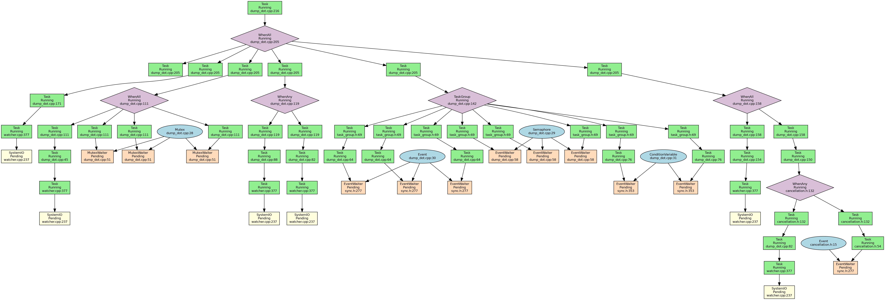
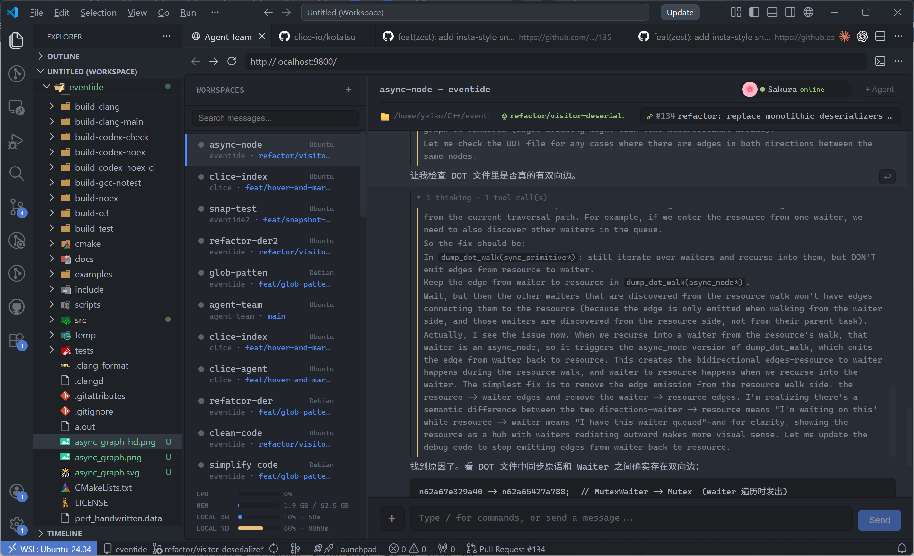
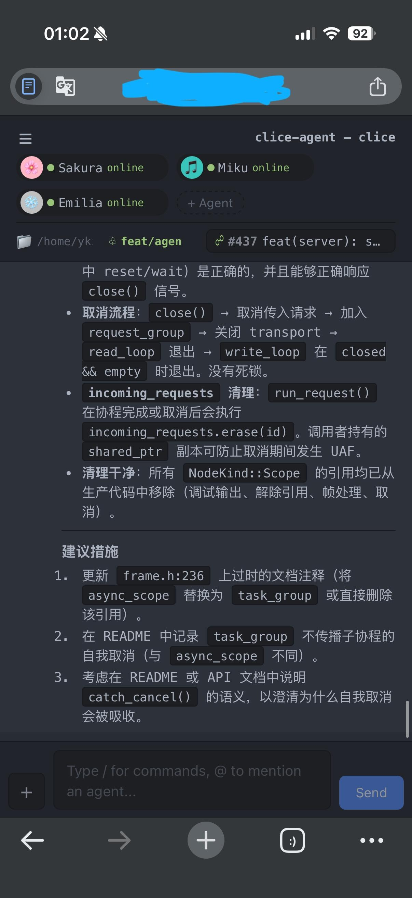

## Summary
The clice developer describes rebuilding the project's infrastructure around [[StructuredConcurrency]], a tested [[Kotatsu]] foundation library, and a crash-isolating multiprocess compiler architecture. The article also reports extensive AI-assisted implementation while retaining human control over architecture and argues that a useful [[AgentNativeLanguageServer]] needs batch operations, cross-worktree caching, selective diagnostics, and semantic project queries rather than an LSP wrapper designed for human editors. These are first-person project reports and design hypotheses: the author says the current main branch still has known cross-environment issues and has not yet reached a public 1.0 release.

## Key Claims
- [[Clice]] replaced loose coroutine lifetime management with a [[StructuredConcurrency]] framework in which cancellation is a first-class outcome and propagates through the task graph.

- [[Kotatsu]] extracts clice's reusable infrastructure—async execution, I/O, IPC, HTTP, static reflection, serialization, CLI parsing, and testing—so the language server can concentrate on domain logic.
- clice isolates Clang frontend work in a process pool because crashes, hangs, undefined behavior, and leaks cannot be recovered reliably inside the multithreaded server process; stateful and stateless workers amortize process startup.
- A fast include-graph scanner trades some precision for cacheability and reports roughly 20,000 files per second and a claimed 100-fold speedup; the same architecture supports C++20 module dependency scans, recursive builds, cycle detection, and selectable compilation contexts.
- The author delegates most implementation to coding agents but retains architecture, review, context supply, and release judgment; tests, static checks, independent review agents, smoke tests, and fuzzing are proposed as deterministic feedback against model uncertainty.
- The author's custom [[AgentTeam]] orchestrator runs multiple workspaces and coding or review agents through a VS Code web view and can also be supervised from a phone.

- An [[AgentNativeLanguageServer]] should expose semantic code intelligence through a protocol designed for fast batch edits, concurrent worktrees, asynchronous selective retrieval, call and include graphs, and agent-chosen detail rather than simply wrap human-oriented LSP calls.

## Key Quotes
> “Context is all you need.” — on the author's view that current coding-agent failures often come from missing project context.

> “agent 可以代替你完成编码任务，但是不应该代替你思考” — on preserving human design judgment while delegating implementation.

> “clice 的核心是一套实时的编译系统，LSP 只是这套系统的一个消费者。” — on why clice can offer a separate agentic protocol.

## Connections
- [[Clice]] - C++ language-server project whose architecture, progress, and agent-native direction are the article's central case.
- [[Kotatsu]] - extracted infrastructure library containing the new async framework and reusable server facilities.
- [[StructuredConcurrency]] - cancellation and lifetime model used to organize clice's asynchronous dependency graph.
- [[AgentNativeLanguageServer]] - proposed semantic interface tailored to coding-agent access patterns rather than human editor interaction.
- [[AgentTeam]] - the author uses multiple implementation and review agents through a custom web orchestrator.
- [[AICodingPractice]] - the article advocates deliberate context supply, human architectural control, deterministic checks, and task-specific delegation.
- [[ContextCoding]] - project context is presented as the main boundary on agent performance in architecture and cross-file reasoning.
- [[HarnessEngineering]] - tests, static analysis, review agents, smoke tests, and fuzzing form feedback around probabilistic implementation.
- [[ConcurrentProgramming]] - clice's cancellation problem is a concrete modern concurrency case involving coroutines, dependency graphs, and synchronization primitives.

## Contradictions
- The article challenges blanket claims that AI-generated code is low quality, but its evidence is one experienced developer's self-report without defect-rate, review-cost, or productivity comparisons; it also says agents remain weak at architecture, reuse, and cross-context reasoning.
- The claim that a multiprocess design is the only thorough answer to Clang failures is a project design judgment, not a comparative evaluation against all isolation or recovery techniques. Reported IPC overhead, scanner throughput, and speedup figures lack benchmark configuration and independent replication.
- The agent-native protocol is an early daemon and CLI experiment. The proposed advantages over grep, LSP, and clangd MCP have not yet been demonstrated through controlled agent-task outcomes.
- Release readiness remains explicitly limited: the author reports known corner cases outside the local environment and plans friend testing before 1.0 rather than claiming production maturity.
- All three remote images were opened and retained at their semantic positions. The graph supplies architectural relationships not fully repeated in prose, while the desktop and mobile screenshots document the orchestrator's multi-workspace, multi-agent, review, and remote-supervision interfaces.
