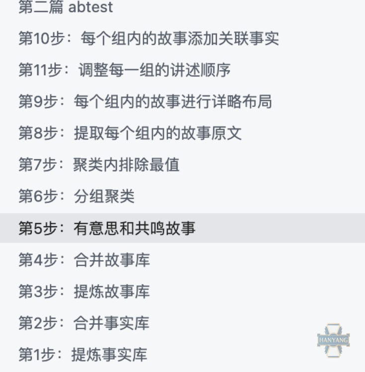

这篇文章整理自《诗梳风》播客中关于人文工作者如何使用 AI 的公开分享。作者反对把 AI 当作能够凭提示词一次性完成作品的魔法工具，而是主张把它接入写作、研究、编辑、选题、资料整理与生产流程，让过程保持可追溯、可监督、可验证，并且最终仍由人承担署名责任。

文章的核心判断是：人文工作者没有主动创造 AI 带来的世界变化，却正在最前沿承受这种变化。可行的应对方式不是索要黑箱结果，而是把 AI 当成工作台，通过明确任务对象、背景材料、结构要求、判断标准和流程步骤，让模型在可控的小任务中稳定发挥作用。

## 方法要点

- 底线是过程可追溯、可监督、可验证；系统必须可操纵；最终产物应达到使用者愿意署名的程度。
- “解释一篇论文”“写一篇好文章”这类愿望式请求过于模糊，应该改写成包含受众、目标、结构、语气和评价标准的工作任务。
- 初学者可以把同一问题交给多个 AI，以体会不同模型在写作、推理、检索、审稿和结构生成上的差异。
- AI 的常识水平可以近似视作优秀本科生；超过常识的材料、标准、范例和禁区需要由使用者提供。
- AI 更适合稳定完成一串小步骤，而不是一次性产出最终答案。文本转语音、多音字处理、事实提炼和结构提取等任务都需要拆分。

## 生产观

文章把有效的人机协作描述为“产线”而非“抽卡”。如果写作或研究流程本身无法描述、复现和质检，AI 也很难可靠参与；反过来，一旦能把非虚构写作拆成故事选择、例子处理、起承转合、过渡和收尾等步骤，不同模型就可以分别承担局部工作。

作者还强调，AI 会倾向于走省力路径，所以人应把算力用于理解文本，而不是消耗在格式噪音中。网页、PDF、EPUB 和长材料最好先被转换、清洗、提炼或入库，再进入写作环节。压缩通常比扩张可靠：更好的路径是让 AI 基于充分材料提炼结构和正文，而不是用少量提示词要求它凭空生成。

## 品质判断

文章提出，在 AI 时代作品质量越来越像“材料 × 品味”。模型会变化，方法会迭代，但材料仍来自真实世界，品味仍来自长期训练。当生成变得便宜，稀缺的是判断什么值得写、哪些证据更硬、哪种叙述更有力量，以及是否愿意为材料付出体力劳动。

## 相关知识

- [人文工作者的 AI 工作流]()
- [把 AI 当作可迭代产线]()
- [材料乘以品味]()
- [汉洋]()
- [FUNES]()
- [诗梳风]()
