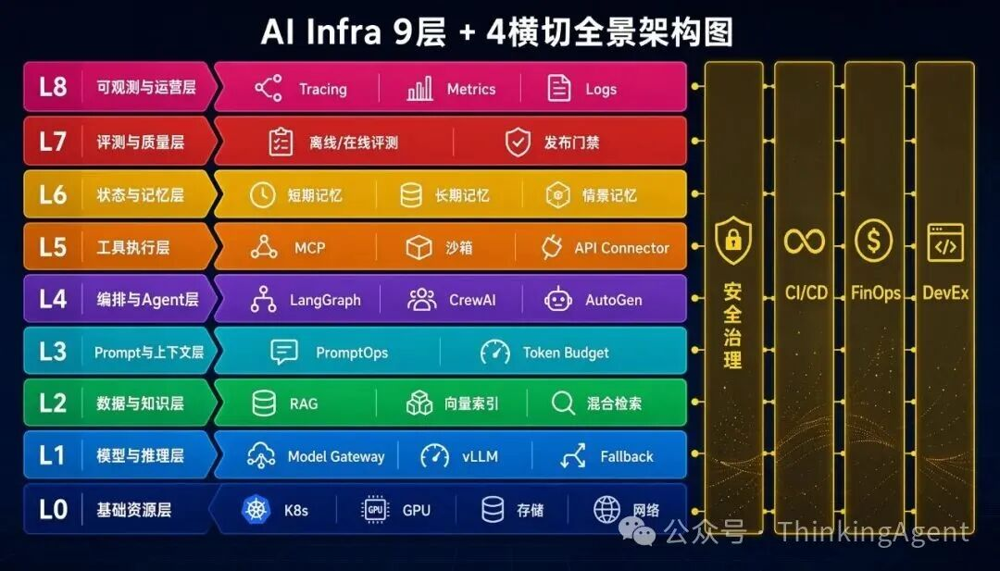
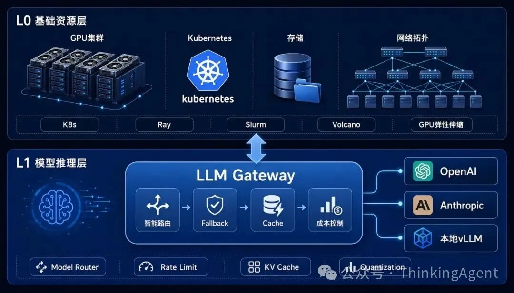
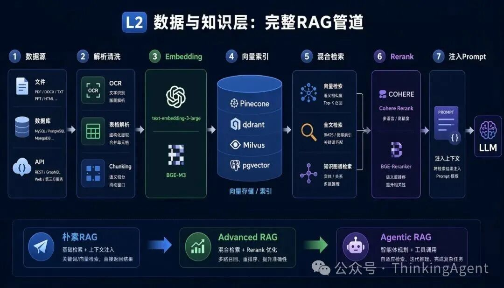
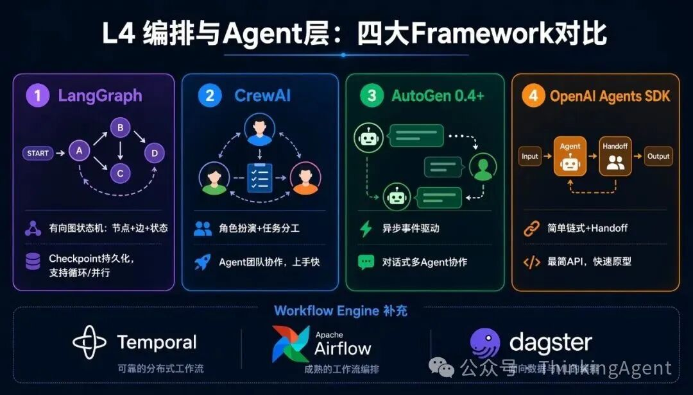
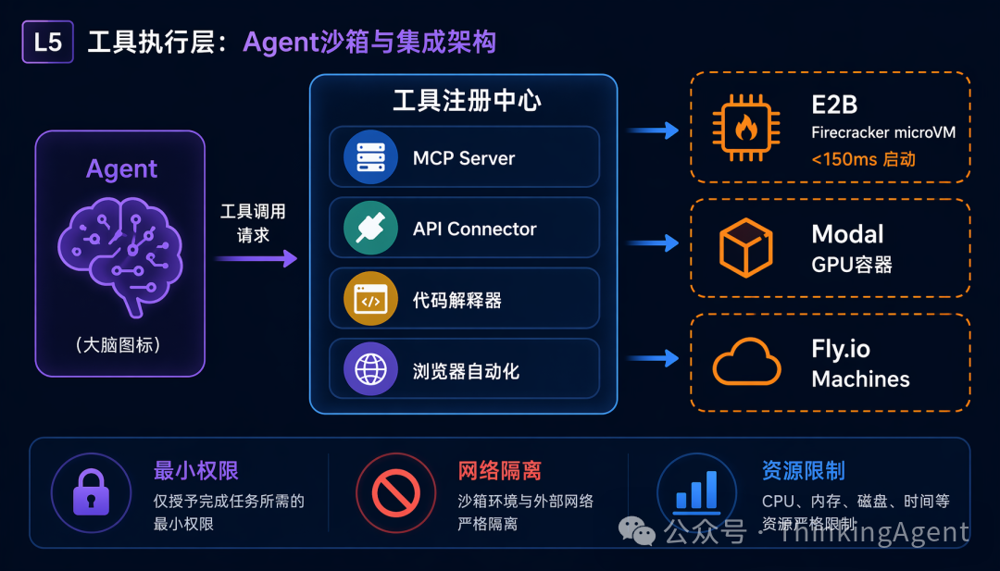
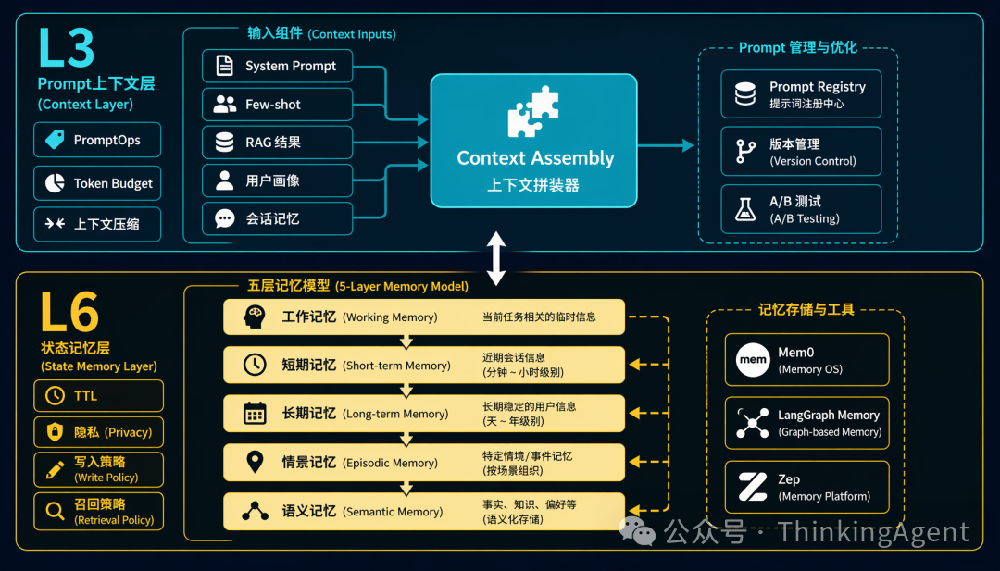
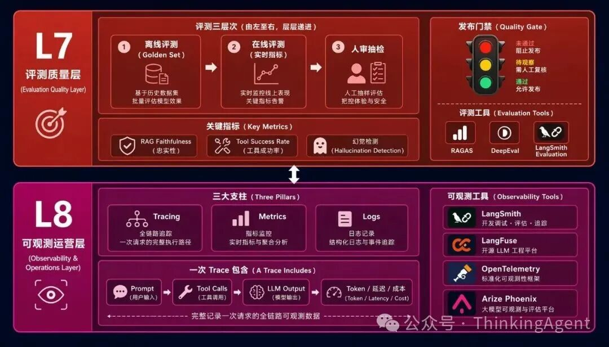
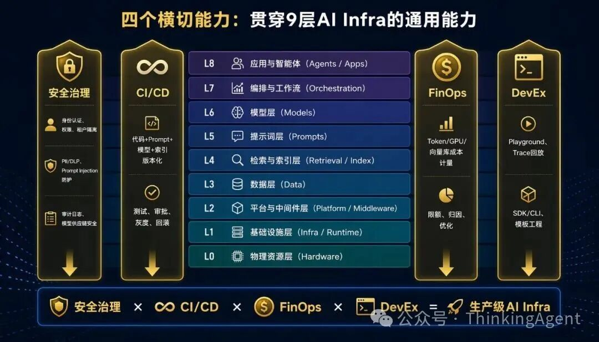

## Summary
[[AIInfrastructureStack]] organizes production AI systems into nine vertical layers—from compute and model serving through data, context, orchestration, tools, memory, evaluation, and observability—and four cross-cutting capabilities: security, delivery governance, cost governance, and developer experience. The central argument is that an agent framework plus a vector store can support a demo, but production operation requires the surrounding control, evidence, isolation, lifecycle, and economics layers. The article adds a staged adoption path, while its named tools, version claims, latency figures, and database recommendations remain point-in-time practitioner guidance rather than comparative evidence.

## Key Claims
- A production AI stack has nine distinct responsibility layers: infrastructure resources, model serving, data and knowledge, prompt and context, agent orchestration, tool execution, state and memory, evaluation and quality, and observability and operations.
- Model gateways should normalize providers and combine routing, fallback, quotas, caching, batching, streaming, and cost controls rather than exposing every application directly to one model endpoint.

- The data layer is a pipeline, not a vector database: ingestion, parsing, chunking, embedding, indexing, hybrid retrieval, reranking, authorization, and prompt injection each have separate failure modes.

- Agent frameworks and workflow engines solve different problems: frameworks express model-directed state and collaboration, while durable workflow systems support long-running execution, recovery, and scheduled data work.

- Tool execution needs a registry plus independently enforced least privilege, network isolation, resource limits, result validation, idempotency, and compensation for side effects.

- Prompt/context assembly and memory are coupled lifecycle systems: selected instructions, retrieved knowledge, profile, conversation, and token budgets shape the active context, while durable memory needs expiration, privacy, write, and recall policies.

- Evaluation and observability are complementary: offline, online, and human review determine whether a change is acceptable, while traces, metrics, and logs make individual execution paths diagnosable and attributable.

- Security, CI/CD, FinOps, and developer experience cut across the full stack and should govern identities, versions, costs, debugging, and releases rather than appear as late production add-ons.

## Key Quotes
> “绝大多数 Agent 项目停留在Demo阶段，无法融入生产。” — on the gap the stack is intended to explain.

> “每一步都有日志，每一步都可追溯，每一步都有 Fallback。” — on the desired operating properties of an end-to-end agent call.

## Connections
- [[AIInfrastructureStack]] - the source's nine-layer, four-cross-cutting architectural taxonomy.
- [[ProductionAgentInfrastructure]] - places agent-specific runtime semantics inside a wider production platform and operating model.
- [[GenerativeAIAgentArchitecture]] - supplies the model, orchestration, tool, context, and state core that the broader stack surrounds.
- [[RetrievalAugmentedGeneration]] - appears as a multi-stage, permission-aware data pipeline rather than vector lookup alone.
- [[AgenticWorkflowPatterns]] - connects model-directed agent loops to explicit workflow and orchestration choices.
- [[SemanticIsolation]] - distinguishes code execution containment from capability, credential, network, and side-effect boundaries.
- [[AgentMemory]] - receives an explicit lifecycle layer with working, short-term, long-term, episodic, and semantic forms.
- [[SoftwareVerification]] - underlies offline evaluation, online measurement, human review, regression tests, and release gates.
- [[ServiceObservability]] - supplies trace, metric, log, latency, token, and cost evidence for operation and diagnosis.
- [[InternalDeveloperPlatform]] - standardizes playgrounds, trace replay, debugging, dashboards, SDKs, CLIs, and templates across the stack.

## Contradictions
- No direct contradiction with the wiki's existing production-agent material was found. The article broadens that material into a platform taxonomy, but its checklist does not replace existing requirements for durable effect logs, scoped capability gateways, or semantic recovery.
- The final retained cross-cutting-capabilities diagram labels applications as L8 and physical hardware as L0, with models at L6 and orchestration at L7; this conflicts with the article's primary taxonomy, where observability is L8, models are L1, and orchestration is L4. It is retained for its cross-cutting relationships, not as consistent layer numbering.
- The worked “single agent call” places offline evaluation inside the request path. Elsewhere the article correctly defines offline evaluation as pre-release, so this step should be read as a quality-gate dependency rather than a literal per-request operation.
- Product versions, launch latencies, database scale guidance, and “best” tool recommendations are uncited or vendor-derived point-in-time claims. The source gives no benchmarks, workload measurements, reliability data, security audits, or total-cost comparison.
