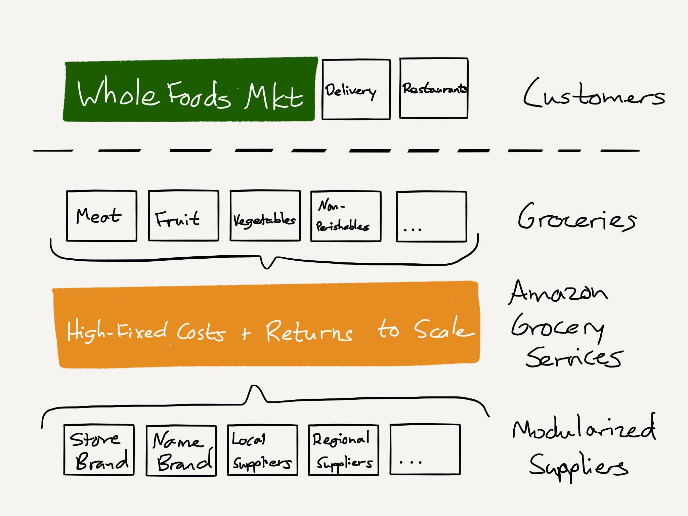

## Summary
[[BenThompson]] argues that Amazon's agreement to buy [[WholeFoods]] should be understood less as buying a retailer than as acquiring the anchor customer needed to bring a modular grocery-services platform to local scale. The article connects this move to [[AWS]], Marketplace, fulfillment, and logistics through [[FirstAndBestCustomer]]: Amazon first justifies high fixed-cost infrastructure with its own demand, then sells the resulting primitives to outside customers and deepens its economies of scale. This is a 2017 strategic forecast, not evidence that the proposed restaurant-supply and grocery-services expansion later occurred.

## Key Claims
- Analysts can misread a competitor by confusing its goal, strategy, and tactics; Thompson frames ecommerce as one Amazon tactic rather than its ultimate strategy.
- [[AmazonPrime]] creates a consumer-retail moat through convenience, reliability, and prepaid membership, but groceries remain a recurring route through which other retailers can reach Prime members.
- Grocery ecommerce differs structurally from books because selection is less expansive, perishables vary in quality, inventory spoils, and useful scale must be achieved city by city.
- AmazonFresh lacked a [[FirstAndBestCustomer]] large enough to absorb fixed grocery infrastructure and reduce spoilage and local scale disadvantages.
- Buying [[WholeFoods]] could provide that anchor demand while Amazon decomposed an integrated grocery supply chain into reusable meat, produce, bakery, non-perishable, store-brand, and supplier primitives.
- The inspected diagram extends the prose by placing Whole Foods Market, delivery, and restaurants above a shared high-fixed-cost Amazon Grocery Services layer connected to modularized suppliers below.
- Thompson's broader claim is that [[Amazon]] behaves as a scale-protected services provider: it converts infrastructure built for itself into external services rather than remaining defined by retail categories.

## Key Quotes
> "Amazon is buying a customer" — Thompson's interpretation of the Whole Foods acquisition.

> "At its core Amazon is a services provider enabled — and protected — by scale." — the article's concluding company model.

## Connections
- [[BenThompson]] — Stratechery analyst applying a goal-strategy-tactics and platform-services lens to the acquisition.
- [[Amazon]] — company interpreted as a scale-driven services provider rather than only a retailer.
- [[WholeFoods]] — acquired retailer framed as the anchor customer for grocery infrastructure.
- [[AmazonPrime]] — consumer moat whose grocery gap motivates Amazon's persistence in the category.
- [[AWS]] — primary analogy for turning internally justified infrastructure primitives into an external service.
- [[AmazonCapabilityLedExpansion]] — broader pattern in which internal operating capabilities become platforms or adjacent businesses.
- [[FirstAndBestCustomer]] — mechanism through which internal demand underwrites fixed costs before external commercialization.

## Contradictions
- No direct contradiction found. The article strengthens the existing capability-led expansion thesis but is explicitly prospective: it does not establish that Amazon successfully created the predicted grocery-services platform or supplied restaurants.
