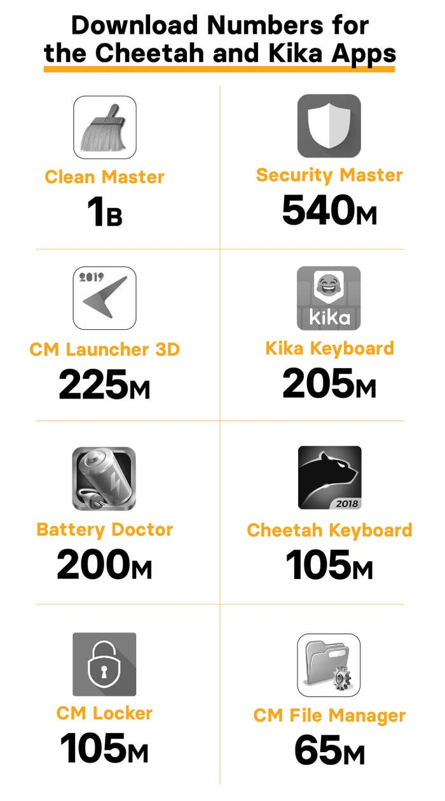

## Summary
[[CraigSilverman]] reports [[Kochava]]'s finding that seven [[CheetahMobile]] apps and [[KikaTech]]'s keyboard exploited Android permissions and last-click install attribution to claim bounties for downloads they did not cause. The alleged methods combined click injection, click flooding, automatic app opening, and attribution laundering through more than 20 ad networks, exposing how a measurement system can be manipulated by software already present on a device. Cheetah and Kika disputed intentional wrongdoing, while the evidence presented by Kochava and Method Media Intelligence tied the suspect behavior to proprietary code in the apps.

## Key Claims
- Eight apps with more than 2 billion combined Google Play downloads were alleged to have committed [[AppInstallAttributionFraud]] at large scale.
- Cheetah apps allegedly watched for new downloads, emitted a late attribution click, and sometimes opened the installed app so Cheetah would appear to have delivered the user and collect a $0.50-$3 install bounty.
- Kika Keyboard allegedly used visibility into Play Store searches to flood candidate apps with clicks and also injected clicks around installations, including while the keyboard was not active.
- Last-click attribution created the exploitable decision point: the party associated with the latest recorded click could receive payment even when it supplied no ad or marketing value.
- Proprietary software allegedly spread claims across more than 20 ad networks, sometimes using false app names or obscured sub-publishers to conceal where the claimed installs originated.
- Broad Android permissions enabled the scheme and created user harms beyond advertiser loss, including privacy exposure, battery drain, and data use.
- The eight-app download chart totals about 2.445 billion downloads, led by Clean Master at 1 billion and Security Master at 540 million.

## Key Quotes
> "This is theft - no other way to say it" - Kochava's Grant Simmons on claiming install bounties without contributing to the installation.

> "The entire industry needs to do more than hide behind plausible deniability" - analyst Richard Kramer on platform and ad-industry accountability.

## Connections
- [[CraigSilverman]] - BuzzFeed News reporter who assembled the allegations, company responses, and platform context.
- [[Kochava]] - attribution company that detected and documented the click flooding and injection behavior.
- [[CheetahMobile]] - owner of seven implicated utility and keyboard apps and developer of the SDK Kochava tied to suspect activity.
- [[KikaTech]] - owner of Kika Keyboard, which Kochava said combined search monitoring, click flooding, and click injection.
- [[AppInstallAttributionFraud]] - the source's central mechanism for stealing install credit and bounties.
- [[MarketingAttribution]] - last-click credit is the measurement rule the alleged scheme gamed.
- [[Android]] - permission and app-event environment in which the alleged behavior operated.
- [[GooglePlay]] - distribution platform for the apps and the app searches and installations at issue.
- [[Google]] - platform owner asked to investigate and remove apps when abuse evidence emerges.

## Contradictions
- Cheetah Mobile said third-party SDKs were responsible and denied that its own SDKs performed click injection; Kochava said the implicated SDK was owned and developed by Cheetah.
- Kika Tech denied intending fraud and said it would investigate, while Kochava and Method Media Intelligence said the behavior used Kika's proprietary software and built-in app functions.
- Google initially said it had not confirmed fraudulent tactics. After publication, CM Locker and Battery Doctor disappeared from Google Play; Cheetah said it had removed them voluntarily and temporarily.
