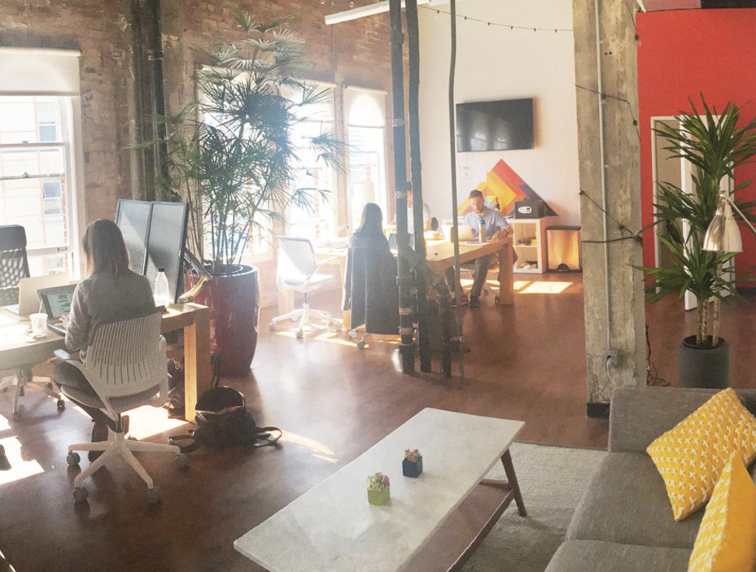

## Summary
Even argues that workplace benefits should make life outside work easier and support focused work rather than keep employees at the office or import leisure into it. Its [[WorkplacePerkDesign]] distinguishes benefits such as minimum paid leave, flexible schedules, health coverage, compensation, equity, and flexible stipends from “anti-perks” such as daily catering, entertainment rooms, alcohol, mandatory social events, and pet-friendly offices. The company applies the same reasoning to workspace design by adding rooms for different work and collaboration modes while declining to build a recreation area; the result is a values-led small-company case, not comparative evidence that the exclusions improve wellbeing or performance.

## Key Claims
- [[Even]] treats employee autonomy and mutual trust as reasons to support life outside work without deciding how employees should relax.
- A useful perk reduces external friction or supports sustainable performance; a supposed perk becomes an anti-perk when it encourages longer office presence, distraction, unhealthy behavior, coercive participation, or exclusion.
- Minimum paid vacation, flexible schedules, medical coverage, equity, salaries, and flexible health, education, and financial-consulting stipends are presented as benefits employees can use according to their needs.
- Office design should support varied modes of focused and collaborative work; Even added private rooms, shared offices, and flex space but deliberately omitted a recreation area.
- Regular catered lunches can reduce movement, alcohol-centered events can burden people who abstain or face addiction, mandatory fun can extend social obligation beyond work hours, and pets can distract or exclude colleagues.
- Perk choices should follow the team's stated values and changing needs rather than imitate a generic Silicon Valley package.

## Key Quotes
> "Knowing what you want to exclude from your offices is just as important as knowing what you want to include in them." - on designing the work environment through deliberate omission.

> "They know what will best help them unwind." - on leaving non-work choices to employees.

## Connections
- [[Even]] - the 17-person company whose Oakland office and benefits philosophy form the case.
- [[WorkplacePerkDesign]] - the source's central distinction between employee-enabling benefits and office-bound anti-perks.
- [[WorkplaceIncentiveDesign]] - perks influence movement, attention, attendance, inclusion, and how long people remain at work.
- [[VacationPolicy]] - Even reports paid vacation with a required minimum rather than relying only on nominal permission.
- [[WorkplaceCollaboration]] - the office redesign added spaces for different collaboration levels, while weekly lunch provided a workday-based alternative to after-hours bonding events.
- [[BurnoutPrevention]] - flexible schedules, minimum leave, and support outside work are presented as conditions for sustainable performance.

## Contradictions
- The source qualifies one-size-fits-all perk lists and the assumption that visible office amenities necessarily improve employee wellbeing or productivity.
- The account is a 2017 company-authored essay about a 17-person team. It reports perceived improvement after the redesign but provides no usage data, employee-level outcomes, comparison group, dissenting views, or evidence that the exclusions transfer to larger, remote, unionized, accessible, or culturally different workplaces.
