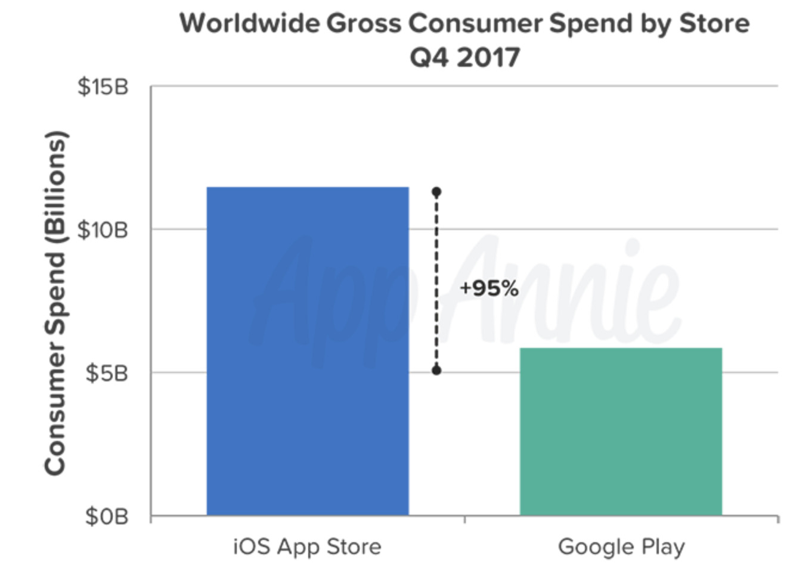

## Summary
AppleInsider reports [[AppAnnie]]'s Q4 2017 app-market estimates: [[GooglePlay]] delivered more than 19 billion new downloads against roughly 8 billion for Apple's [[AppStore]], while App Store consumer spend reached $11.5 billion and exceeded Google Play by a reported 95%. The comparison reinforces [[MobileAppStoreEconomics]] as a split between [[Android]]'s wider download reach and [[IOS]]'s stronger direct monetization, but the article's rounded figures and unsupported causal claims require caution.

## Key Claims
- New downloads across the two stores approached 27 billion in Q4 2017, with more than 19 billion on Google Play and roughly 8 billion on the App Store; re-installs and updates were excluded.
- Combined downloads grew 7% year over year, while consumer spending on apps and subscriptions grew 20% to about $17 billion.
- Apple's App Store generated $11.5 billion in consumer spend, reported as 95% more than Google Play despite handling fewer than half as many downloads.
- Google Play's limited presence in China means the store comparison does not measure all Android app distribution or spending in the world's largest app market.
- The article says Netflix was the top-grossing app by customer spend and argues that stronger iOS monetization can encourage premium developers to prioritize iOS.

## Key Quotes
> "new app downloads (not counting re-installs or updates) across both stores approached 27 billion" - scope and total for the reported download comparison.

> "revenue from app sales and subscriptions grew far faster: 20 percent" - year-over-year consumer-spend growth reported by the article.

## Connections
- [[AppAnnie]] - analytics firm identified as the source of the Q4 2017 estimates.
- [[AppStore]] - marketplace with lower download volume but substantially higher reported consumer spend.
- [[GooglePlay]] - marketplace with greater download volume but lower reported consumer spend and limited China coverage.
- [[Apple]] - platform owner whose iOS customer base is presented as more valuable for paid apps and subscriptions.
- [[Google]] - platform owner associated with Google Play's broad Android reach.
- [[Android]] - mobile ecosystem behind Google Play's download advantage.
- [[IOS]] - mobile ecosystem behind the App Store's spending advantage.
- [[MobileAppStoreEconomics]] - framework separating distribution scale from monetization strength.

## Contradictions
- The article first says Google Play served 145% more downloads than the App Store, consistent with more than 19 billion versus roughly 8 billion, but later describes this as only "nearly one and a half times as many downloads."
- The retained chart depicts Google Play near $5.9 billion and labels the App Store's $11.5 billion as 95% higher; the prose instead rounds Google Play to "around $5 billion" and total spend to $17 billion, so the displayed and written figures do not reconcile exactly.
- The article infers lower Android subscription propensity and connects bootleg content to iOS-first premium development, but it provides no direct subscription-rate, piracy-rate, or developer-prioritization evidence for those causal claims.
