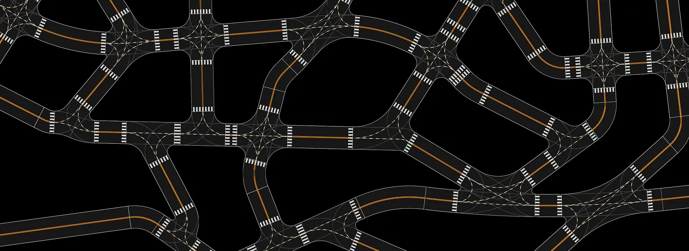
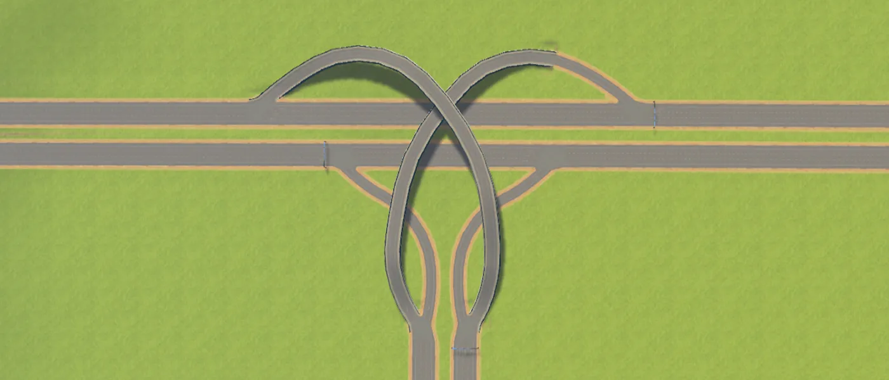
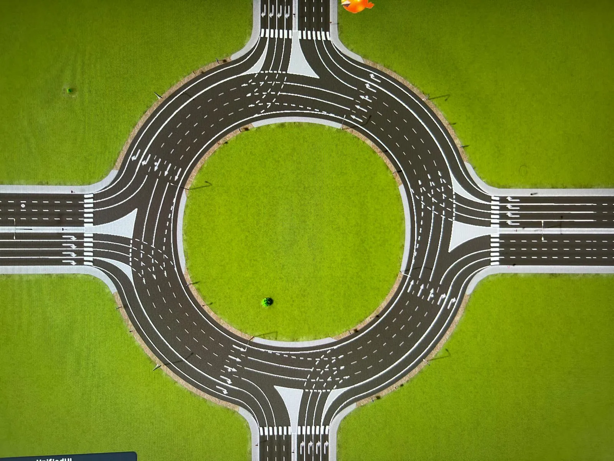
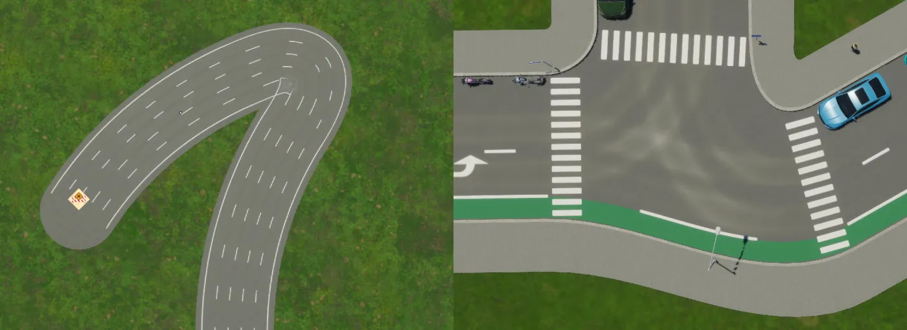
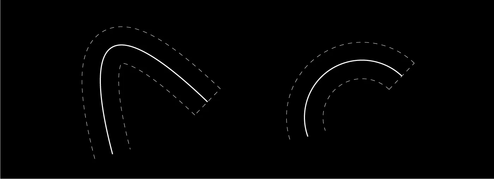
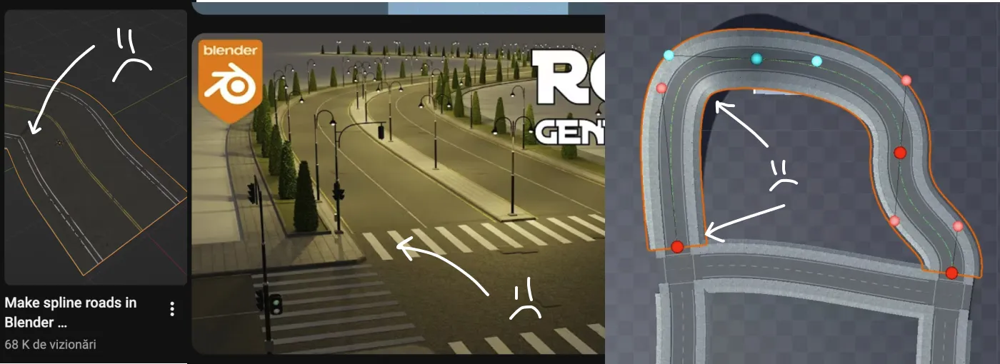

## Summary
Sandbox Spirit argues that realistic procedural roads require geometry constrained by vehicle motion, not merely visually smooth centerlines. The article uses [[CitiesSkylines]] examples to show how unconstrained Bézier splines can pinch or self-intersect when offset, proposes circular arcs as a practical urban-intersection primitive, and identifies clothoids as the higher-fidelity option for smooth high-speed curvature transitions. Its custom road-system demo shows roads and intersection connectors being regenerated as endpoints move, but the post does not provide implementation details or performance measurements.

## Key Claims
- [[ProceduralRoadGeometry]] should model lane-width preservation, curvature, intersection construction, and vehicle motion constraints rather than treating any smooth centerline as road-like.
- Offsets of a Bézier curve are generally not themselves Bézier curves, so tight offsets can produce pinching, mismatched inner and outer boundaries, or self-intersection.
- Circular arcs preserve concentric parallel offsets and make curve-intersection calculations simpler, making them a practical choice for lower-speed urban roads and intersections.
- Circular arcs introduce an abrupt curvature change where a straight meets an arc; transition curves such as clothoids increase curvature gradually and better suit high-speed travel.
- Modding can improve markings, merges, and transitions in [[CitiesSkylines]], but remains bounded by the game's underlying road model.
- The indie-tooling gap motivates a custom road system that combines manipulable road segments with procedurally regenerated intersection connectors.

## Key Quotes
> "The offset of a Bezier curve is not a Bezier curve." — on the representation mismatch behind tight road-boundary failures

> "Vehicles move slowly on city streets. For intersections of urban roads, circular arcs are more than a decent choice." — on choosing fidelity by operating context

## Connections
- [[CitiesSkylines]] — historical and visual case for increasing road-placement freedom, mod-enabled realism, and persistent geometric limits.
- [[ProceduralRoadGeometry]] — the article's central engineering problem of generating plausible road surfaces and intersections from constrained curves.
- [[IndieGameDevelopment]] — the custom system is motivated partly by weak off-the-shelf road tools available to independent developers.
- [[RamerDouglasPeuckerAlgorithm]] — related computational-geometry material, but focused on simplifying sampled trajectories rather than constructing offset road surfaces.

## Contradictions
- No direct contradiction with existing wiki content. The article's claims about constant-time circular-arc intersections, the ability to compose arbitrary road shapes from arcs, and clothoid offset behavior are practitioner assertions without derivations, benchmarks, or implementation evidence in this source.
