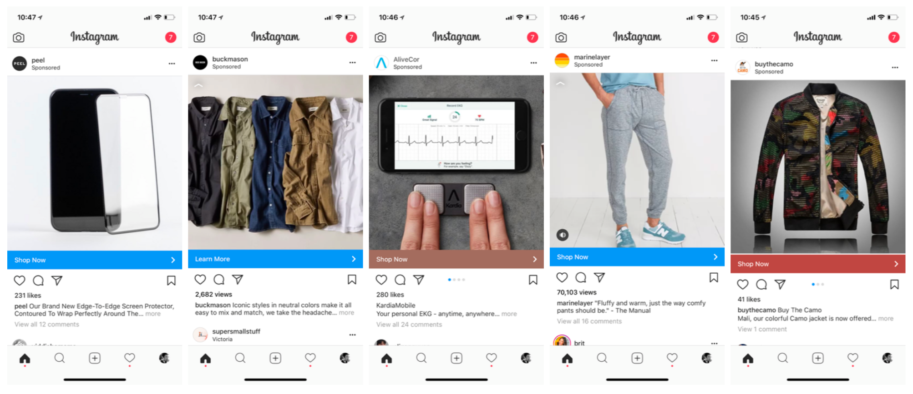
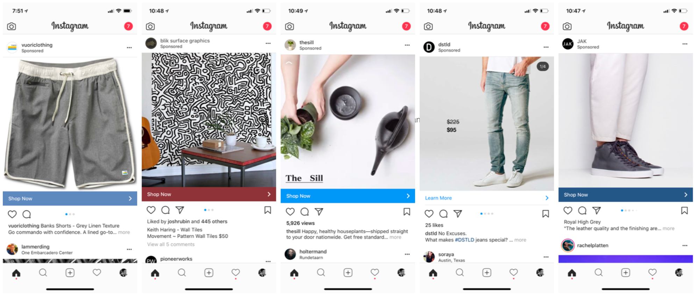

## Summary
[[ScottBelsky]] argues that incumbent consumer brands face aggregate competition from a long tail of small direct-to-consumer brands rather than only from a few new category dominators. These [[MicroBrandCommerce]] businesses combine social discovery and targeting, small-batch or on-demand supply chains, design-led differentiation, and lightweight commerce infrastructure to test and operate brands with low inventory and capital exposure. The article is a 2018 practitioner thesis supported by observed Instagram ads and anecdotes rather than comparative market data.

## Key Claims
- The collective long tail of micro brands can erode large incumbent brands even when no single challenger achieves category dominance.
- Small-batch, on-demand, and partner-managed manufacturing can let operators test several brand concepts before committing to inventory.
- Instagram-style interest, age, geography, and engagement targeting can match narrow brands to dispersed audiences and make customer acquisition more measurable.
- Tiny teams may reach meaningful revenue and margins because design, storefront, advertising, manufacturing, and fulfillment can be assembled from specialized services.
- Platforms and suppliers such as [[Instagram]] and [[Shopify]] may capture more durable value than any individual micro brand.
- Designers gain strategic leverage because brand concepts can be conceived, tested, iterated, and closed with relatively little overhead.
- Some micro brands may not need venture capital, because low fixed costs and delayed inventory commitments reduce the capital required to test demand.

## Key Quotes
> "Many of us failed to recognize the collective impact of the long-tail of micro brands." - thesis about aggregate competitive pressure.

> "These brands can be spun up and wound down quickly" - description of the low-commitment testing model.

> "the creativity and ingenuity of designers is at the center of the future of brands" - claim about who gains leverage.

## Connections
- [[ScottBelsky]] - author of the micro-brand thesis and disclosed investor in Lumi and several larger modern brands.
- [[MicroBrandCommerce]] - combines narrow positioning, modular operations, social targeting, and low-inventory testing.
- [[Instagram]] - discovery and paid-targeting surface illustrated by the two retained ad montages.
- [[Shopify]] - merchant infrastructure identified as a likely ecosystem winner.
- [[CustomerAcquisitionCost]] - operating decisions are framed around acquisition cost and the margin available from targeted Instagram demand.
- [[MinimumViableProduct]] - selling before a full inventory commitment functions as a demand test, though delayed delivery transfers risk to customers.
- [[PlatformDistributionDependence]] - micro brands gain reach from social platforms while remaining exposed to their data, ad pricing, and privacy rules.

## Contradictions
- No direct contradiction was found. The source qualifies category-dominance narratives by proposing aggregate fragmentation, but it does not measure incumbent share loss, survival rates, repeat purchase, returns, advertising-cost inflation, fulfillment quality, or the profitability of failed brands.
- The reported cases of tiny teams exceeding $10 million in sales are second-hand and unnamed, and the article's investment disclosures create a commercial perspective on the ecosystem it praises.
