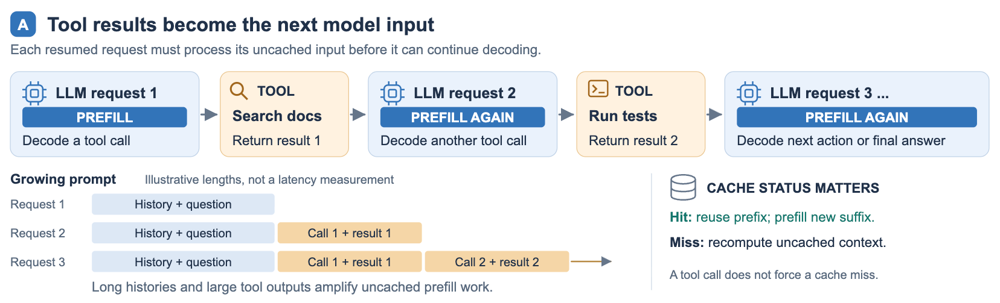
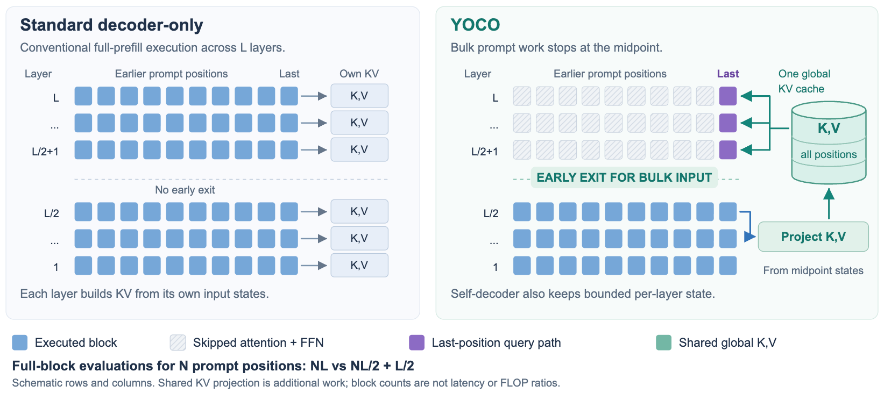
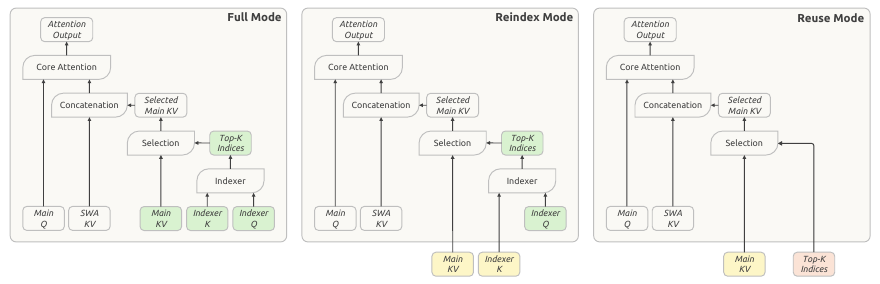
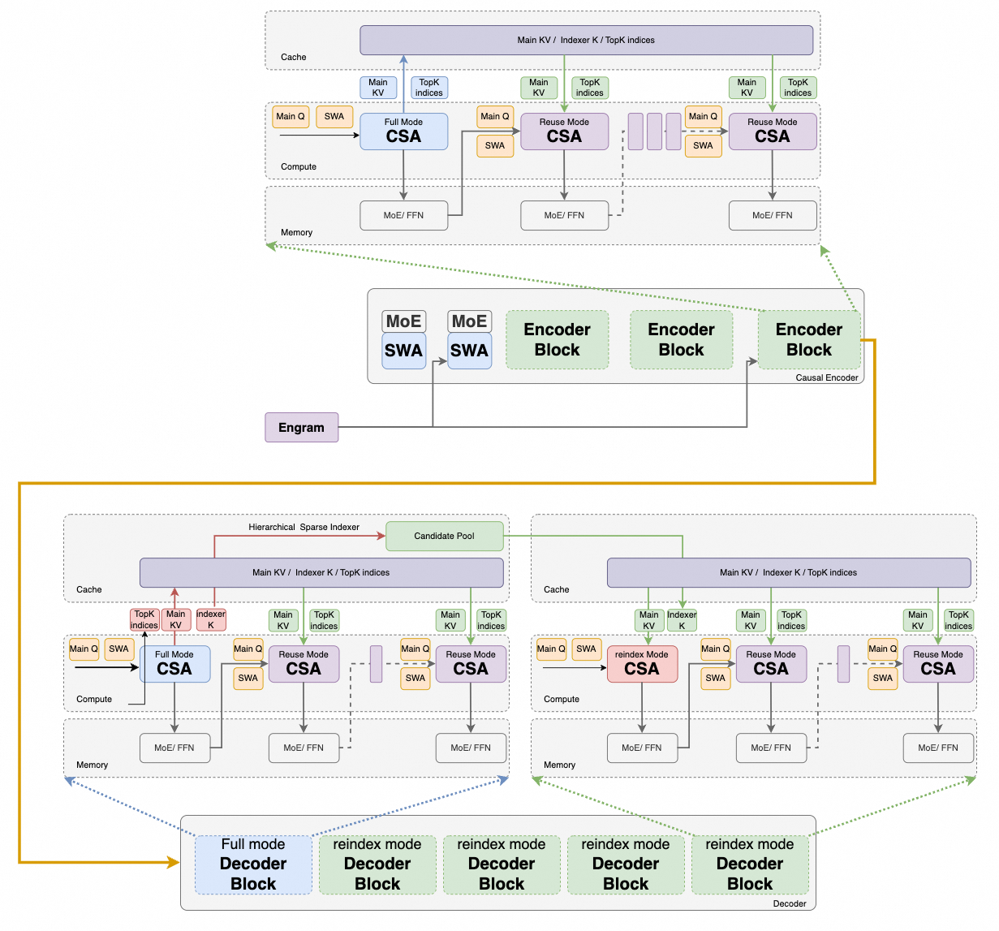
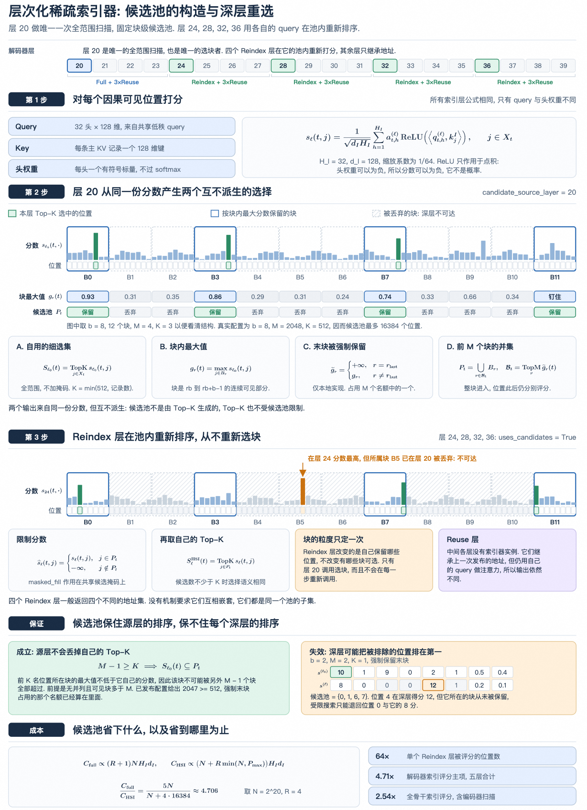
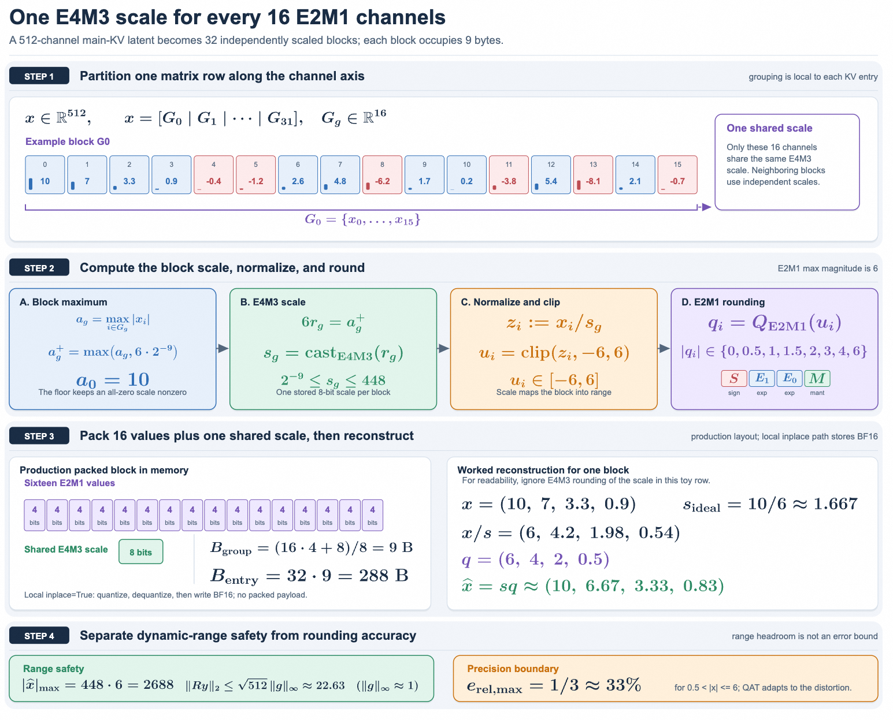
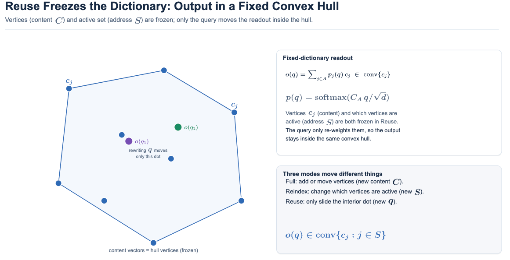
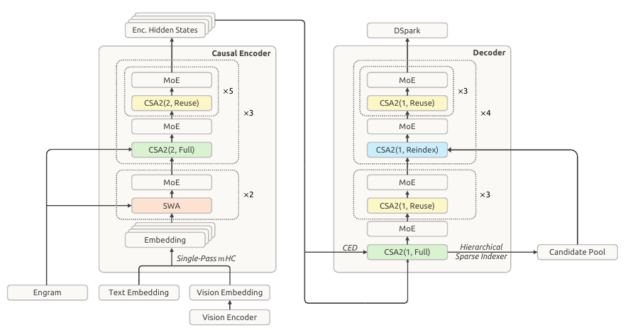
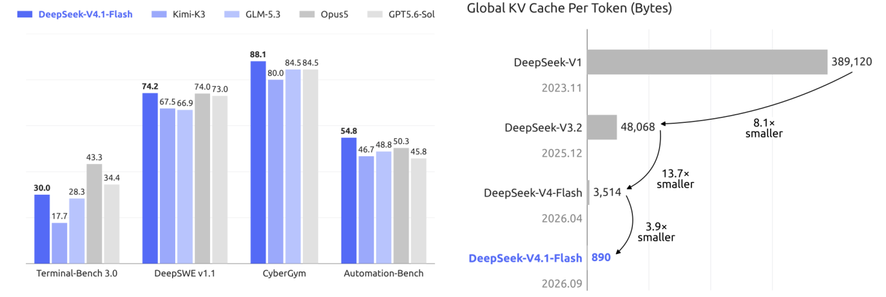

## Summary
[[Zartbot]] interprets [[DeepSeekV41Flash]] as a long-context model designed around storage, transfer, and prefill constraints rather than parameter count alone. Its central account combines [[CausalEncoderDecoderArchitecture]] to stop most prompt positions after 20 of 40 backbone layers, [[CompressedSparseAttention2]] to compress cache entries across channel, sequence, and layer dimensions, [[HierarchicalSparseIndexer]] to bound repeated sparse-routing work, and FP4 main-KV storage. The article's strongest original synthesis treats cached content, sparse addresses, and per-layer queries as three update rates: expensive content changes least often, addresses refresh selectively, and queries remain layer-specific.

## Key Claims
- Agent tool results repeatedly extend the prompt, so cache misses can turn each resumed request into substantial prefill work; long contexts also make persisted and transferred KV state a storage and bandwidth bottleneck.

- [[CausalEncoderDecoderArchitecture]] divides the 40-layer backbone into a 20-layer causal encoder and 20-layer decoder. Bulk prompt positions stop at the midpoint, while the decoder reads global KV projected from the encoder boundary and replays only a bounded recent suffix for per-layer sliding-window state.

- [[CompressedSparseAttention2]] reduces KV cost in three multiplicative dimensions: a 512-channel shared latent reduces per-entry width, encoder positions are compressed 2:1 while decoder entries remain per-token, and only four layers publish long-lived main KV across the 40-layer network.
- CSA2 separates three execution modes. Full computes main KV, indexer K, and Top-K addresses; Reindex reuses content but selects new addresses; Reuse keeps content and addresses while computing a fresh query and local SWA state.

- [[HierarchicalSparseIndexer]] lets decoder layer 20 scan the full causal history, retain up to 2,048 eight-position blocks as a 16,384-position candidate pool, and restrict layers 24, 28, 32, and 36 to independently selecting Top-512 addresses inside that shared pool.

- FP4 main KV uses E2M1 values with one E4M3 scale per 16 channels. A 512-channel entry therefore occupies 288 bytes, and the article derives 890 bytes per token for the four global main-KV and indexer-K sources, versus 3,514 bytes per token for its DeepSeek-V4-Flash baseline.

- Reuse is expressive but bounded: with cached content and Top-K addresses frozen, a new query exponentially tilts the attention weights and moves the output only inside the selected content vectors' convex hull. It cannot recover omitted content, move the hull's vertices, or replace the selected address set.

- The reported overall system also includes four-stream single-pass mHC residual mixing, two Engram conditional-memory modules, three DSpark speculative-decoding blocks, a multimodal vision path, and modality-specific MoE balancing; these features complement rather than directly produce the main KV-storage reduction.

- The article reproduces reported benchmark scores alongside the cache reduction, but the chart is not independent evidence that the architectural components individually preserve quality.

## Key Quotes
> “内容、地址、查询这三者就是‘注意力的三类自由度’。” — the article's abstraction for deciding what CSA2 must recompute or may reuse.

> “Full 重建 KV 缓存，跑完整 Indexer 加 TopK，是锚点。” — on the refresh hierarchy behind Full, Reindex, and Reuse.

## Connections
- [[DeepSeekV41Flash]] - model whose architecture, cache layout, and reported efficiency are analyzed.
- [[CausalEncoderDecoderArchitecture]] - reduces prefill by separating global-memory production from repeated decoder consumption.
- [[CompressedSparseAttention2]] - combines latent, positional, and cross-layer KV compression with decoupled address reuse.
- [[HierarchicalSparseIndexer]] - bounds later decoder index searches through a shared candidate pool.
- [[AttentionMechanism]] - supplies the query, key, value, selection, and weighted-readout basis for the reuse analysis.
- [[TransformerArchitecture]] - broader architecture family modified through causal early exit, shared global memory, MoE, and multimodal input.
- [[BlockQuantization]] - provides the per-block scale pattern used by the FP4 cache format.
- [[QuantizationAwareTraining]] - adapts the model to FP4 main-KV storage during post-training.
- [[KVCacheAwareRouting]] - deployment-level routing complements model-level cache compression by increasing the chance that reusable prefix state remains available.

## Contradictions
- No direct contradiction with the existing wiki was found. The source extends the standard [[TransformerArchitecture]] and [[AttentionMechanism]] accounts rather than replacing them: its “encoder” is causal and supplies shared global KV, not the bidirectional encoder of the original translation Transformer.
- The supplied Markdown has many missing mathematical symbols and values where rendered equations were lost, so exact derivations cannot be reconstructed from text alone; retained diagrams preserve several otherwise missing relationships.
- Cache sizes, benchmark scores, 420-tokens-per-second observation, quality retention, and training behavior come from the model report or the author's interpretation and are not independently replicated here. HSI's undisclosed post-training loss and the article's proposed query-aware KV-space mapping remain explicitly speculative.
