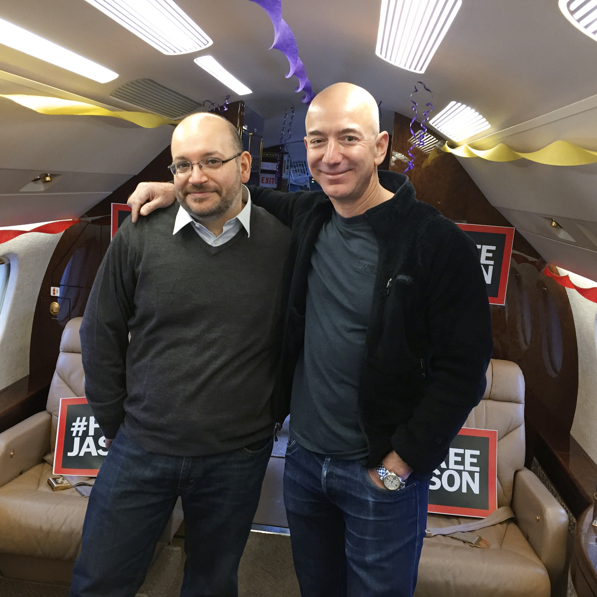
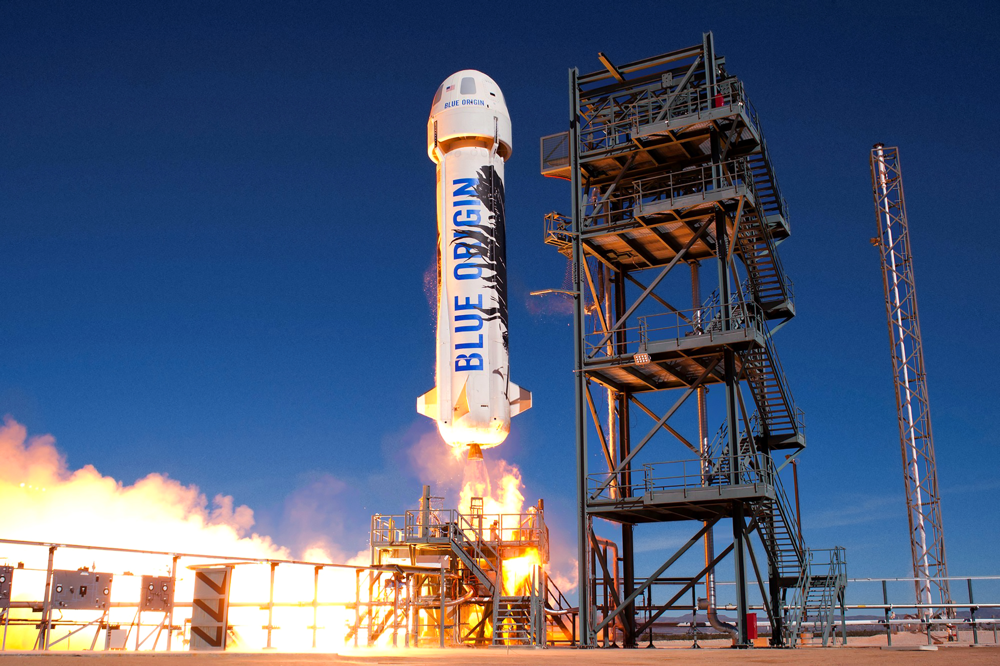
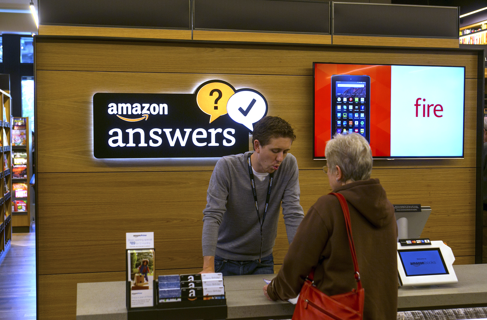

## Summary
Fortune profiles [[JeffBezos]] at a point when [[Amazon]] had become too large to manage through founder-centered control and his attention also spanned [[WashingtonPost]] and [[BlueOrigin]]. The article's unifying claim is that Bezos retained customer focus, long time horizons, written operating reviews, and intense standards while shifting from a prescriptive hub into a [[LeaderOfLeaders]] who chose a few high-leverage problems, empowered durable executives, and funded experimentation without quarterly punishment.

## Key Claims
- Bezos's personal retrieval of [[JasonRezaian]] after his release from Iranian detention is presented as both employee solidarity and a signal that the Post would not abandon its people.
- [[WashingtonPost]] used patient ownership and internet operating experience to accelerate digital experimentation through aggregation, PostEverything, a freelance talent network, faster pages, easier subscriptions, and its Arc publishing tools while [[MartyBaron]] retained editorial control.
- [[BlueOrigin]] paired a very long-term goal of millions of people living in space with iterative technical learning, including abandoning an unsuccessful alternative-launch approach, adopting liquid propulsion, and demonstrating a reusable New Shepard suborbital flight and landing.
- Amazon's scale forced Bezos to narrow his direct attention to selected future-facing work while long-tenured lieutenants ran major businesses; [[JeffWilke]] describes his style as changing from prescription toward teaching and refinement.
- Six-page written narratives, annual planning, and recurring operating reviews let Bezos inspect reasoning and progress without managing every decision directly.
- Long-horizon funding created room for risk at the Post and Blue Origin, but Amazon's intense culture remained contested after a New York Times investigation and Amazon's rebuttal.
- The inspected images independently show Bezos with Rezaian aboard the retrieval aircraft, New Shepard descending under rocket power beside its landing structure, and an Amazon Books counter integrating service, digital payment hardware, and Fire-device merchandising.

## Key Quotes
> "Today it's not a hub-and-spoke connecting to him." - Amazon director Patty Stonesifer on Bezos's leadership evolution.

> "I would say his style has gone from being more prescriptive to teaching and refining." - [[JeffWilke]] on Bezos at Amazon.

> "I have no interest in dying gracefully." - [[MartyBaron]] on adapting the Post to digital publishing.

## Connections
- [[JeffBezos]] - profile subject whose expanding commitments forced a change in leadership style.
- [[LeaderOfLeaders]] - central leadership pattern: scale through senior owners, operating mechanisms, selective depth, and teaching rather than universal prescription.
- [[Amazon]] - main company where long-tenured executives, narrative planning, and selective founder attention supported continued expansion.
- [[WashingtonPost]] - civic and media institution whose owner funded digital experimentation while staying out of coverage decisions.
- [[BlueOrigin]] - privately funded space company pursuing reusable flight and eventual human settlement in space.
- [[JasonRezaian]] - Post correspondent personally retrieved by Bezos after release from detention in Iran.
- [[MartyBaron]] - Post editor defending rapid digital adaptation and confirming editorial independence from Bezos.
- [[JeffWilke]] - Amazon consumer leader describing the shift from prescriptive control to teaching and auditing.
- [[StrategicWriting]] - Amazon and Blue Origin use six-page narratives to make decisions inspectable before meetings.
- [[AmazonCapabilityLedExpansion]] - AWS, Alexa, fulfillment, physical retail, media, and transport experiments reflect Amazon's continued capability expansion.

## Contradictions
- Bezos and Amazon defended the company's intense culture as a strength, while the New York Times investigation described a bruising workplace; this profile reports the dispute but provides no independent employee-outcome evidence to resolve it.
- Blue Origin's passenger timetable and orbital ambitions were forward-looking statements made in 2016, not demonstrated outcomes in this source.
- The Post's traffic and idea growth support digital momentum, but the organization disclosed no financial data, so the article could not establish economic sustainability.
