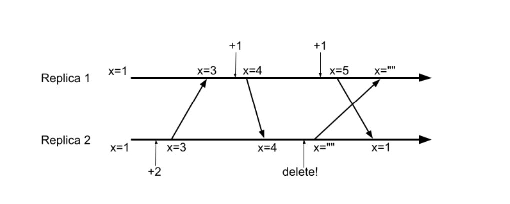
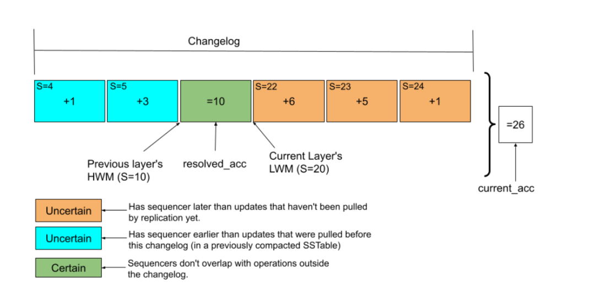

## Summary
[[CiJianDeShanLin|此间的山林]] uses Google's twenty-year retrospective to explain how [[Bigtable]] kept its storage and tablet-management skeleton while adding global replication, SQL, change streams, CRDT counters, materialized views, integrity checking, elastic sizing, and operational probes. The central architectural claim is that separating durable state from tablet servers created movable units, while attaching expensive coordination, derivation, validation, and maintenance to asynchronous background mechanisms preserved the foreground write path. The same stability carries costs: cross-feature interactions become subtle, replication remains eventually consistent, and the single-row transaction boundary still pushes modeling constraints onto applications.

## Key Claims
- Bigtable's separation of tablet-serving compute from Colossus-resident data lets tablets move without copying their contents, supporting balancing, autoscaling, external compaction, and offline access.
- Asynchronous pull replication accepts a mutation after one replica succeeds, isolates workloads and failure domains, and shifts progress tracking to each destination, but requires replication-aware garbage collection and accepts unbounded best-effort lag.
- SQL row-key schemas formalize user-defined composite-key conventions, while change streams, CRDT counters, and materialized views move selected computation into the database.
- Counter deletion is not commutative with increments: Bigtable resolves this by retaining per-layer subtotals and changelogs, then trimming operations around sequencer watermarks during LSM compaction.

- Expensive correctness work is also off the foreground path: checksums are verified at several mutation stages, and completed SSTables are fully reread, decrypted, decompressed, parsed, and checked before metadata publication.
- Scale forced internal parallelism and offload rather than a wholesale redesign: master locking and schema updates became finer-grained, file GC became distributed, and compaction, batch access, cache proxying, and bulk SSTable construction moved to independently scalable workers.
- Workload-aware resource control and operations are product capabilities: local slack pools absorb fast autoscaling, cache sizing follows a TCO knee point, hotspot movement avoids client-cache storms, ineffective Bloom filters can be disabled, and black-box probes measure a well-behaved user's latency.
- The architecture's unchanged single-row transaction limit demonstrates that evolvability is not free: some complexity avoided inside the database is transferred to application data modeling.

## Key Quotes
> “复杂度没有消失，只是换了地方。” — on both the benefits and hidden interactions of moving work off the write path.

> “下一个大功能来了，能挂在哪里？” — the author's test for a storage architecture's longevity.

## Connections
- [[Bigtable]] - the database whose twenty-year architecture and operation are examined.
- [[CiJianDeShanLin]] - author interpreting the Google retrospective and comparing it with GreptimeDB.
- [[StorageArchitectureEvolvability]] - central principle that new capabilities need stable extension points outside critical paths.
- [[DatabaseEngineeringTradeoffs]] - the account couples latency, consistency, resource efficiency, operability, and application constraints.
- [[GreptimeDB]] - comparison target for storage-compute separation, read replicas, remote compaction, and incremental materialized views.
- [[Google]] - organization operating Bigtable as a centrally managed internal and cloud service.
- [[ReplicatedLog]] - contrast case: Bigtable replication avoids one globally coordinated write order and instead relies on eventual convergence plus CRDT-specific handling.

## Contradictions
- No direct contradiction with existing wiki content was found. The source qualifies generic enthusiasm for asynchronous work: moving coordination off the write path preserves latency but creates replication/GC, deletion/order, watermark, recovery, and resource-governance interactions that must be designed explicitly.
- The article is a secondary practitioner interpretation of a 2026 Google paper. Its scale figures, operational outcomes, and implementation details are not independently benchmarked in the supplied Markdown, and the best-effort replication latency is descriptive rather than an SLA.
