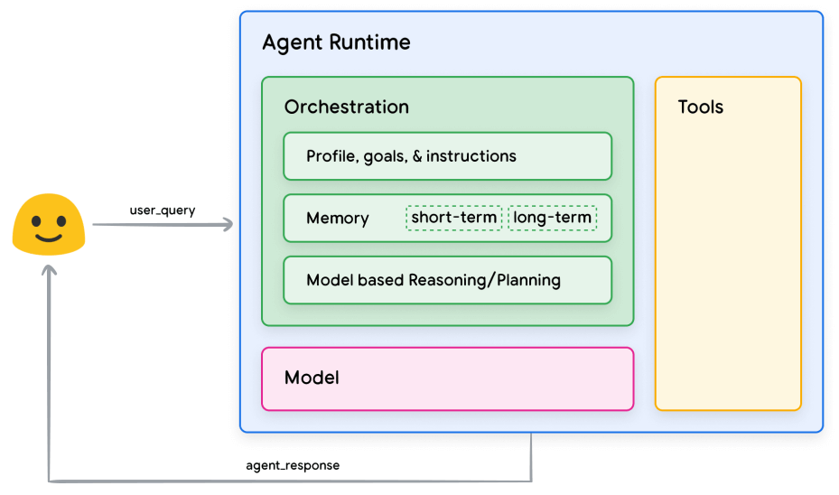
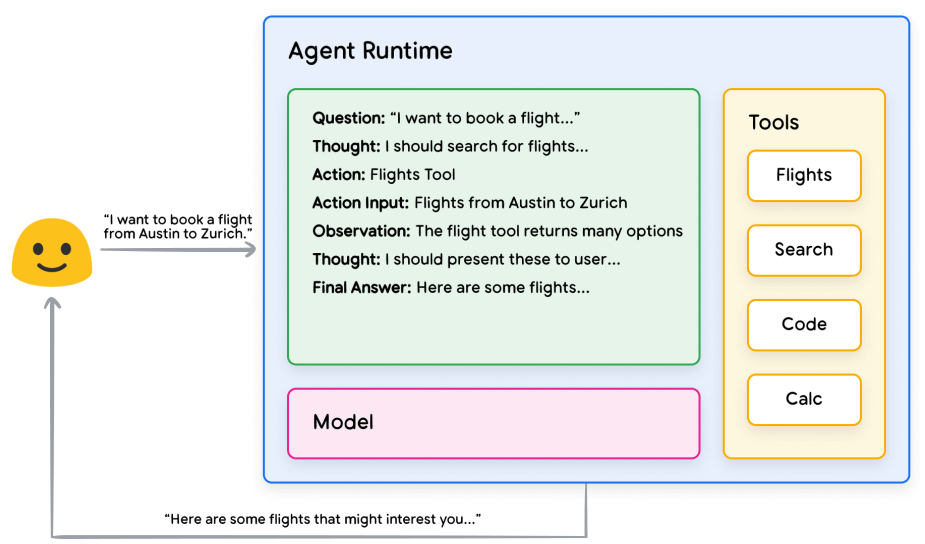
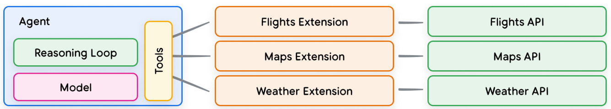
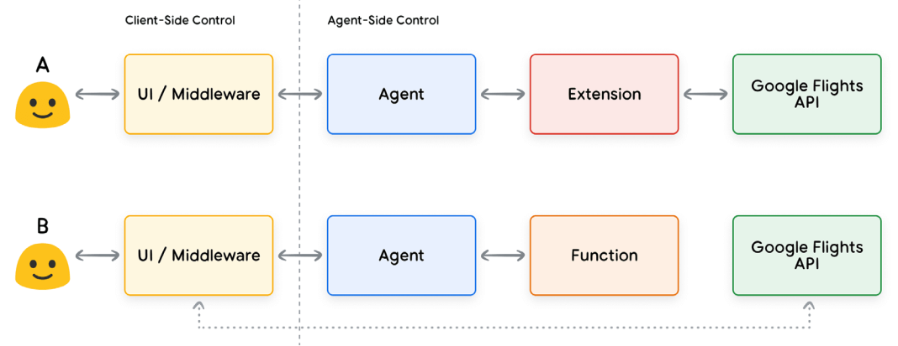
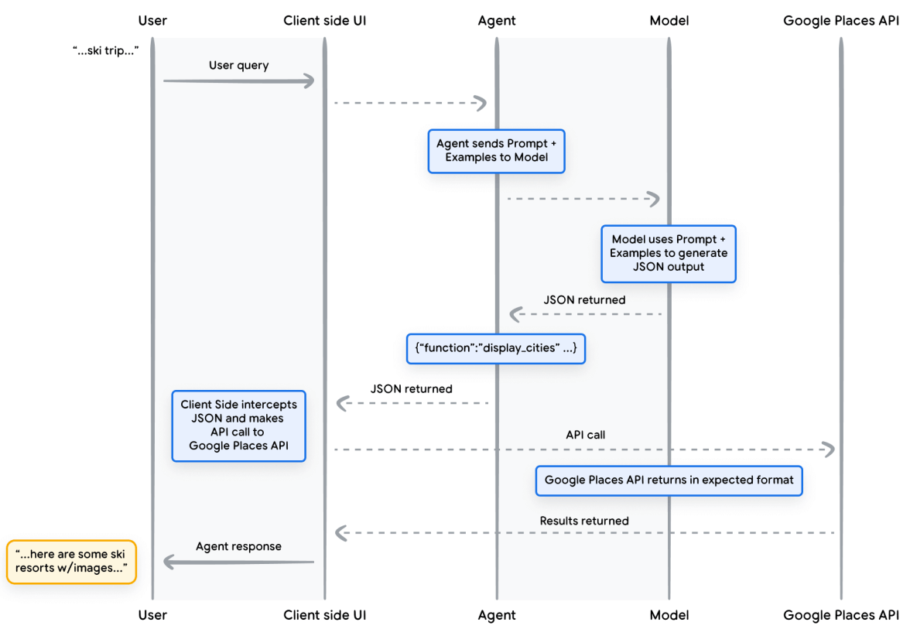
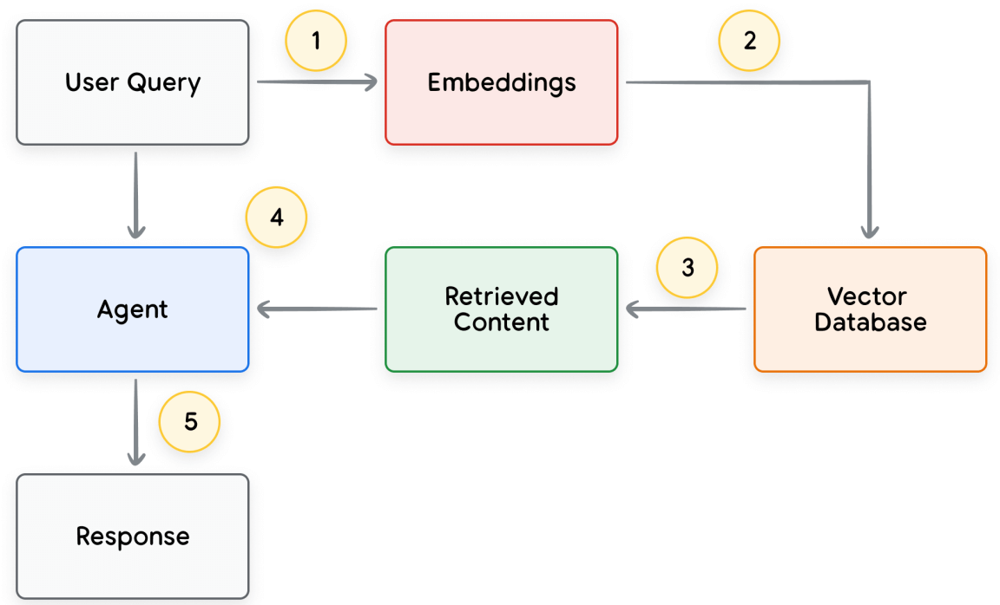
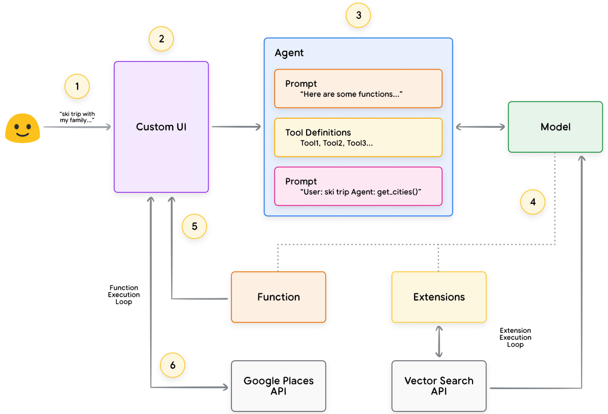

## Summary
Arthur Chiao translates Google's 2024 introductory white paper on generative-AI agents. The paper defines an agent as an application that combines a model, an orchestration layer, and tools so it can maintain state, plan, retrieve current information, and act beyond the model's training data; it then distinguishes agent-side extensions and data stores from client-executed function calls and demonstrates a small [[LangChain]]/LangGraph prototype.

## Key Claims
- [[GenerativeAIAgentArchitecture]] extends a language model with an orchestration loop, state or memory, goals and instructions, and external tools; the model alone does not supply those application-level capabilities.
- ReAct structures an iterative question, thought, action, action-input, observation, and final-answer loop in which tool results can correct an initial unsupported guess.

- Extensions connect an agent to APIs with operation descriptions, parameters, and examples, allowing the agent runtime to choose and execute an appropriate integration.

- Function calling returns a function name and structured arguments but leaves execution to client middleware, giving developers tighter control over authentication, sequencing, review, and private APIs.

- Data stores support [[RetrievalAugmentedGeneration]] by embedding a query, retrieving similar content from a [[VectorDatabase]], and returning that content to the agent before generation or action.

- In-context examples, retrieval-based context, and fine-tuning offer different ways to teach a model when and how to select tools; they trade off flexibility, data requirements, latency, and cost.
- [[LangChain]] and LangGraph can compose a model with search and places tools into a prototype, while a managed platform can combine prompts, tool definitions, functions, extensions, vector search, and a custom UI.

## Key Quotes
> “Agent 可以理解为是一个扩展了大模型出厂能力的应用程序。” - the translator's compact framing.

> “工具是将基础模型与外部世界连接起来的桥梁。” - on the role of tools.

> “复杂的 Agent 架构并不是一蹴而就的，需要持续迭代。” - on architecture development.

## Connections
- [[GenerativeAIAgentArchitecture]] - central model-orchestration-tools architecture synthesized from the paper.
- [[AgentComputerInterface]] - tool descriptions, parameters, examples, execution boundaries, and results form the agent's external interface.
- [[AgenticWorkflowPatterns]] - ReAct supplies the paper's main iterative reasoning-and-action loop.
- [[RetrievalAugmentedGeneration]] - data stores retrieve current external context for an agent.
- [[LangChain]] - framework used with LangGraph to demonstrate a two-tool ReAct agent.
- [[LLMAgentStages]] - function calling's structured output and client-side execution align with the staged history of agent tooling.
- [[Google]] - publisher of the original white paper and provider of the Vertex AI examples.

## Contradictions
- The paper's claim that agents are natively stateful, logical, and tool-enabled is an application-architecture definition rather than a property of the underlying model; it therefore complements rather than overturns the wiki's distinction between model capabilities and runtime scaffolding.
- The source is an introductory, Google-centered 2024 white paper translated in 2025. It offers architecture examples rather than comparative production evidence, does not quantify reliability or safety, and predates later agent tooling and model-capability changes.
