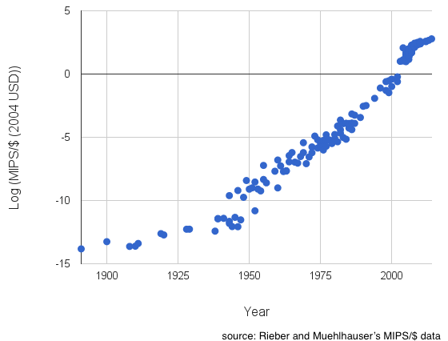
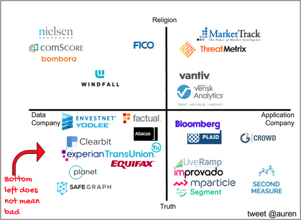
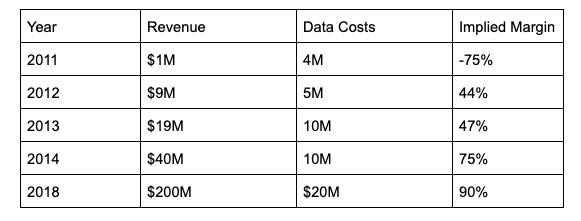

## Summary
[[AurenHoffman]] presents [[DataAsAService]] as a business category distinct from SaaS and compute: providers acquire, transform, and deliver verifiable external data that customers combine with their own systems. The operating thesis joins truth-oriented quality, shared identifiers, temporal freshness, evaluation workflows, standardized rights, and falling customer cost to a winner-takes-most market argument. The article is a broad 2019 practitioner manual grounded in [[SafeGraph]] and the author's prior data-company experience, so its strategic claims and forecasts are useful hypotheses rather than independent market evidence.

## Key Claims
- A data company has three core operations: acquire raw data, transform and resolve it into useful facts, and deliver it through files, APIs, streams, interfaces, documentation, and integrations.
- External data becomes more useful when it can be joined across stable themes such as people, products, places, companies, procedures, geography, and time.
- A reusable identifier should be storable, immutable, meticulous, portable, low-cost, and established—the SIMPLE criteria for [[DataJoinability]].
- Quality is a competitive variable: providers must manage the precision-versus-recall tradeoff, document transformations, measure improvement, and accept that no dataset is perfectly true.
- Data acquisition often behaves like a fixed or step-function cost even when accounting places it in cost of goods sold, so early gross margins can understate later incremental economics.

- DaaS can become winner-takes-most when one or two providers use scale to improve coverage and quality while lowering price per datum, but this dominance thesis assumes rational competitors and functional markets.
- Data sales require an evaluation path, clear usage and deletion rights, controls against copying, and either direct delivery or workflow integration; each choice changes pricing, protection, and competitive boundaries.

## Key Quotes
> "Data companies are ultimately about selling verifiable facts." - Hoffman's distinction between truth-oriented data and future-oriented prediction.

> "the data isn't useful unless it's in the place it needs to be" - Alex MacCaw on delivery through integrations and workflows.

## Connections
- [[AurenHoffman]] - author and data-company operator presenting the framework.
- [[SafeGraph]] - place-data company used throughout as the main operating example.
- [[DataAsAService]] - the article's overall business-model and operating framework.
- [[DataJoinability]] - the central-key and SIMPLE-identifier argument for making datasets combinable.
- [[DataMonetization]] - adjacent concept covering how data creates or captures economic value.
- [[IdentityResolution]] - person-level identifiers are one join mechanism, with elevated privacy risk.
- [[LocationDataPrivacy]] - qualifies the article's treatment of place and people data with downstream privacy concerns.
- [[FreemiumAcquisition]] - free samples and self-serve access can reduce friction in data evaluation and qualify buyers.

## Contradictions
- The claim that data niches tend toward one or two dominant providers is a strategic thesis, not demonstrated market-wide evidence; commodity markets, differentiated collection methods, regulation, exclusive rights, switching costs, and customer-specific requirements can sustain multiple vendors.
- The article distinguishes truth companies from prediction companies, but its own account shows that acquisition, entity resolution, filtering, and transformation embed assumptions and probabilistic judgments rather than merely preserving neutral facts.
- The 2019 forecast that external-data buyers would grow by another order of magnitude, and the examples tied to then-current firms, regulation, and infrastructure, are not verified by the source itself.
- People data may be defensible because it is hard to access, but the same privacy, security, consent, and regulatory burdens can make collection harmful or illegitimate; the article acknowledges responsibility without offering a full governance framework.
