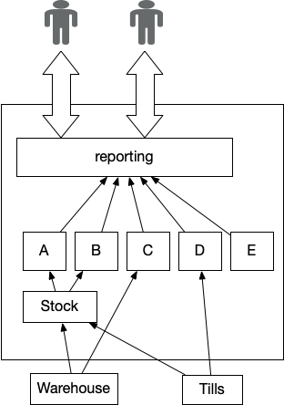
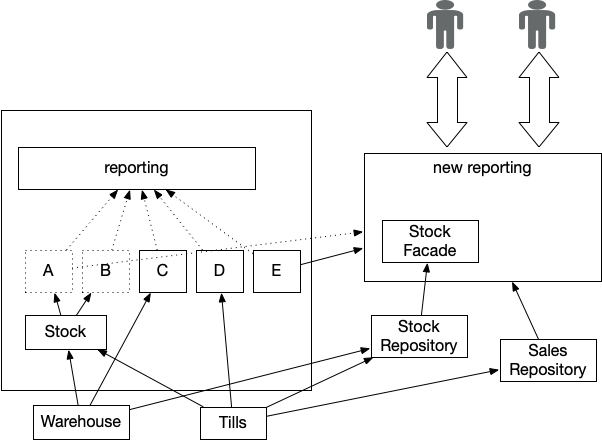

## Summary
Ian Cartwright, Rob Horn, and James Lewis describe [[DivertTheFlow]] as a [[LegacyDisplacement]] strategy that replaces a business-critical cross-cutting [[CriticalAggregator]] early, then progressively redirects it toward better upstream data sources. The approach releases upstream systems from the legacy aggregator's formats and update cadence, but requires an explicit [[TransitionalArchitecture]], careful source mapping, output reconciliation, staged cutover, and automated monitoring.

## Key Claims
- A legacy [[CriticalAggregator]] can freeze upstream systems in place because business-critical outputs depend on invasive, tightly coupled data flows.
- [[DivertTheFlow]] builds a decoupled replacement before upstream systems are displaced, then retires the legacy aggregator.
- The alternative is to leave the aggregator until last and use [[LegacyMimic]] feeds so displaced upstream systems continue satisfying its legacy contracts.
- Teams should map ultimate data origins, consumers, flow frequency, and discarded source data rather than accepting an intermediate legacy store as the source of truth.
- [[EventInterception]] and [[RevertToSource]] can be combined to feed the new aggregator while its legacy dependencies decline.
- Rebuilding every report is not automatically valuable; current user needs may justify smaller reports and dashboards instead of strict feature parity.
- [[ParallelRunning]] with worked examples and known test inputs helps distinguish legitimate corrections from regressions when old and new outputs disagree.
- Production monitoring should check feed timeliness, plausible input bounds, output tolerances, and divergence between old and new implementations.

The first architecture shows reporting embedded in the legacy boundary and coupled to systems A through E. Warehouse and till data reach reporting indirectly through several internal systems, so the visible legacy source is not necessarily the ultimate origin.

The replacement reporting capability sits outside the legacy boundary and is fed through stock and sales repositories. Dotted paths mark declining legacy-report dependencies while direct warehouse and till flows make source ownership and migration sequencing more explicit.

## Key Quotes
> "we need to get to the ultimate upstream system" - guidance for tracing data beyond an apparent legacy source

> "the new outputs rarely, if ever, match the existing ones" - warning that reconciliation needs known inputs and business judgment

## Connections
- [[IanCartwright]] - coauthor of the pattern article.
- [[RobHorn]] - coauthor of the pattern article.
- [[JamesLewis]] - coauthor of the pattern article.
- [[DivertTheFlow]] - central strategy explained by the source.
- [[CriticalAggregator]] - business-critical cross-cutting capability being replaced.
- [[LegacyDisplacement]] - broader incremental modernization context.
- [[TransitionalArchitecture]] - temporary feeds and components needed during migration.
- [[LegacyMimic]] - alternative mechanism when the old aggregator remains until later.
- [[EventInterception]] - possible way to supply legacy activity to the new aggregator.
- [[RevertToSource]] - possible way to bypass legacy intermediaries and use ultimate data origins.
- [[ParallelRunning]] - validation and staged-cutover technique for old and new outputs.

## Visual Evidence
- The first diagram places reporting and systems A-E inside one legacy boundary. Warehouse data feeds Stock and C, till data feeds Stock and D, and reporting consumes all five systems, illustrating invasive coupling and indirect provenance.
- The second diagram moves new reporting outside the legacy boundary. A stock facade receives from legacy E during transition, stock and sales repositories receive more direct source feeds, and legacy A-C-to-reporting paths are dotted to show dependencies being displaced rather than preserved as the target design.

## Contradictions
- No direct contradiction found. The source qualifies [[LegacyMimic]] by presenting it as the alternative cost of leaving a critical aggregator until last, rather than the default sequencing choice for every migration.
