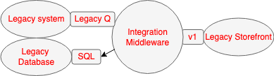
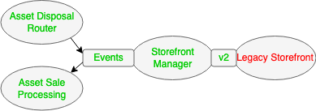
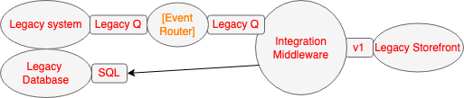
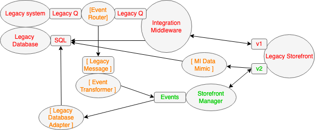
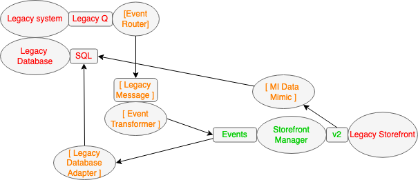
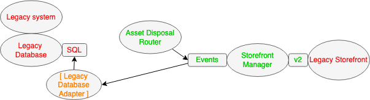

## Summary
Ian Cartwright, Rob Horn, and James Lewis define [[TransitionalArchitecture]] as deliberately temporary software that lets legacy and replacement systems coexist while responsibilities move incrementally. Its value comes from earlier delivery and lower migration risk, but only when teams compare those benefits with construction cost and design explicit removal conditions.

## Key Claims
- Gradual [[LegacyDisplacement]] reduces big-bang risk but requires old and new systems to operate together through configurations that are not part of the target architecture.
- Transitional components create seams by diverting or duplicating API, event, or data traffic; examples include [[EventInterception]], [[LegacyMimic]], repository APIs, branch by abstraction, and [[AntiCorruptionLayer]] mechanics.
- Direct legacy-data access should ideally be replaced by an API boundary; where that is not feasible, state may need to be replicated temporarily between old and new systems.
- Migration paths should be compared by time-to-value, risk reduction, temporary construction cost, and the possibility that replacement will take longer than planned.
- Teams should invest enough in removability to retire transitional components cleanly; unused bridgework still increases future maintenance and evolution cost.
- The worked example removes components in dependency order: integration middleware first, then the event router, transformer, and reporting mimic, and finally the legacy database adapter when asset-sale processing arrives.

The starting architecture routes product-published events from the legacy system through a queue and long-running integration middleware to the legacy storefront. The middleware writes shared legacy state used by critical reports, while storefront sale callbacks return through its version-one API.

The target removes the middleware and shared database path from this flow. An asset disposal router publishes business events to a storefront manager, the legacy storefront collaborates through a version-two API, and sale events feed asset-sale processing.

The first enabling change inserts an event router into the existing queue path without yet replacing business behavior. That seam can progressively route selected products toward new components while preserving the middleware path.

The most complex intermediate state introduces the storefront manager and a clean business-event format. An event transformer isolates it from the legacy message, a legacy database adapter records sales for unreplaced processes, and an MI data mimic preserves reporting state while both version-one and version-two storefront interactions operate.

Once all product traffic uses the new path, the integration middleware can be removed even though several transition components remain. The diagram makes decommissioning dependency-based rather than synchronized to one final cutover.

After the asset disposal router and replacement reporting sources arrive, the event router, event transformer, and MI data mimic disappear. The legacy database adapter remains only until asset-sale processing can consume the storefront manager's sale events, after which the architecture reaches the target state shown earlier.

## Key Quotes
> "you will have to invest in work that will be thrown away" - direct statement of the temporary-investment tradeoff

> "Remember that part of using a Transitional Architecture is removing it" - reminder that retirement is part of the pattern

## Connections
- [[IanCartwright]] - coauthor of the article.
- [[RobHorn]] - coauthor of the article.
- [[JamesLewis]] - coauthor of the article.
- [[TransitionalArchitecture]] - central pattern and cost-benefit discipline described by the source.
- [[LegacyDisplacement]] - incremental replacement context that creates old/new coexistence.
- [[EventInterception]] - creates a routable seam and supports rollback or gradual traffic migration.
- [[LegacyMimic]] - preserves legacy-facing state or behavior while new components take responsibility.
- [[AntiCorruptionLayer]] - isolation role played by the event transformer around the new business-event model.
- [[ExtractValueStreams]] - one way to divide displacement into safer capability-sized steps.

## Contradictions
- No direct contradiction found. The source reinforces [[TechnologyTransitionStrategy]]'s warning that bridge architecture needs a destination and retirement path, while qualifying any categorical rejection of temporary architecture by showing its time-to-value and risk-reduction benefits.
