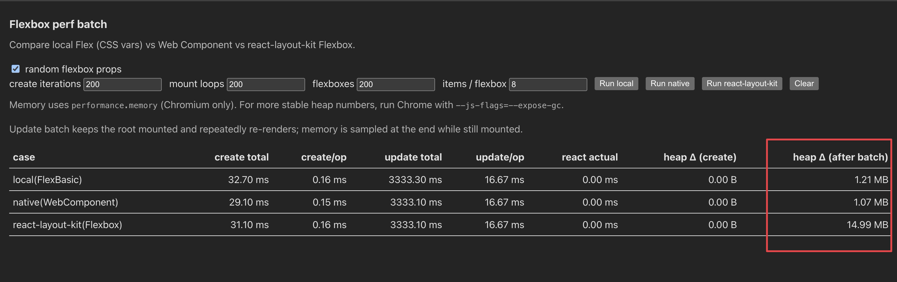
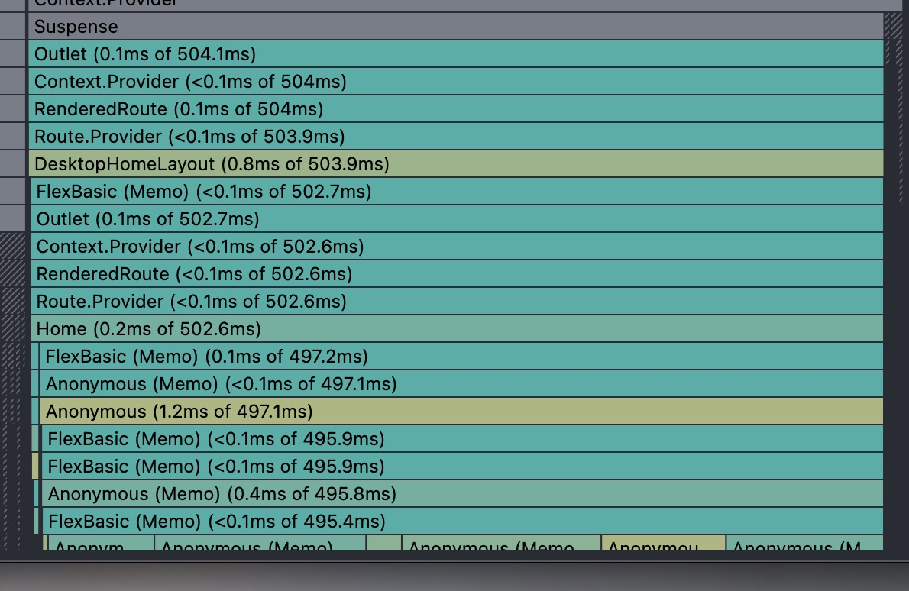
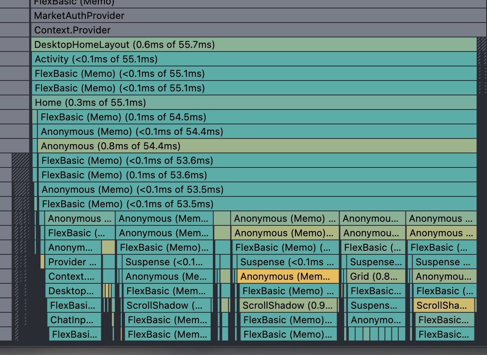
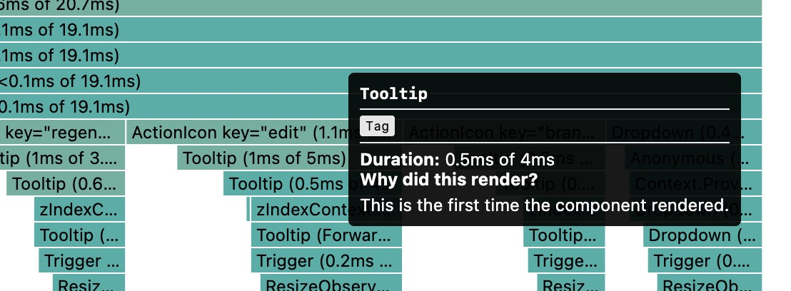
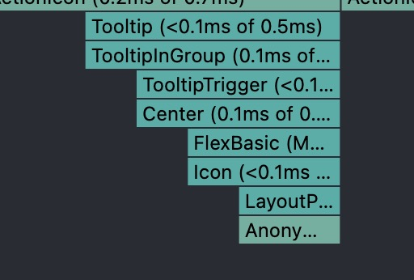

## Summary
[[Innei]] reports a month of performance and developer-experience work on [[LobeHub]], combining React profiler investigation with changes to layout primitives, styling hooks, offscreen route retention, and foundational UI components. The article also describes reducing the [[Electron]] desktop package, flattening internationalization keys, adopting typed IPC decorators, and experimenting with a [[NextJS]]-to-Vite migration. Its screenshots supply concrete development-environment measurements, but most improvements remain author-reported point observations rather than controlled production benchmarks.

## Key Claims
- Repeated small component costs matter at application scale: a Flexbox benchmark showed similar timing but about 14.99 MB of post-batch heap growth for `react-layout-kit`, versus about 1.21 MB for local CSS and 1.07 MB for a native web component.

- Replacing dynamic CSS-in-JS hooks with static styling avoids rerunning widely used style-generation logic on every render.
- Retaining the home screen offscreen with React Activity reduced the profiled return-to-home subtree from about 504 ms to 55.7 ms in development.

- Deferring collapsed Accordion content and replacing heavy Ant Design overlays with Base UI or singleton-backed components reduced avoidable work inside complex message items.

- Removing unused Electron localization bundles and excluding bundled `node_modules` except required native modules reportedly cut the desktop application by about 100 MB to roughly 260 MB.
- Flat i18n keys improve searchability and copyability, while typed decorator-based IPC replaces stringly typed dispatch-and-subscribe plumbing.
- A preliminary experiment found Vite development memory a little above 1 GB, versus more than 10 GB for the current Next.js server, but the migration was still only being planned.

## Key Quotes
> "在代码由 AI 快速生成的环境下，很难做到对代码质量的可控。" - why generated code increases the need for performance and quality discipline.

> "UI 中本身不可见，那么对应的组件逻辑也不应执行。" - principle behind deferring collapsed component content.

## Connections
- [[Innei]] - author and LobeHub engineer reporting the optimization work.
- [[LobeHub]] - application and team in which the changes were made.
- [[ReactRuntimePerformance]] - profiler-guided reduction of component, styling, route-return, and overlay costs.
- [[DesktopApplicationPackaging]] - Electron localization and dependency pruning used to shrink the desktop distribution.
- [[DeveloperExperience]] - i18n, IPC, and development-server resource use are treated as engineering-productivity surfaces.
- [[WebPerformanceOptimization]] - the case broadens performance work from page load to runtime rendering, memory, and route transitions.
- [[NextJS]] - current development server considered for replacement because of reported memory use.
- [[Electron]] - desktop runtime and packaging target.

## Contradictions
- The benchmark screenshot contradicts the prose phrase “ten orders of magnitude”: 14.99 MB versus roughly 1.1 MB is about fourteen times, not ten orders of magnitude.
- The screenshots are development-environment point measurements with no device, run-count, variance, production telemetry, or controlled before-and-after methodology, so they support diagnosis but not universal effect sizes.
- The Vite comparison is an experiment and migration proposal, not evidence from a completed production migration.
