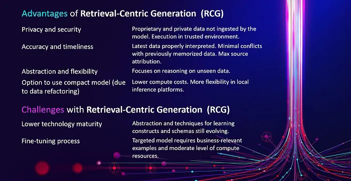
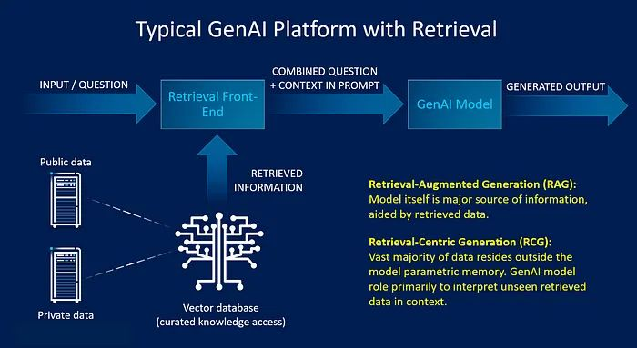
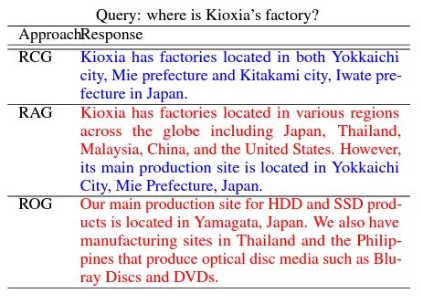
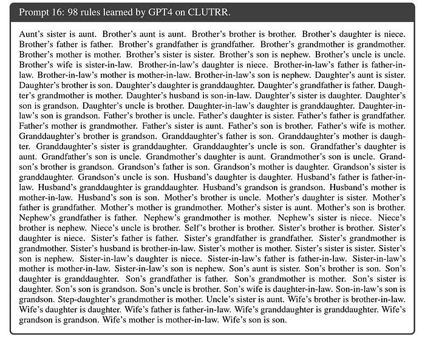

## Summary
[[IntelLabs]] argues that business generative-AI systems should move from [[RetrievalAugmentedGeneration]], where retrieved context supplements model memory, toward [[RetrievalCentricGeneration]], where curated external data supplies most factual content and the model primarily interprets information it did not see during training. The proposed architecture emphasizes provenance, privacy, timeliness, compact targeted models, and [[SchemaBasedReasoning]], but its strongest accuracy and efficiency claims remain a research agenda supported mainly by architecture arguments and a single [[SimplyRetrieve]] example rather than broad comparative evidence.

## Key Claims
- [[RetrievalCentricGeneration]] places most application data outside parametric memory and makes interpretation of retrieved, previously unseen information the model's primary role.
- Moving factual content into verifiable indexed sources can improve provenance, privacy, freshness, and conflict control, but it shifts reliability toward corpus quality, retrieval, context construction, and source attribution.
- Business systems need traceable, specialized outputs and often cannot tolerate the residual error acceptable in consumer use; the article therefore sets near-100% accuracy as a goal, not a demonstrated result.
- Compact targeted models may match larger models on bounded enterprise work when retrieval supplies the facts and fine-tuning teaches task constructs, relationships, and functions.
- [[SchemaBasedReasoning]] is proposed as the cognitive bridge from retrieved tokens to useful interpretation: models should learn reusable constructs and relationships rather than memorize changing company records.
- An implementation path can start from a pretrained base model, fine-tune behavior on representative tasks, and index the larger proprietary corpus for retrieval instead of repeatedly pretraining on changing business data.
- [[FastRAG]] and [[SimplyRetrieve]] illustrate small-model retrieval and retrieval-centric separation, while the Hypotheses-to-Theories example suggests that models can induce explicit relational rules from demonstrations.

## Key Quotes
> "the vast majority of data resides outside the model parametric memory" - the defining information-placement claim for RCG.

> "The model needs to learn the constructs rather than the particular cases." - on separating schema learning from changing business records.

> "quality of data, source of data, and targeted uses" - the three business pressures used to motivate the shift.

## Connections
- [[IntelLabs]] - authoring research organization advancing the retrieval-centric framing.
- [[RetrievalCentricGeneration]] - the article's proposed business-oriented generation architecture.
- [[RetrievalAugmentedGeneration]] - predecessor pattern whose retrieved context still supplements a model that remains a major information source.
- [[SchemaBasedReasoning]] - proposed abstraction capability for interpreting unfamiliar retrieved data.
- [[FastRAG]] - Intel Labs retrieval project presented as a compact, training-free implementation direction.
- [[SimplyRetrieve]] - Kioxia research system used as the article's principal RCG example.
- [[LangChain]] - named as a framework for composing retrieval, vector storage, and generation.
- [[VectorDatabase]] - indexed access layer for curated public and private information.
- [[Embeddings]] - representation mechanism underlying the dense retrieval history discussed in the article.

## Contradictions
- The article's near-100% accuracy goal is not established by the cited examples; retrieval can still fail through missing, stale, conflicting, malicious, misranked, or misinterpreted context.
- The [[SimplyRetrieve]] figure shows one factory-location query where RCG is accurate and RAG and retrieval-off generation hallucinate. The article itself concedes that those alternatives may answer correctly in other cases, so the example does not prove general superiority.
- The claim that compact targeted models can perform comparably to much larger models is conditional on appropriate retrieval and schema competence and is not backed here by a broad size-quality-cost benchmark.
- The article distinguishes emergent neural schema learning from explicit knowledge-graph schemas; it does not compare their reliability, inspectability, or maintenance costs.
