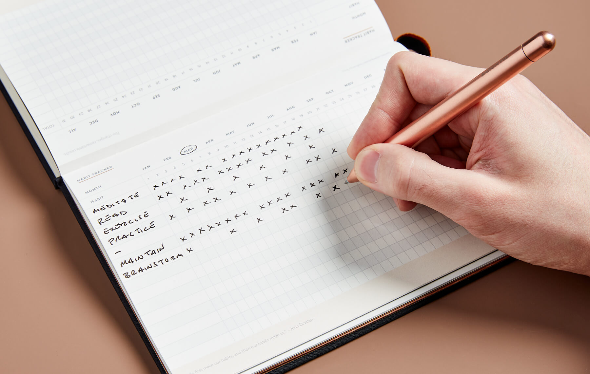
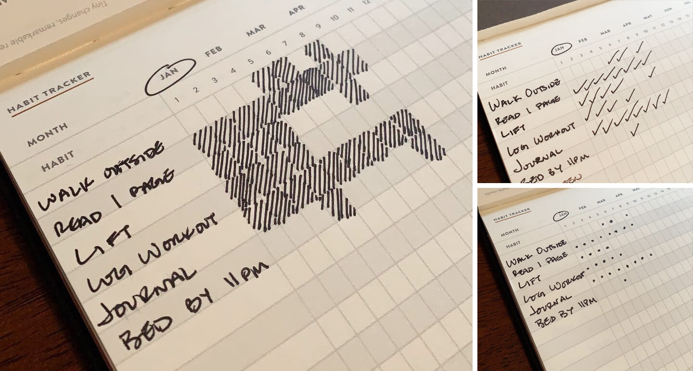

## Summary
[[JamesClear]] presents [[HabitTracking]] as a lightweight feedback system for behaviors whose desired results arrive too slowly to sustain motivation on their own. A visible record can prompt action, make progress salient, and provide immediate satisfaction, but Clear recommends manually tracking only a few important or fragile habits, recording completion immediately, and treating missed days as cues for quick recovery rather than failure.

## Key Claims
- [[HabitTracking]] converts delayed outcomes into immediate evidence that a behavior occurred, helping people persist before larger results become visible.
- A visible streak can operate as a prompt, a record that counters optimistic self-perception, and a motivating signal of accumulated progress.
- Tracking itself supplies immediate satisfaction and shifts attention from distant outcomes toward repeatedly performing the process.
- The most useful targets are new, important, or easily neglected behaviors; habits that already happen reliably may not justify the extra tracking burden.
- The [[FoggBehaviorModel]]-compatible Two-Minute Rule reduces a target to a version that takes two minutes or less, making daily participation feasible even on difficult days.
- Tracking should be simple: manually monitor only a few priorities and record each mark immediately after the behavior, using the completed behavior as the cue for tracking.
- Recovery matters more than perfect streaks: Clear's “never miss twice” rule treats one lapse as an accident but repeated lapses as the beginning of a competing pattern.

The photographed journal demonstrates the basic implementation: routines occupy rows, calendar days occupy columns, and an X records each completion. It also shows that multiple behaviors can be made visible in one compact monthly grid.

The comparison shows that the mark's visual style is secondary to maintaining a legible completion record: shaded cells, checkmarks, and dots all encode the same behavior signal.

## Key Quotes
> "It is better to consistently track one habit than to sporadically track ten." - Clear's constraint on manual tracking overhead.

> "Missing once is an accident. Missing twice is the start of a new habit." - Clear's recovery rule for preventing a lapse from becoming a pattern.

## Connections
- [[JamesClear]] - author and first-person practitioner presenting the tracking and recovery framework.
- [[HabitTracking]] - central method for turning completed behavior into visible, immediate feedback.
- [[BehaviorDesign]] - tracking combines prompts, easier actions, feedback, and rewards to shape repeated behavior.
- [[FoggBehaviorModel]] - the Two-Minute Rule emphasizes ability through simplification, while immediate recording adds a prompt tied to the completed behavior.
- [[BJFogg]] - credited for “anchoring,” the practice Clear calls habit stacking when an existing behavior cues a new one.
- [[WorkHabits]] - daily, weekly, and monthly work routines are among the behaviors that can be tracked selectively.
- [[GoalSetting]] - the tracker measures repeated process behavior rather than relying only on delayed goal outcomes.

## Contradictions
- No direct contradiction found. The article qualifies rigid streak logic by acknowledging that every streak ends and recommending rapid recovery rather than perfection.
- The article cites progress-monitoring research and a food-log result but does not provide enough study detail in the captured text to establish how well those findings generalize to every habit or whether tracking itself caused the improvement.
- The reported average of 66 days to form a habit is explicitly rejected as a universal deadline because the underlying range varied with behavior difficulty; the practical recommendation is ongoing sustainable practice, not completion after a fixed number of days.
