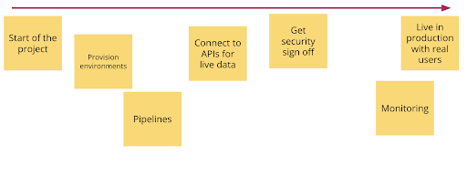
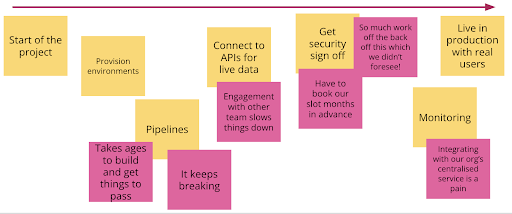
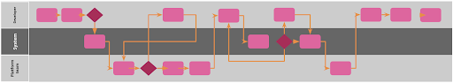
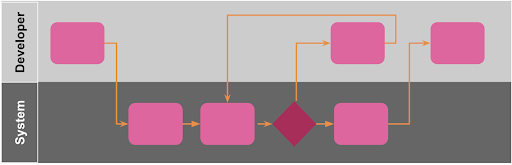
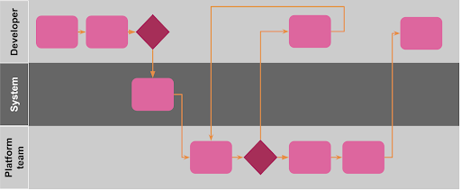

## Summary
[[PoppyRowse]] and [[ChrisShepherd]] argue that an [[InternalDeveloperPlatform]] should be managed as an internal product, beginning with one measurable organizational problem and continuing through user discovery, early onboarding, technical communication, service design, complexity control, and actionable measurement. Their seven-principle framework is synthesized as [[InfrastructurePlatformProductManagement]]: platform teams should validate that a platform is needed, find the shortest path to learning and value, and make the resulting paved path easier to adopt than bespoke infrastructure.

## Key Claims
- Repeated infrastructure work can justify a shared platform, but the decision should follow a prioritized problem statement, measurable goal, and practical strategy rather than precede them.
- Platform discovery should treat product teams as customers, combining stakeholder interviews with timeline-based Event Storming that overlays pain points, systems, timing, and organizational handoffs.
- A shortest path to value should onboard real users before a fully mature definition of viability delays feedback for months.
- C4 diagrams communicate the platform's present or intended structure at context, container, component, and optional code levels, while [[ArchitectureDecisionRecords]] preserve why past choices were made.
- [[UserJourneyMapping]] can expose onboarding handoffs, loops, waiting, manual platform-team work, and missing automation; the target is a simple, self-service path where the platform's purpose justifies its implementation tradeoffs.
- Platform complexity is reliability exposure because every supported component must be measured, maintained, and supported, while Conway's Law can freeze organization-specific workarounds into architecture.
- Delivery lead time, deployment frequency, change failure rate, and mean time to recovery are useful trailing indicators after adoption; before adoption, user learning and uptake matter more, and all selected metrics should be actionable.

The discovery example maps provisioning, pipelines, APIs, security approval, monitoring, and production release along one delivery timeline.

The second layer makes the research value visible: slow provisioning, recurring pipeline breakage, other-team outages, advance booking, unexpected back-office effort, and centralized monitoring integration are attached to the steps that create them.

The three journey diagrams contrast a long path crossing developer, system, and platform-team lanes with an idealized three-step self-service flow and a more realistic intermediate release that still contains platform-team work and feedback loops.

## Key Quotes
> "If you can't put together a problem statement maybe you don't need an infrastructure platform." - on validating the intervention before funding it

> "your customers' dev environments are your production environments" - on the platform team's reliability boundary

## Connections
- [[PoppyRowse]] - Thoughtworks business analyst and co-author of the seven-principle framework.
- [[ChrisShepherd]] - Thoughtworks lead developer and co-author drawing on platform-building experience.
- [[Thoughtworks]] - consultancy context of both authors.
- [[InfrastructurePlatformProductManagement]] - synthesis of the source's strategy, discovery, onboarding, communication, UX, complexity, and measurement guidance.
- [[InternalDeveloperPlatform]] - shared infrastructure product whose common components reduce repeated product-team work.
- [[UserJourneyMapping]] - method for diagnosing and simplifying platform onboarding.
- [[ArchitectureDecisionRecords]] - lightweight record of architectural decisions, context, consequences, and participants.
- [[DeveloperExperience]] - platform adoption depends on low-friction, understandable, self-service interactions.
- [[TechnologyStackComplexity]] - each additional platform component adds maintenance, measurement, support, and failure modes.
- [[ContinuousDelivery]] - deployment lead time, frequency, failure, and recovery provide outcome measures after adoption.

## Contradictions
- No direct contradiction found. The article broadens the existing [[InternalDeveloperPlatform]] synthesis from packaged operational defaults to an internal-product discipline that begins before platform construction.
- The seven principles are practitioner guidance supported by illustrative workflows rather than comparative adoption, delivery, cost, security, or reliability data. The article's four delivery metrics are trailing indicators and cannot establish platform success before teams adopt it.
