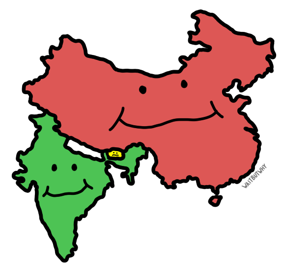
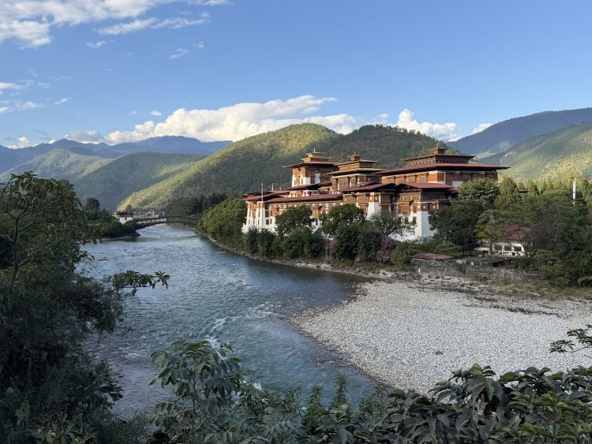
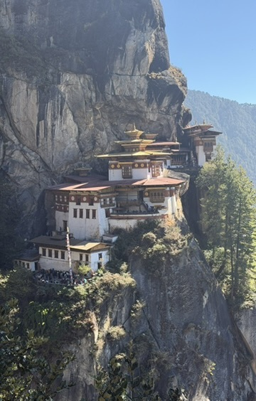

## Summary
[[TimUrban]] presents [[Bhutan]] through a short personal travelogue about its Buddhist monarchy, distinctive architecture, cultural-preservation policies, environmental claims, and tension between tradition and economic opportunity. The article frames the country as unusually remote and cohesive while acknowledging that a guided visit cannot verify national happiness, official stories about the king, or long-term development promises. The inspected images reinforce the geographic and built-environment account: Bhutan sits between India and China, a traditional dzong dominates a river valley, and the Tiger's Nest monastery clings to a forested cliff.

## Key Claims
- [[Bhutan]] has maintained a distinct Buddhist kingdom and highly consistent architectural identity despite its position between India and China.
- Bhutan restricts tourism and immigration and delayed television and internet access as part of a strong cultural-preservation stance.
- The article reports that forest absorption exceeds national emissions, making Bhutan carbon-negative, but supplies no underlying inventory or methodology.
- [[GrossNationalHappiness]] is presented as a policy priority over GDP, although Urban explicitly says he could not verify the popular claim that Bhutan is the world's happiest country.
- The king is described through tour-guide accounts as personally supporting tourism workers and stray dogs during COVID-19; Urban treats the stories as plausible but not independently verified.
- Youth emigration for opportunity threatens the traditional model, and [[GelephuMindfulnessCity]] is proposed as an innovation-centered economic response intended to preserve Bhutanese culture.

## Key Quotes
> "Bhutan does things differently than other countries."

> "Bhutan is a special place—remote, mysterious, and breathtakingly beautiful."

## Connections
- [[TimUrban]] - author and traveler narrating the visit.
- [[WaitButWhy]] - publication hosting the illustrated travelogue and linked trip video.
- [[Bhutan]] - country whose geography, culture, monarchy, conservation, and demographic challenge organize the article.
- [[GrossNationalHappiness]] - national policy frame contrasted with GDP and popular happiness rankings.
- [[GelephuMindfulnessCity]] - planned economic hub presented as a response to youth migration and limited domestic opportunity.

## Contradictions
- No direct contradiction with an existing wiki claim was found. Within the source, strict preservation and restricted access sit in tension with the need to create opportunity through a large innovation-oriented city.
- Urban compares the favorable royal stories with propaganda he previously heard in North Korea, then says the situations differ and he is inclined to believe the Bhutan accounts; the article nevertheless provides no independent corroboration.
