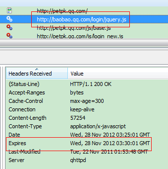
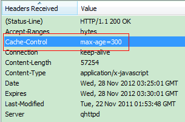
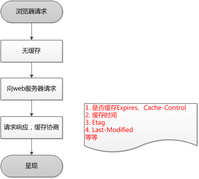
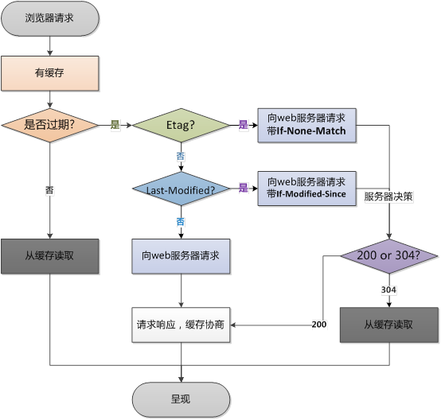

## Summary
[[Wulc]] presents [[BrowserCaching]] as a two-stage HTTP mechanism: freshness metadata lets a browser reuse a stored response without contacting the server, while validators let it ask whether a stale response can still be reused. The article contrasts `Expires` with `Cache-Control`, explains `Last-Modified`/`If-Modified-Since` and `ETag`/`If-None-Match`, and uses four inspected screenshots and flow diagrams to show first-request storage and later conditional revalidation. Several explanations reflect a simplified 2016 teaching model and need qualifications, especially the meanings of `no-cache`, `Expires`, and `If-Modified-Since`.

## Key Claims
- A first request with no usable stored response reaches the web server; the response can carry freshness and validator metadata that the browser stores with the representation.

- `Expires` gives an absolute freshness deadline, while `Cache-Control: max-age=300` gives a relative five-minute freshness lifetime and takes precedence when both are present.

- After a cached response becomes stale, an `ETag` can be sent in `If-None-Match`, or a `Last-Modified` value can be sent in `If-Modified-Since`, so the server can return either a new representation with `200` or a bodyless `304` that permits cache reuse.
- `ETag` can distinguish changes that modification timestamps miss, including multiple changes within one second and metadata changes that do not alter content.
- Browser navigation and reload actions can change whether freshness and validation metadata are honored, although the exact behavior is browser- and context-dependent.

## Key Quotes
> "Cache-Control 与 Expires 的作用一致，都是指明当前资源的有效期。" - on freshness metadata.

> "若最后修改时间较新……HTTP 200；若最后修改时间较旧……响应 HTTP 304。" - on conditional validation outcomes.

## Connections
- [[Wulc]] - author of the technical explainer.
- [[BrowserCaching]] - central mechanism described through freshness, validation, and request-flow examples.
- [[HTTP]] - protocol layer that defines the response directives and conditional request headers.
- [[HTTP11]] - protocol generation associated with `Cache-Control` and entity-tag validation.
- [[WebPerformanceOptimization]] - cache hits and `304` responses reduce network transfer and user-visible delay.
- [[DynamicContentCaching]] - broader freshness problem that becomes harder when content can change before a browser cache entry expires.

## Contradictions
- The article says `no-cache` means a response cannot be cached. More precisely, `no-cache` permits storage but requires successful validation before reuse; `no-store` is the directive that prohibits storage.
- The claim that browsers using HTTP/1.1 effectively ignore `Expires` is too strong. `Expires` remains usable as a fallback, while `Cache-Control: max-age` takes precedence when both are present.
- `If-Modified-Since` carries the stored `Last-Modified` timestamp, not the time of the new request. Validators also do not require `Cache-Control`; they can support revalidation whenever a stored response is selected for validation.
- The article's reload-behavior table and Apache `ETag` generation description are implementation- and version-dependent rather than universal browser and server guarantees.
