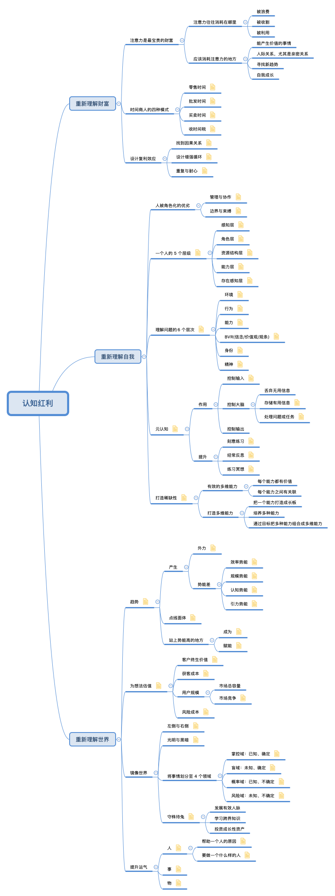
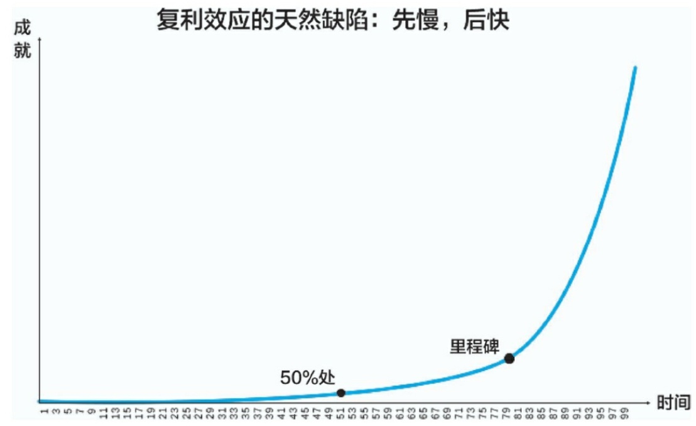
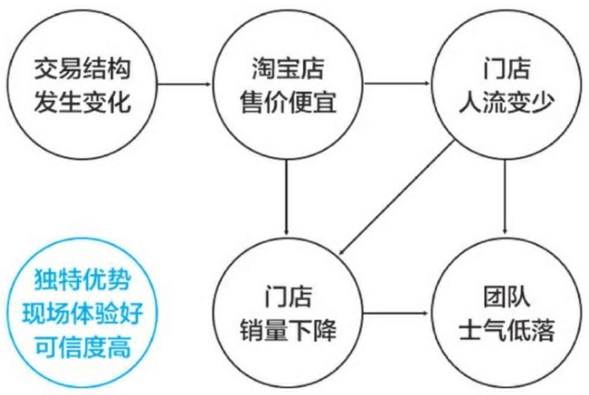
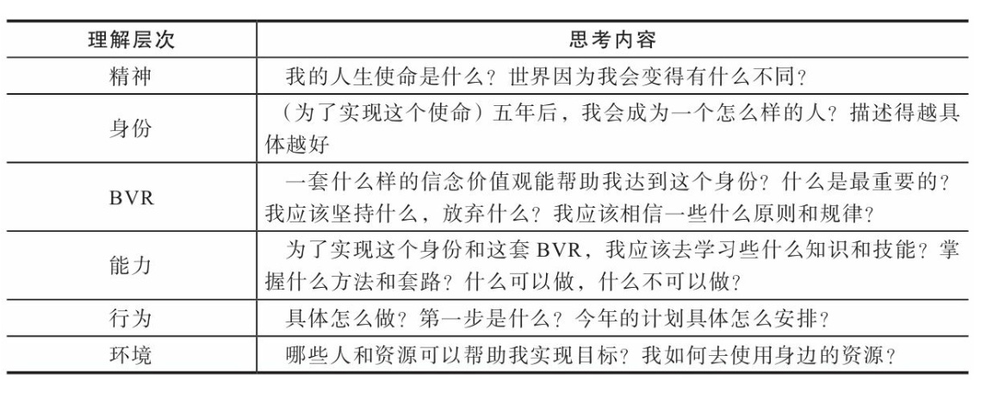
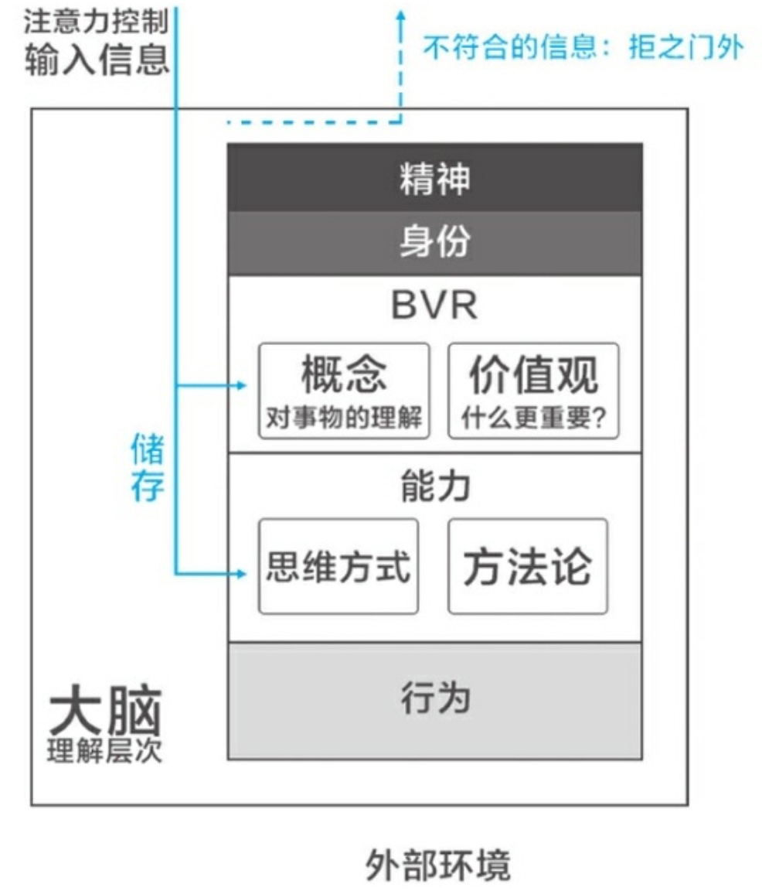
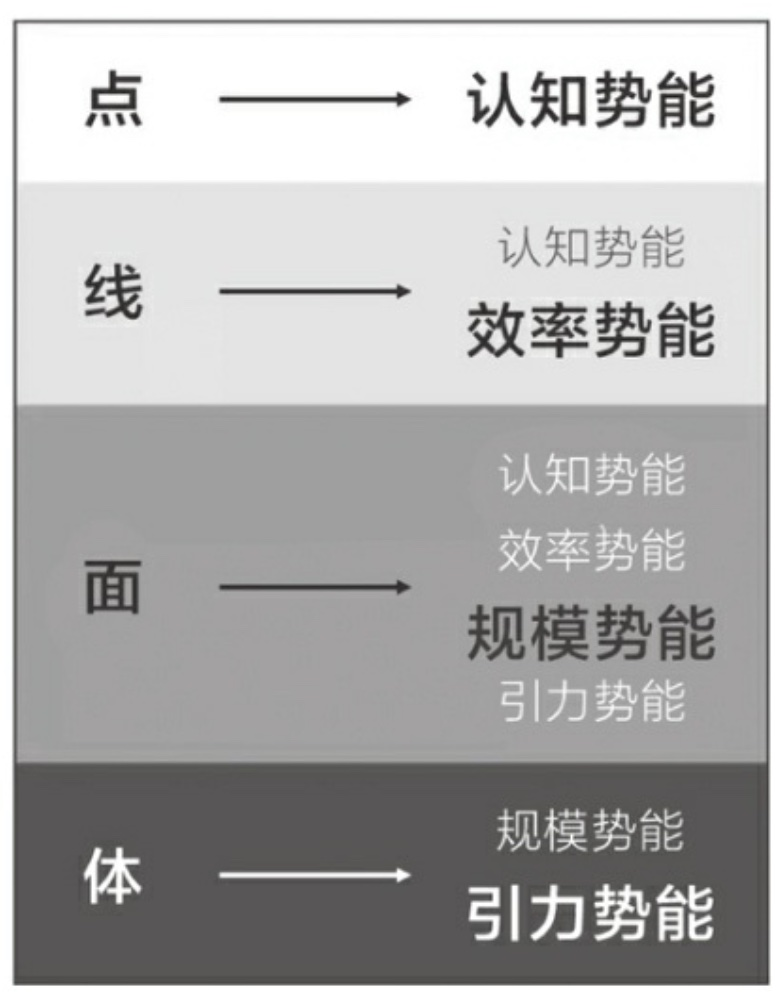
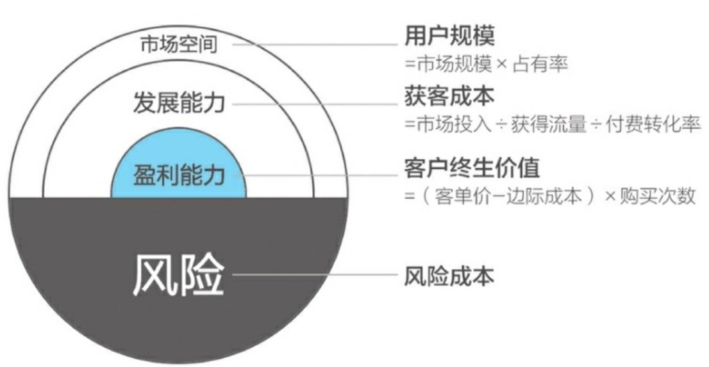
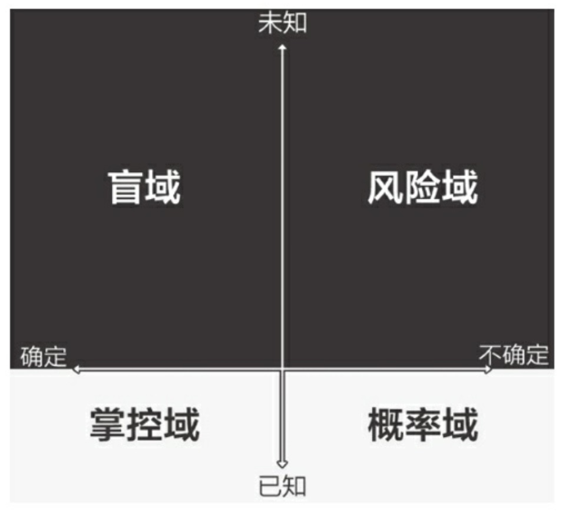

## Summary
[[Wulc]] summarizes the first half of 《认知红利》 as three attempts to redefine wealth, self, and the world. The note treats attention as a productive resource, time and compounding as leverage choices, identity and metacognition as layers of self-direction, and trends, unit economics, uncertainty, and accumulated relationships as tools for acting in an uneven world. Eight inspected diagrams make the argument operational by showing the source's causal loops, cognitive hierarchy, information-control model, potential-energy hierarchy, project-valuation formula, uncertainty matrix, and complete concept map.

## Key Claims
- [[AttentionManagement]] begins by treating attention as a controllable productive resource that can be wasted, commercially captured, or deliberately allocated to value creation, relationships, trends, and growth.
- Economic leverage can move from retailing one's own time to low-marginal-cost replication, coordinating other people's time, or operating a value-creating platform; the source cautions that a platform is an outcome of user value, not a starting label.
- Compounding requires a credible causal relationship, a reinforcing loop, and enough repetition to survive the long period in which progress remains visually small.

- Self-understanding deepens when people distinguish assigned roles from chosen identity, examine resources and capabilities beneath labels, and use higher-level purpose, beliefs, and values to guide lower-level action.

- [[MetacognitiveFeedback]] is presented as a correction loop over input, thought, and output: notice an automatic reaction, evaluate it, choose a better response, and practice that intervention through reflection, deliberate practice, and meditation.

- Trends are framed as differences in efficiency, scale, cognition, or attraction; a person or firm can gain leverage either by becoming part of a higher-potential system or by using a larger line, platform, or economic system for enablement.

- Business ideas should be tested through [[CustomerLifetimeValue]], [[CustomerAcquisitionCost]], reachable user scale, and downside risk, while action under uncertainty should differ across known/unknown and certain/uncertain domains.

## Key Quotes
> "平台是结果，而不是原因" - on why a platform must emerge from value created for participants.

> "大脑也是一个器官，是可以被控制的，而元认知则是大脑的纠错机制" - on metacognition as deliberate self-correction.

> "你的顿悟，很可能只是别人的基本功" - on searching for established knowledge before rediscovering it alone.

## Connections
- [[Wulc]] - author of the reading note and its interpretive qualifications.
- [[AttentionManagement]] - attention is treated as scarce productive capacity requiring deliberate protection and allocation.
- [[AttentionEconomy]] - recommendation and advertising systems are described as recording and monetizing attention traces.
- [[MetacognitiveFeedback]] - the note expands metacognition from reflection into control of information input, processing, and action.
- [[CustomerLifetimeValue]] - one input to the source's simplified idea-valuation model.
- [[CustomerAcquisitionCost]] - acquisition spend is subtracted from customer value before scaling the opportunity estimate.

## Contradictions
- The note is a selective secondary summary rather than direct empirical support for the book's frameworks. Its ranked labels for six "talent" levels, claims about meditation and brain-region strengthening, and broad success advice should be treated as heuristics rather than validated psychological findings.
- The project formula `(customer lifetime value - acquisition cost) × user scale - risk cost` omits timing, discount rates, fixed and operating costs, cohort variation, retention uncertainty, capital constraints, competition, and dependencies among estimates. The note itself questions the claim that estimation errors will naturally cancel out.
- The source's offline-store causal example and point-line-surface-system hierarchy clarify strategic reasoning visually, but Wulc explicitly doubts parts of their practical guidance and notes that discovering high-potential systems remains unresolved.
