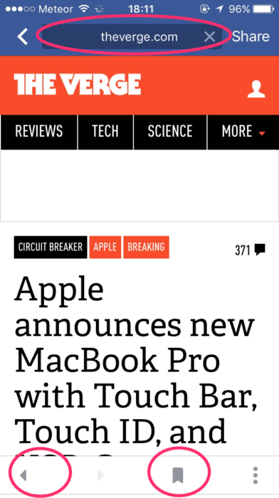
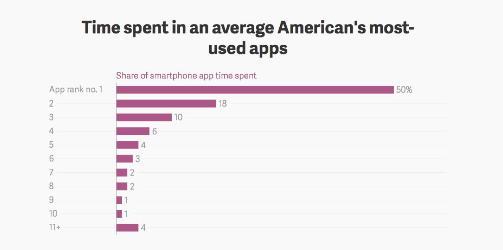
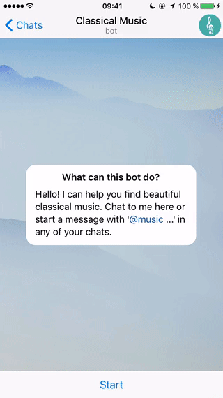

## Summary
This Inside Intercom essay argues that native apps fit frequent, hardware-integrated tasks but should not be the default delivery model for every mobile service. It broadens “browser” to include [[Facebook]], [[Slack]], and [[WhatsApp]] as context-rich discovery surfaces, then presents bots as dynamic bookmarks that can retrieve and act on content inside messaging. The three retained images substantiate the interface, attention-concentration, and bot examples; the thesis remains a forceful 2016 forecast rather than later outcome evidence.

## Key Claims
- [[MobileRuntime]] should be chosen by task: high-frequency communication and direct camera, microphone, or OS access favor native apps, while improved connectivity and mobile-web capability weaken the case for installing every service.
- Social and messaging products can function as contextual browsers by pushing material through friend, colleague, and interest networks instead of waiting for users to retrieve known destinations.
- [[MessagingAsPlatform]] can absorb work formerly split across apps by combining content, integrations, conversation, and transactional actions inside a few high-attention surfaces.
- [[MobilePlatformDiscovery]] is highly concentrated in the source's cited comScore snapshot: the leading app receives 50% of app time and the top three receive 78%.
- Bots can work as dynamic bookmarks: they remember interests, push increasingly relevant material, and make the retrieved content actionable through booking, purchasing, reading, or media use.
- Startups should build for the distribution surfaces where users already spend time rather than assume that native iOS or Android installation automatically creates discovery.

The inspected Facebook screenshot shows a URL field, back navigation, and bookmarking inside the social app, directly supporting the essay's claim that a feed product was acquiring conventional browser affordances.

The chart labels each app rank's share of smartphone app time: 50%, 18%, and 10% for ranks one through three, followed by 6%, 4%, 3%, 2%, 2%, 1%, 1%, and 4% for ranks eleven and below. It supports concentration within the measured app-time frame but gives no visible date, sample, or methodology.

The retained 12.1-second GIF shows [[Telegram]]'s Classical Music bot moving from `/start` through a “Bach” query, paginated results, download commands, and in-chat playback. It grounds the dynamic-bookmark example, although the image does not establish adoption, retention, reliability, or superiority to a native music app.

## Key Quotes
> "If you own the browser, you own the audience." - on control of discovery and distribution.

> "bots are appearing as a new type of dynamic bookmark" - on personalized, actionable retrieval inside messaging.

## Connections
- [[MobileRuntime]] - distinguishes tasks that benefit from native OS integration from services the mobile web or messaging surface can deliver.
- [[MessagingAsPlatform]] - treats social and messaging products as contextual browsers that host discovery, integrations, and actions.
- [[MobilePlatformDiscovery]] - contrasts deliberate pull through a traditional browser with network- and interest-driven push distribution.
- [[ConversationalUI]] - the Telegram bot illustrates an early hybrid, in-chat service flow.
- [[Telegram]] - supplies the inspected `@music` bot example.
- [[Facebook]] - presented as a socially personalized browser with emerging conventional navigation controls.
- [[Slack]] - described as a work browser through which colleagues push documents, conversations, and data.
- [[WhatsApp]] - described as a browser for trusted close-tie recommendations.

## Contradictions
- Qualifies [[BrowserBypass]] rather than directly refuting it: this essay calls proprietary social and messaging apps “browsers” because they display and route web content, whereas [[BrowserBypass]] reserves the term for the open browser environment those controlled surfaces displace.
- Later [[chatbots-were-the-next-big-thing-what-happened]] and [[chatbots-what-happened-chatbots-life]] qualify the bot-replacement forecast: first-wave bots often lacked mature ecosystems, visible affordances, and reliable language understanding, while hybrid extensions proved more defensible than wholesale app replacement.
