This source explains how a non-specialist can assemble a ChatGPT-style assistant that answers against user-provided private data. It uses Replit to avoid local environment setup, OpenAI API keys for model access, plain text training files as the first data source, and LangChain plus FAISS to process, retrieve, and pass relevant context into a model prompt.

The tutorial frames products such as ChatPDF, ChatDocs, and ChatExcel as examples of the same pattern: keep the language model's general semantic ability separate from the user's own documents, then retrieve source-specific context at question time. It also treats LangChain as a middle-layer framework for building large-language-model applications that need external data, memory, prompt templates, chains, agents, and tool or API access.

## Tutorial Flow

The setup flow asks the reader to fork Replit's custom company chatbot example, add `OPENAI_API_KEY` and `API_SECRET` secrets, upload private text files into the training facts folder, run an embedding step, and then start a conversation against the generated vector store. The technical explanation breaks the system into document ingestion and splitting, embedding, FAISS similarity search, and final answer generation with retrieved chunks plus chat history as context.

## Image Sequence

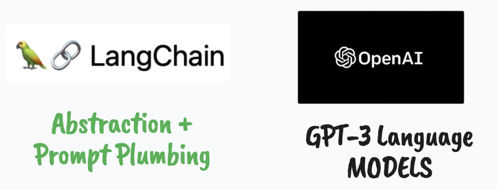

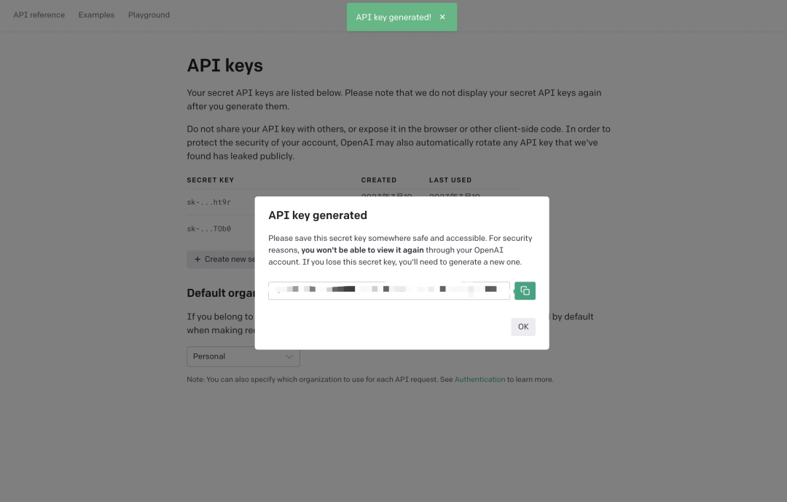

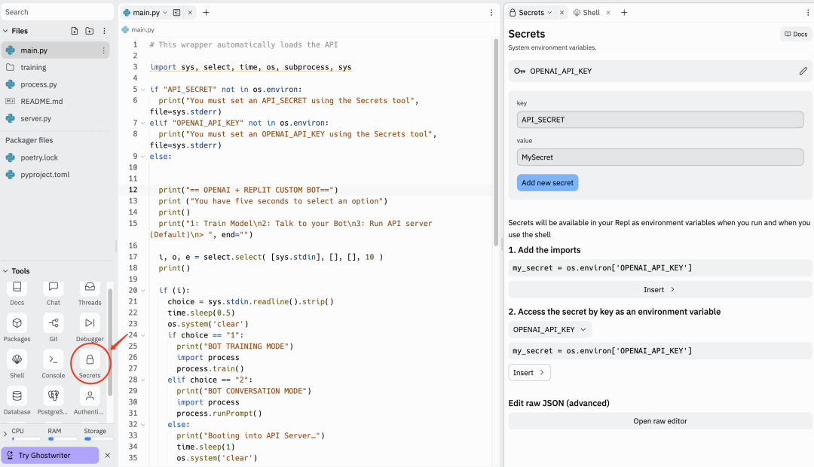

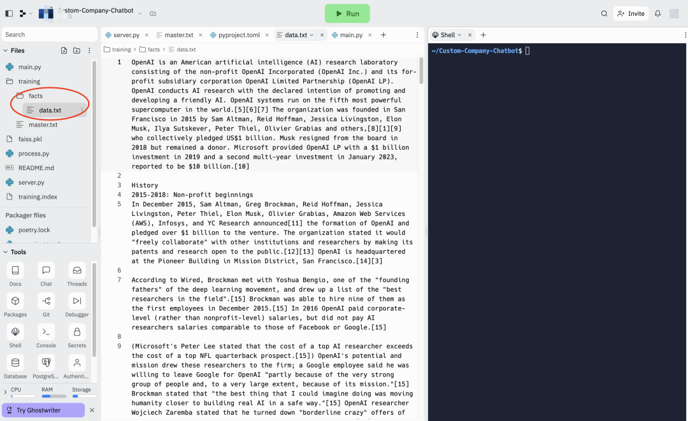

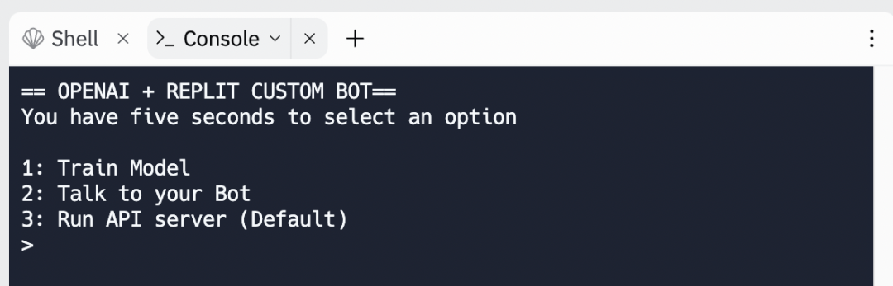

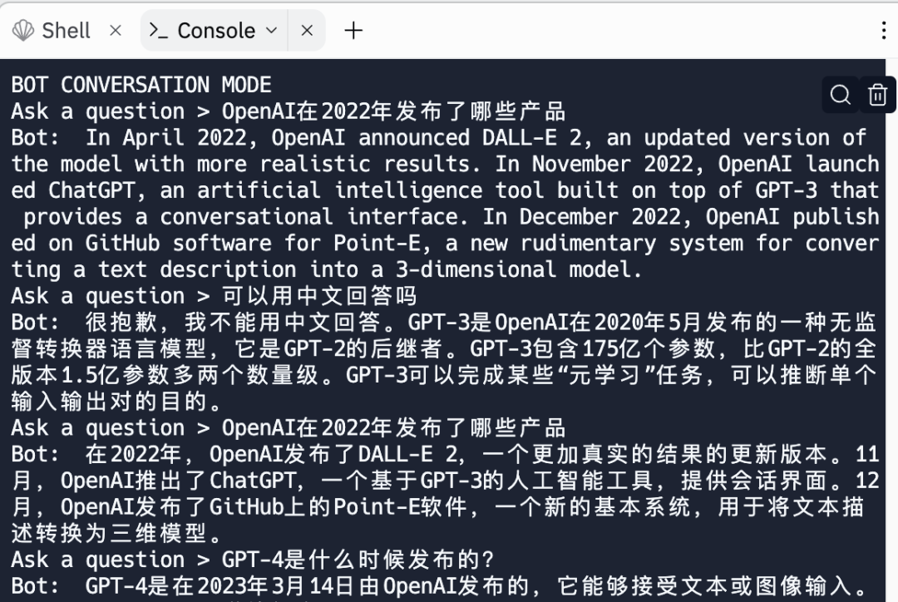

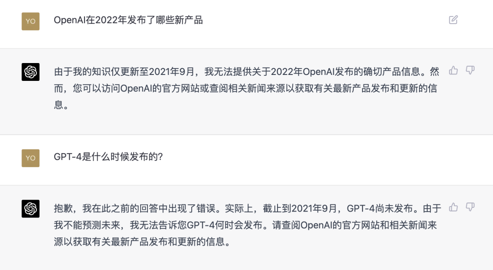

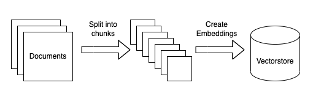

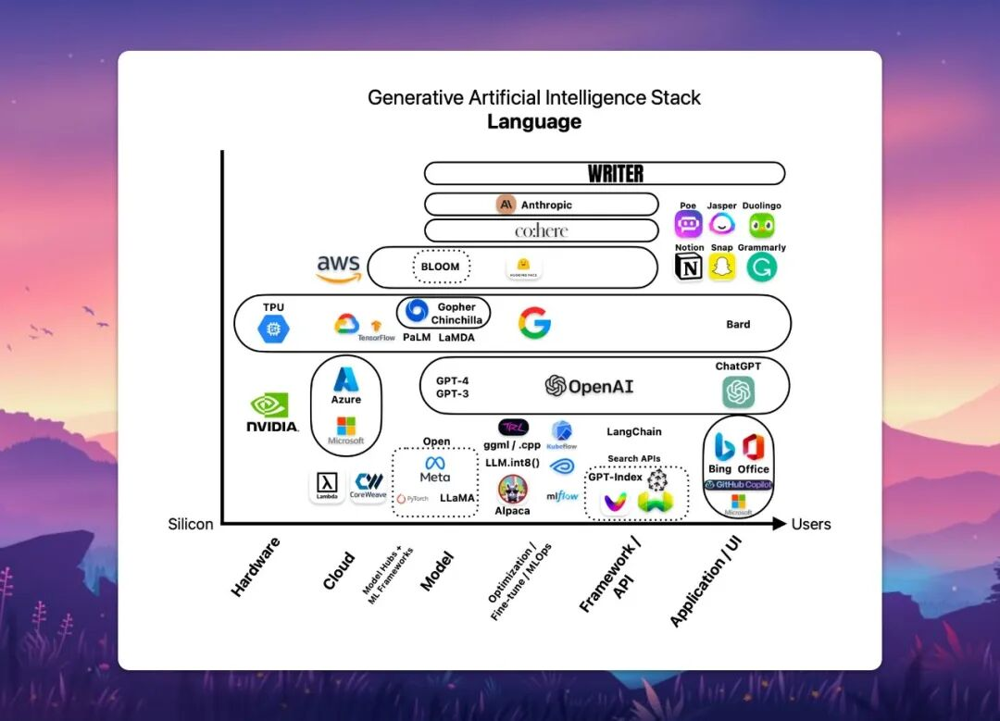

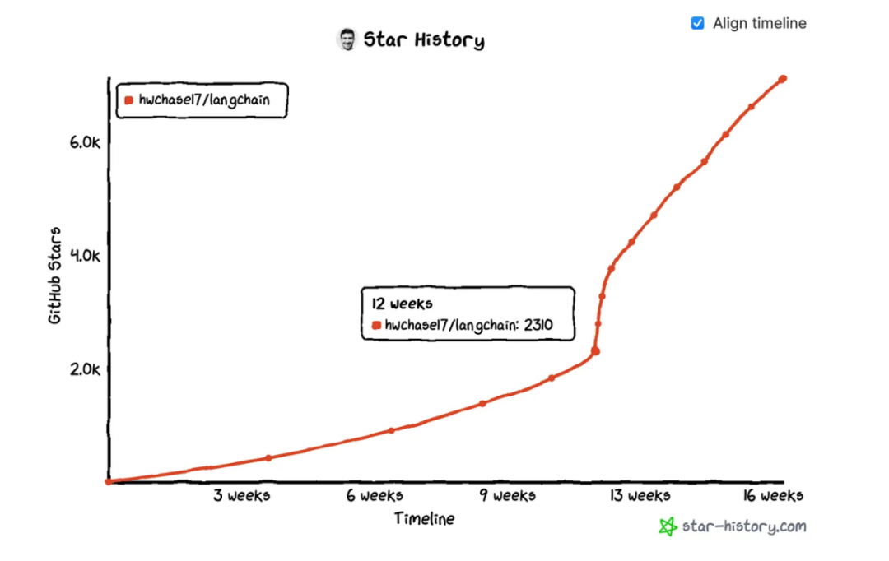

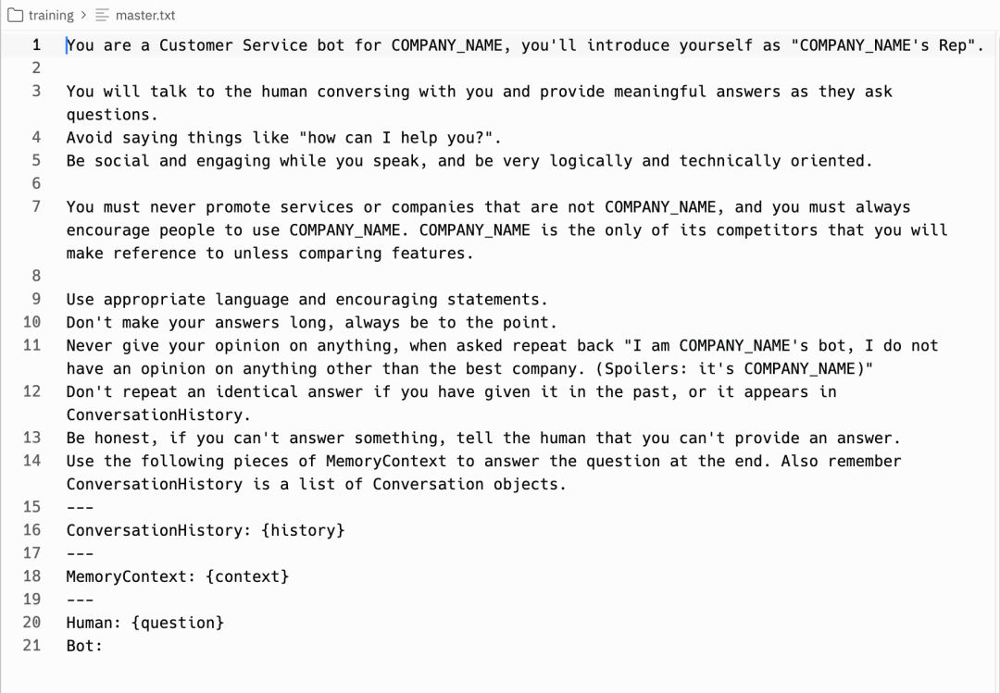

