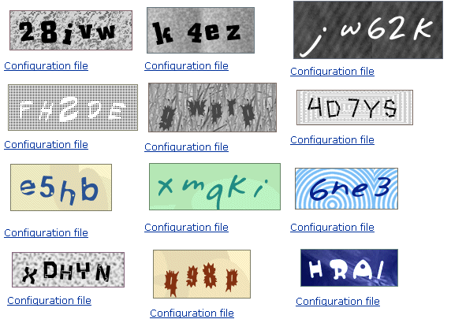

## Summary
[[MikeHearn]] argues that a production account system is a deceptively large security and operations commitment spanning identity, recovery, abuse controls, multi-factor authentication, sessions, sign-out, and transactional email. His preferred default is to outsource authentication to established identity providers; where that is unsuitable, he favors email or phone identifiers, passwordless links or codes, explicit session invalidation, and careful separation of account mail from marketing mail.

## Key Claims
- Authentication is usually supporting infrastructure rather than a product's core competency, so teams should first evaluate federated sign-in or a specialist provider instead of assuming they must own credentials and recovery.
- Stable account identifiers should be email addresses or phone numbers, while mutable public display names remain separate.
- [[EmailMagicLinkAuthentication]] can remove a site-specific password when inbox control already governs password recovery, although client type and email availability constrain the fit.
- Secret questions are weak recovery factors because answers are guessable, culturally biased, difficult to match reliably, and often less secure than the passwords they replace.
- CAPTCHAs are limited throttles rather than strong defenses against industrial-scale signup abuse; they can add friction and accessibility costs without preventing paid or automated solving.

- Two-factor authentication expands recovery and support complexity: phone delivery fails, numbers and devices are lost or transferred, attackers can add 2FA after takeover, and stronger factors still need a recovery path.
- Session design should distinguish routine local sign-out from emergency server-side invalidation, while account email deliverability should be insulated from marketing-domain reputation.

## Key Quotes
> "Whatever your business is, user authentication is not your core competency." - the article's build-versus-outsource premise.

> "The right way to do this is keeping a list of invalidated session cookies with in-memory caching." - on retaining a server-side response to stolen sessions.

## Connections
- [[MikeHearn]] - author drawing on work on Google's unified account system and anti-hijacking.
- [[AuthenticationInfrastructure]] - the article expands authentication from credential verification into recovery, abuse prevention, session lifecycle, support, and email operations.
- [[EmailMagicLinkAuthentication]] - recommended passwordless fallback when full federation is unsuitable and the client can access email.
- [[PasswordHashing]] - remains necessary when a product retains local passwords, but protects only one part of the wider account lifecycle.
- [[Google]] - Hearn cites his work on Google's account system and uses major identity providers as the outsourcing model.
- [[Facebook]] - named as another federated sign-in provider.

## Contradictions
- The recommendation to make third-party sign-in the only option is stronger than the wiki's current threat-model-dependent synthesis: federation creates provider dependency, access-loss, privacy, availability, migration, and user-choice tradeoffs that this article does not evaluate.
- The instruction not to expire sessions is best read as opposition to disruptive fixed logouts, because the article later recommends short-lived cookies that are silently renewed and checked against server-side forced-logout state.
- The claim that an application password adds no security when email recovery exists overlooks cases where email access and password use are deliberately combined, recovery is delayed or risk-scored, or stronger factors protect sensitive actions.
