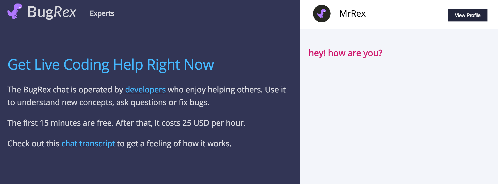
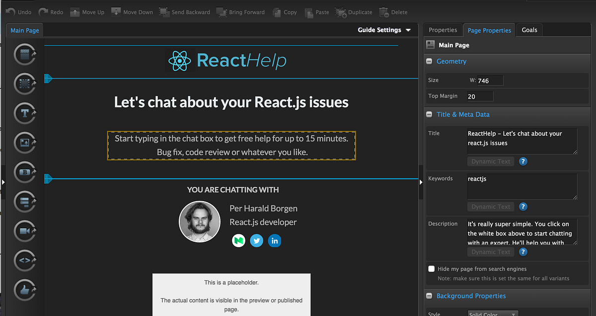

## Summary
[[PerHaraldBorgen]] describes how he and Andreas Hennie assembled [[BugRex]], an on-demand developer-help marketplace, from five existing services instead of first building custom software. The prototype was designed to test three commercial assumptions—customer interest in chat-based coding help, customer willingness to pay, and the compensation experts would require—while deferring code and business-model questions that were not necessary for those tests. The case connects [[NoCodeProductPrototyping]], [[StartupHypothesisTesting]], and [[MinimumViableProduct]] through a functional but deliberately compromised service workflow.

## Key Claims
- Early product progress should be measured by assumptions tested rather than lines of code written.
- Existing services can form a functional MVP when their combined workflow reproduces enough of the intended customer experience to test the core commercial questions.
- The prototype used [[Unbounce]] for its landing page, Olark for web chat, Trillian for mobile expert notifications, [[PayPal]] PayPal.me pages for direct customer-to-expert payment, and Typeform for expert applications.
- The payment design deliberately bypassed BugRex, so the test could examine willingness to pay without yet proving that the marketplace could take a transaction fee.
- The author estimates that using existing tools saved roughly three weeks to three months, but the estimate is explicitly rough and unscientific.
- A no-code prototype is an alternative route with tradeoffs, not a universal formula; BugRex later moved from Unbounce to GitHub Pages when customization needs increased.

## Key Quotes
> "Measure your progress by the assumptions you've managed to test" — on validated learning as the unit of progress.

> "Do I need to build this feature or have someone else built it for me?" — on checking for existing services before implementing a feature.

## Connections
- [[PerHaraldBorgen]] — author and BugRex co-founder describing the prototype.
- [[BugRex]] — two-sided coding-help marketplace assembled for the experiment.
- [[NoCodeProductPrototyping]] — composes hosted services into a testable end-to-end product experience.
- [[StartupHypothesisTesting]] — the prototype targets explicit demand, price, and supplier-compensation assumptions.
- [[MinimumViableProduct]] — the five-service workflow is a functional MVP without custom application code.
- [[Unbounce]] — supplied the first visual landing page before customization justified migration.
- [[PayPal]] — enabled direct payment while deliberately leaving marketplace fee capture untested.

## Contradictions
- No direct contradiction found. The source strengthens the wiki's MVP and hypothesis-testing material, while qualifying it by showing that a prototype can validate demand and payment behavior without validating platform economics, integration durability, or a scalable operating model.

## Image Notes
Nine distinct local image files were opened. The full-resolution BugRex customer/chat interface and ReactHelp Unbounce editor were retained; duplicate thumbnails, service screenshots whose content was fully repeated by the prose, a promotional Scrimba banner, and empty image placeholders were omitted.
