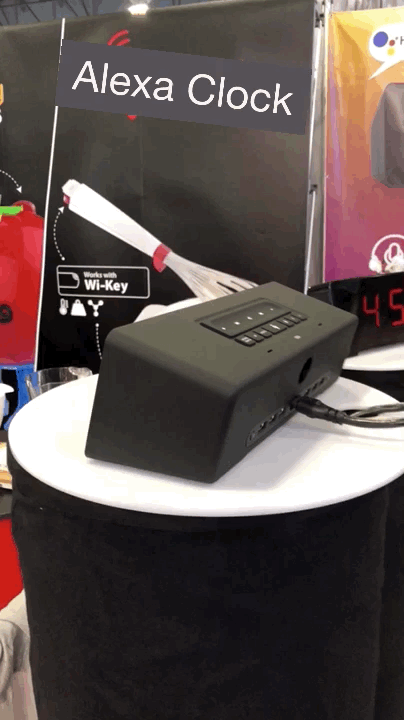
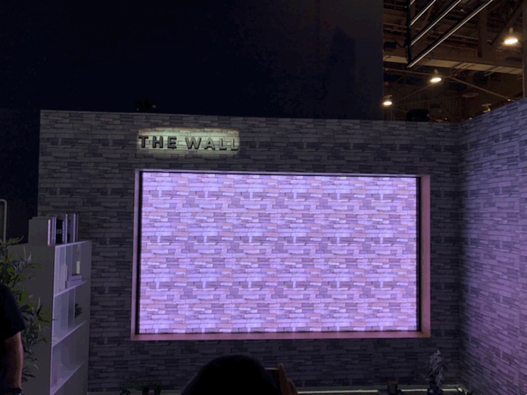
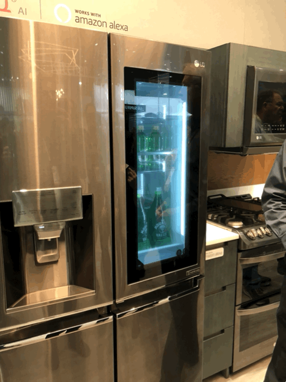
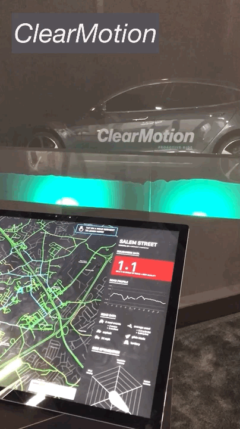
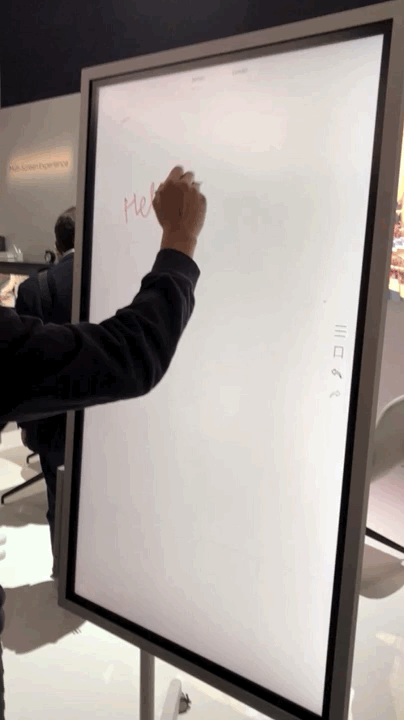
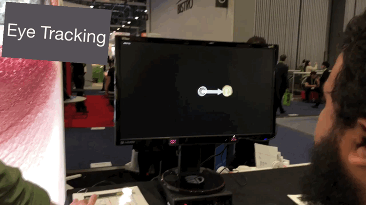

## Summary
[[StevenSinofsky]] reads CES 2018 as evidence that consumer technology usually advances through accumulated, ordinary improvements rather than one show-stopping invention. Voice control, connected appliances, wireless links, OLED displays, electric transport, augmented-reality displays, Qi charging, and specialized health or robotics products were becoming more useful, but the report repeatedly asks whether manufacturers were placing too much software, hardware, and interface complexity inside long-lived endpoints. Its product-management conclusion is optimistic but conditional: impressive components and demonstrations matter only when integration, standards, maintenance, privacy, and a real user problem make them durable everyday products.

## Key Claims
- Voice had become a platform strategy led by Alexa and Google Assistant, but simple command-and-control was much more credible than a universal conversational interface; embedding microphones and proprietary runtimes into every endpoint created privacy, lifecycle, and cross-platform costs.

- [[ConsumerElectronicsIntegration]] was the central design problem: cheap processors, radios, sensors, screens, and Android-derived software made almost anything "smart," while product quality depended on deciding whether intelligence belonged in the endpoint, a phone, a hub, or a cloud service.
- Displays showed real component progress through mainstream OLED, modular large-screen systems, short-throw projection, and better panel audio, even as "AI" labels and built-in TV control centers often added more marketing and software complexity than user value.

- Home appliances combined useful physical innovation and connectivity with risky embedded screens, microphones, vendor hubs, and proprietary assistants whose software cycles are shorter than refrigerators, ovens, plumbing, and other household infrastructure.

- Automotive exhibits often emphasized positioning and future-cockpit theater, but electric service vehicles, last-mile transport, heads-up navigation, and software-controlled suspension supplied narrower examples tied to concrete problems.

- PCs and mobile devices were consolidating around established use cases and standards such as USB-C, while purpose-built products could still improve a specific interaction without pretending to create a new general platform.

- Connected-health products were strongest when sensors and software augmented a defined diagnostic workflow and weakest when measurement preceded clinical value or drifted toward pseudoscience.

- [[LongNoseInnovation]] is visible at show scale: standards such as Qi and mundane improvements in appliances, wireless audio, and home control needed several product cycles to reach critical mass, so novelty is a poor test of progress.

## Key Quotes
> "CES 'just' needs to show how everyday life will get better next year or the year later." - on judging a trade show by cumulative practical improvement rather than total disruption.

> "Beyond that we are at the very early stages with a good deal of frustration ahead." - on the gap between reliable basic voice commands and broad conversational control.

> "why so much complexity at the edge" - the report's recurring question about putting processors, screens, microphones, and independent software stacks into long-lived devices.

## Connections
- [[StevenSinofsky]] - author applying a product-management lens across the CES 2018 show floor.
- [[ConsumerElectronicsIntegration]] - captures the choice of where intelligence, controls, connectivity, and maintenance responsibility should live.
- [[VoiceAssistantUX]] - captures the value of basic hands-free commands and the limits of expectations, discoverability, platform divergence, and microphone proliferation.
- [[SmartHomeInteroperability]] - captures tension between useful connected appliances and fragmented hubs, runtimes, vendor suites, and replacement cycles.
- [[LongNoseInnovation]] - explains why several years of refinement and standard adoption can matter more than a supposedly unprecedented launch.
- [[Google]] - mounted a show-wide Assistant campaign while hundreds of third-party booths advertised Google integration.
- [[Amazon]] - Alexa supplied the leading accessible SDK and a common voice-integration target across many product categories.
- [[Samsung]] - represented Korean leadership in displays, appliances, connected-home suites, and purpose-built collaboration hardware.
- [[LG]] - represented Korean leadership in OLED, appliances, home hubs, and the Cloi assistant strategy.
- [[Apple]] - AirPods helped revive wireless earbuds and the iPhone X accelerated visible Qi ecosystem investment despite Apple's limited direct show presence.

## Contradictions
- No direct contradiction found. The report strengthens [[ces-2019-a-show-report-learning-by-shipping]] by showing the same integration and endpoint-complexity concerns one year earlier, while documenting genuine progress in voice command reliability, displays, appliances, wireless standards, and specialized products.
- The source is one observer's three-day show-floor report rather than adoption, reliability, market-share, or clinical-outcome research. Many examples are prototypes or demonstrations, and the 2018 platform and product judgments are period-specific.
