## Summary
[[Cisco]] documents how [[CiscoCatalystSDWAN]] combines certificate-based identity with administrator-controlled allowlists to admit control components and WAN Edge routers to an overlay. The guide recommends automated Cisco PKI for supported releases, retains manual Cisco PKI and enterprise-CA paths, and treats certificate renewal, root-chain distribution, time synchronization, organization-name consistency, transport reachability, and authorized serial-number propagation as one operational lifecycle.

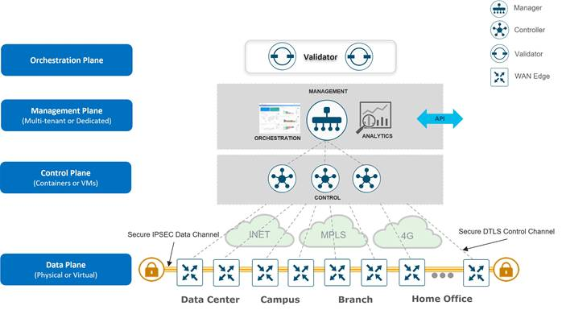

## Key Claims
- The SD-WAN Validator onboards and directs devices, the Manager configures and monitors the system, Controllers distribute topology and policy, and WAN Edge devices forward traffic.
- Mutual certificate validation is necessary but not sufficient: peers also check organization identity and, where applicable, certificate or chassis identity against an authorized list.

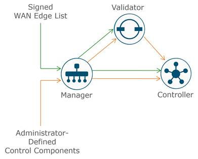

- Certificate signatures establish that a presented public key and identity were signed by a trusted CA root.

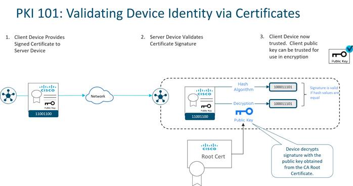

- Control components can use Cisco PKI or an enterprise CA, while hardware and virtual WAN Edge identities differ: many hardware devices carry manufacturing-installed credentials, whereas virtual devices may bootstrap with a one-time token and receive a permanent Manager-signed identity.

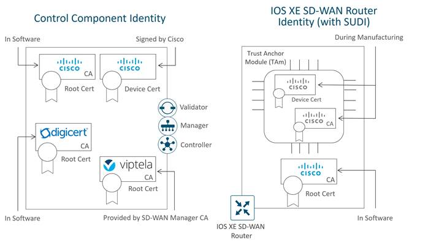

- Authentication checks vary by peer type but culminate in a mutually authenticated DTLS/TLS control connection.

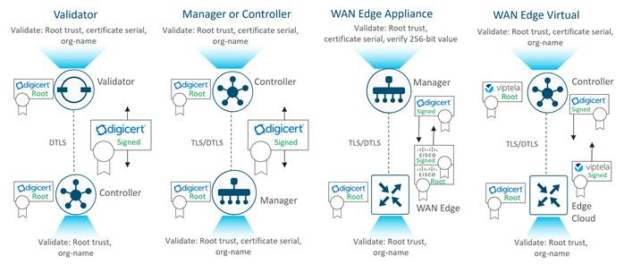

- Automated Cisco PKI is the recommended signing path for SD-WAN Manager 19.1 and later: Manager submits CSRs, retrieves signed certificates, and installs them on the control components.

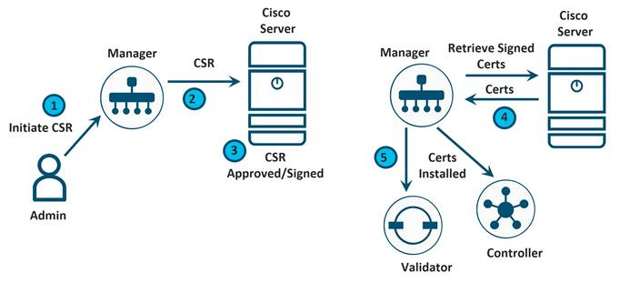

- Manual Cisco PKI moves CSR submission and certificate retrieval through an administrator when Manager cannot perform the cloud exchange directly.

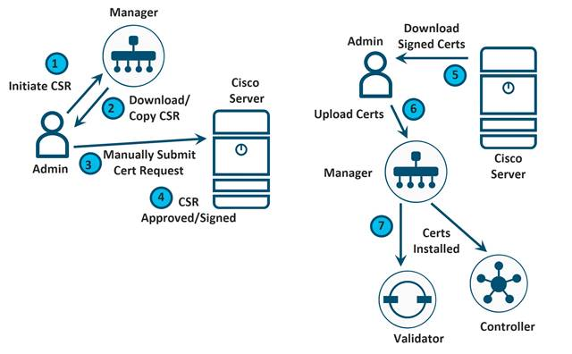

- Enterprise CA operation adds an explicit full root-chain import and customer-operated signing step; intermediate and root certificates must be distributed before device certificates can be trusted.

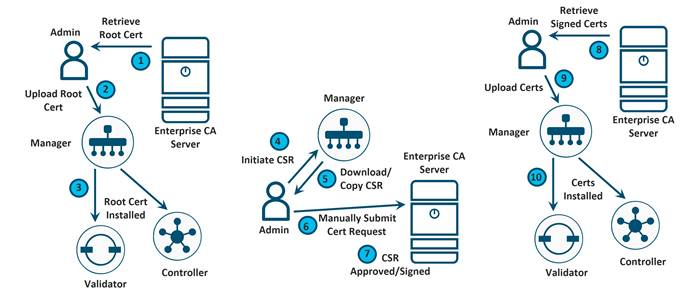

- Adding control components in Manager creates the authorized control-component list that Manager distributes through the control complex.

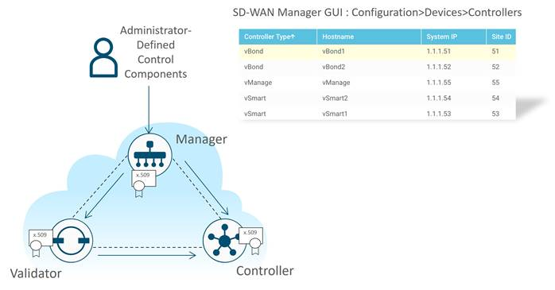

- WAN Edge authorization can be synchronized from Plug and Play Connect, uploaded as a signed provisioning file, or represented by a supported unsigned CSV; validation state controls overlay participation.

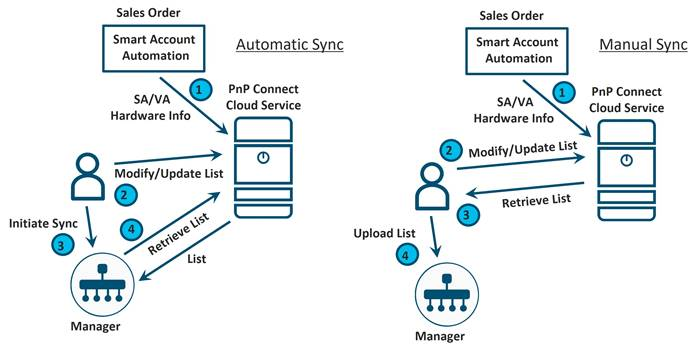

- Renewal should proceed one control component at a time, with control connections verified after each brief flap; the data plane should continue forwarding.

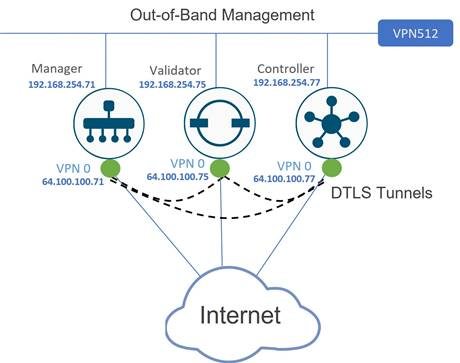

## Key Quotes
> "Cisco PKI is the recommended control component certificate method." - the guide's preferred signing model after Cisco ended sponsorship of Symantec/DigiCert control-component certificates.

> "Renew certificates one by one" - the guide's operational safeguard for limiting control-plane disruption during renewal.

## Connections
- [[Cisco]] - vendor and author of the deployment guidance.
- [[CiscoCatalystSDWAN]] - product architecture whose control complex and WAN Edge devices are being admitted.
- [[CertificateBasedDeviceIdentity]] - CA roots, signed device certificates, organization identity, and protected device keys establish peer identity.
- [[AuthorizedDeviceLists]] - explicit control-component and WAN Edge inventories add authorization after cryptographic authentication.
- [[ZeroTrustAccess]] - adjacent trust model because reachability alone does not grant participation; identity and policy checks remain required.
- [[NetworkSegmentation]] - VPN 0 and VPN 512 separate control transport from out-of-band management in the example topology.

## Contradictions
- No direct contradiction identified. The guide qualifies generic certificate authentication by showing that a valid chain alone does not authorize an SD-WAN peer: organization matching and allowlist membership also matter.
