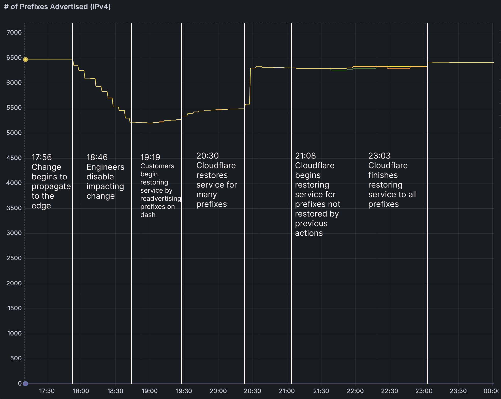

## Summary
[[Cloudflare]] reports that a malformed query in a newly automated cleanup task treated all Bring Your Own IP prefixes as pending deletion, withdrawing about 1,100 of 4,306 BYOIP prefixes and removing some service bindings. The resulting six-hour-seven-minute incident made affected CDN, Spectrum, Dedicated Egress, and Magic Transit services unreachable while leaving 1.1.1.1 DNS resolution intact; recovery ranged from customer re-advertisement to global edge-configuration restoration. The postmortem connects the failure to incomplete task-runner testing, direct propagation from authoritative configuration to operations, and the absence of production-ready state snapshots, staged health mediation, and large-withdrawal circuit breakers. Its chart shows advertised IPv4 prefixes falling in steps from roughly 6,500 to 5,200 before recovering through several distinct interventions rather than one immediate rollback.

## Key Claims
- A valueless `pending_delete` query parameter returned every BYOIP prefix because the server treated its empty string as if the filter were absent; the cleanup task then interpreted the result as the deletion set.
- The task withdrew about 1,100 prefixes, or 25% of Cloudflare's 4,306 BYOIP prefixes, before engineers stopped it; iterative execution limited the impact before all customers were reached.
- Recovery was state-dependent: some customers could re-advertise prefixes, some had partial binding loss, and others required service bindings to be reapplied across Cloudflare's edge.
- [[ChangeSafety]] for network configuration needs production-like task-runner tests, typed API schemas, staged and health-mediated propagation, rate or breadth circuit breakers, and customer-service health signals.
- [[DeploymentAutomation]] must separate configured intent from operational state and preserve known-good snapshots when automated changes can mutate authoritative data and trigger global workflows.
- The incident was caused by Cloudflare's own configuration change rather than a cyberattack; public DNS resolution through 1.1.1.1 was not affected, although the one.one.one.one website returned HTTP 403 errors.

## Key Quotes
> "Because the client is passing pending_delete with no value" - the postmortem identifies the client-server schema mismatch that selected all prefixes.

> "changes to the Addressing API are immediately propagated to the Cloudflare edge" - the operational coupling that enlarged the consequences of an authoritative-data error.

## Connections
- [[Cloudflare]] - company reporting the BYOIP outage and its remediation program.
- [[ChangeSafety]] - the incident demonstrates why configuration changes need staged exposure, health gates, circuit breakers, and bounded recovery.
- [[DeploymentAutomation]] - the failed cleanup task automated a manual workflow without equivalent rollout and recovery controls.
- [[SystemReliability]] - reachability failed through the interaction of API semantics, authoritative data, BGP advertisement, service bindings, and global edge propagation.
- [[NetworkAutomation]] - customer prefix advertisement and withdrawal were driven by APIs and operational workflows that changed routers and edge state.
- [[ServiceObservability]] - one.one.one.one failures exposed the impact, while future customer-service signals are proposed as circuit-breaker inputs.

## Contradictions
- The source qualifies [[Cloudflare]]'s favorable cost-and-platform profile by documenting a first-party configuration failure with a large BYOIP blast radius and prolonged stateful recovery.
- No direct contradiction with the existing change-safety synthesis was found; the incident strengthens its distinction between code reversion and restoration of operational and dependent state.
