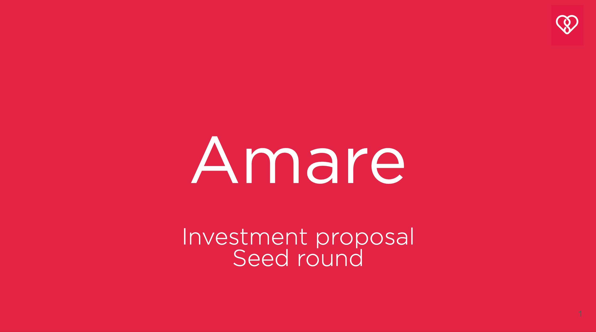

## Summary
Ash Vardanian proposes a [[SemanticJoin]] that adapts [[StableMatching]] to dynamically queried [[ApproximateNearestNeighborSearch]] indexes instead of materializing every participant's complete preference list. A first-party [[USearch]] experiment reports that title-to-abstract matching degrades as the candidate pool grows and that image-text joins degrade much more sharply, making shared-space representation quality a larger constraint than self-retrieval quality. The article is an implementation and benchmark account, not an independent validation of the algorithm, cost estimates, or general multimodal-model quality.

## Key Claims
- Recomputing preferences through vector search can replace the quadratic storage required by complete stable-matching preference lists, trading memory for search work.
- The proposed USearch join uses two vector indexes and a bounded proposal process; the article recommends a practical cap rather than claiming exact Gale-Shapley behavior over fully materialized rankings.
- On Arxiv title-abstract pairs, reported correct joins fell from 87.85% at 10,000 pairs to 57.67% at one million, even though self-recall at 10 stayed above 99.8%.
- Downcasting 768-dimensional E5 embeddings from `f32` to `i8` reportedly tripled construction and search/join speed with little change in the displayed join metrics.
- On Creative Captions image-text pairs, reported correct joins at one million were 9.02% for OpenCLIP ViT-B-16 and 13.46% for the much larger ViT-G/14 checkpoint.
- High self-recall within each modality does not establish reliable cross-modal alignment or correct one-to-one joins.

## Key Quotes
> "Instead of storing preferences, we can recalculate them as needed." — the article's central compute-for-memory tradeoff

> "The reality is harder." — transition from an optimistic search-cost baseline to the measured representation-quality limits

## Connections
- [[AshVardanian]] — author and implementer reporting the design and benchmark results.
- [[USearch]] — vector-search library that implements the proposed join operation.
- [[Unum]] — company and project context from which Amare, USearch, and UForm emerged.
- [[SemanticJoin]] — database operation proposed by the article.
- [[StableMatching]] — combinatorial procedure generalized over dynamically searched candidates.
- [[ApproximateNearestNeighborSearch]] — supplies candidate retrieval without complete stored rankings.
- [[HNSWIndex]] — approximate graph structure used by USearch in the experiments.
- [[Embeddings]] — representation quality determines whether true cross-collection pairs rank highly enough to be joined.

## Contradictions
- No direct contradiction with the existing wiki was identified. The article qualifies simple embedding-quality assumptions by showing that strong within-modality recall can coexist with weak cross-modal and final join accuracy.
- The performance, cloud-cost, and model-comparison figures are author-run snapshots with fixed datasets, checkpoints, proposal caps, and implementation choices; they should not be generalized without reproduction.
