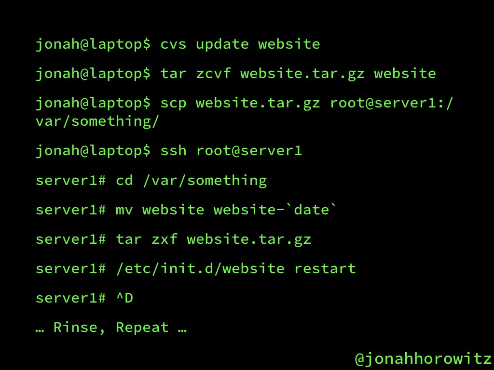
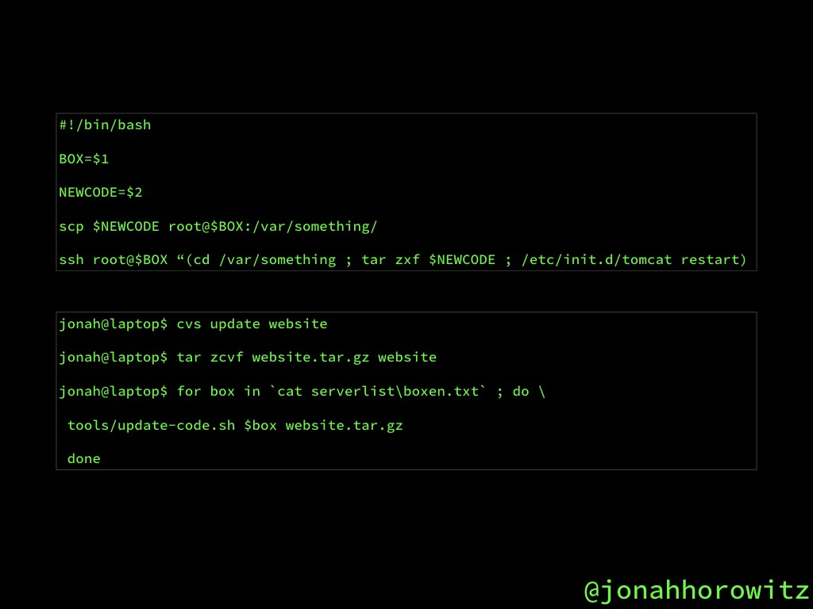
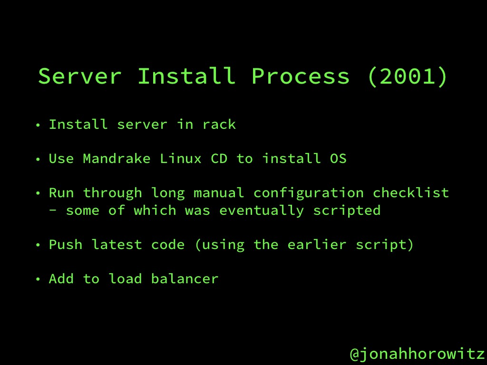
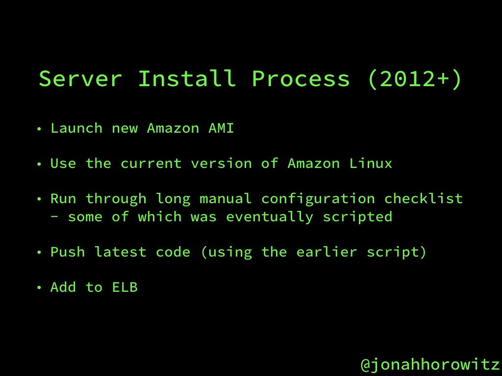
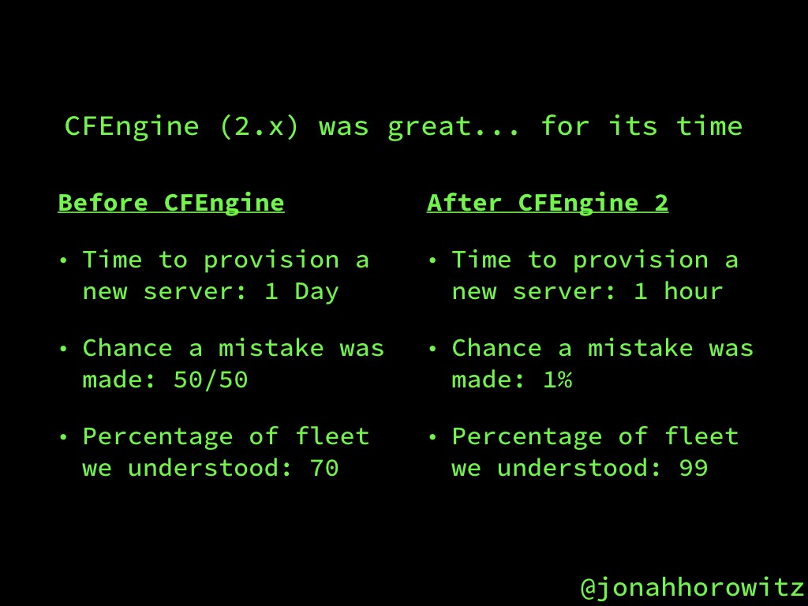
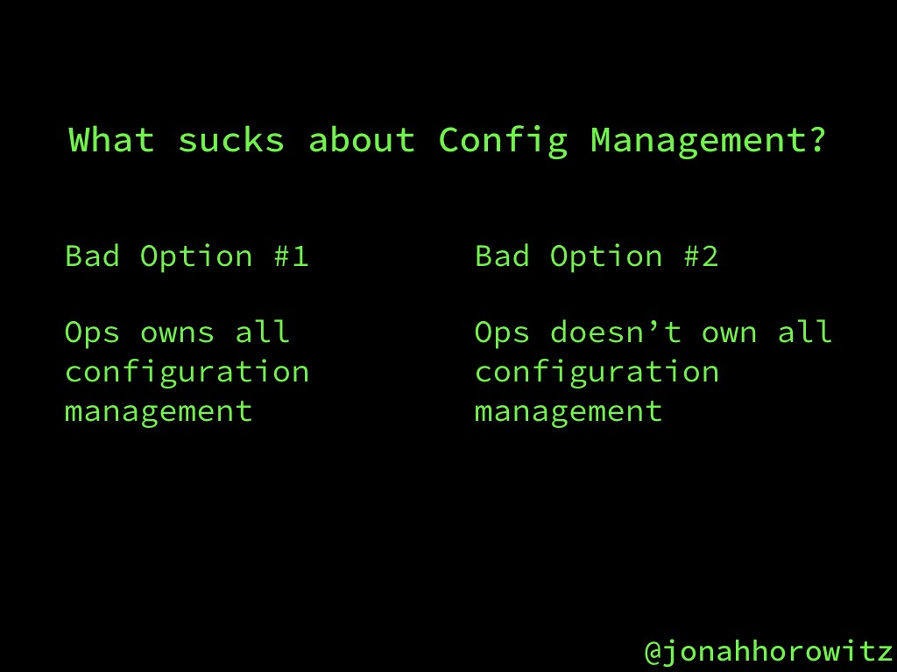
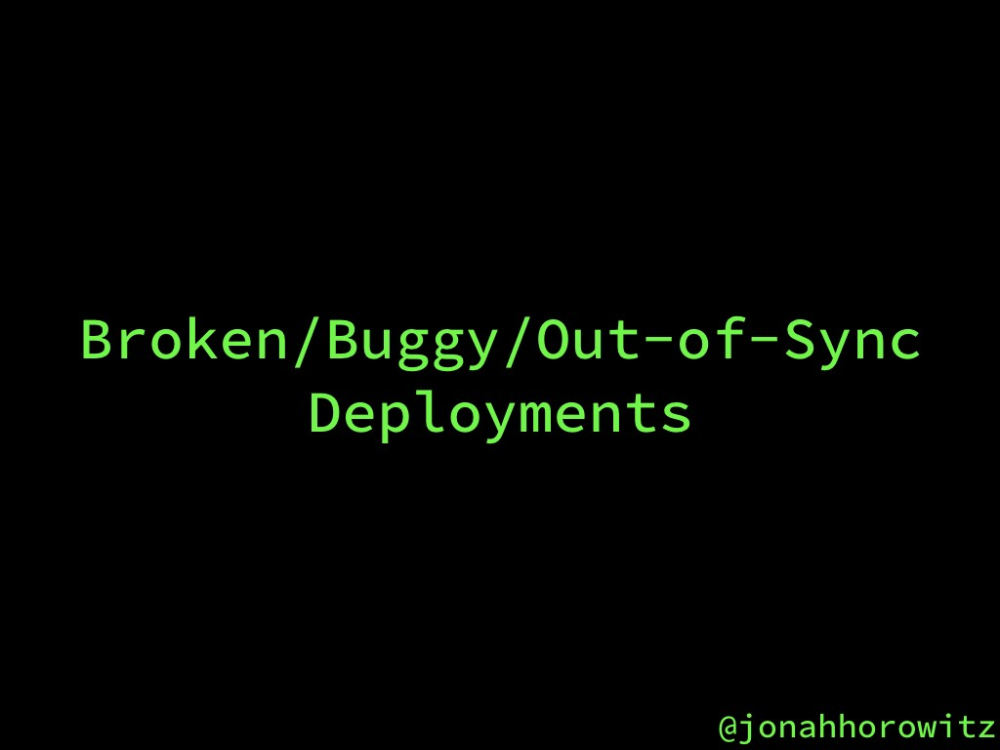
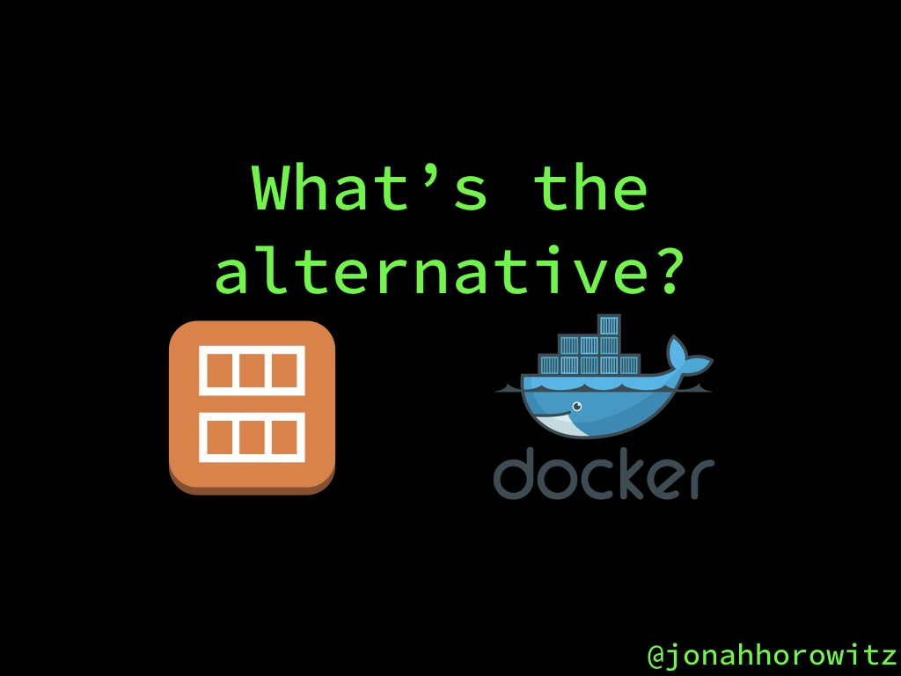

## Summary
[[JonahHorowitz]] argues that convergence-oriented [[ConfigurationManagement]] improved manual server operations but became a poor default for cloud-era releases because ownership bottlenecks, fleet drift, partial runs, and failure-recovery logic prevent it from delivering a fully known state. He advocates [[ImmutableInfrastructure]] instead: build application code and dependencies into a tested image, promote that artifact across environments and regions, and replace instances through rolling or blue/green [[DeploymentAutomation]]. The argument is a practitioner talk grounded in Horowitz's experience, not a controlled comparison; it also preserves limited roles for configuration tooling in image construction and bare-metal base systems.

## Key Claims
- Manual release procedures are slow and error-prone even after they are wrapped in increasingly elaborate scripts.

- Manual and launch-time server installation create drift because machines are assembled or updated at different times from changing package repositories.

- [[ConfigurationManagement]] was a major advance over hand-built servers: Horowitz reports that CFEngine cut provisioning from a day to an hour, reduced mistakes, and made almost the whole fleet understandable and rebuildable.

- Configuration management creates an ownership tradeoff: central operations control becomes a delivery bottleneck, while broad developer control requires specialist DSL knowledge and can give faulty changes fleet-wide blast radius.

- Desired-state convergence does not guarantee uniform actual state because clients run at different times and networks, configuration servers, code, or pushes can fail partway through.

- [[ImmutableInfrastructure]] moves work to image build time: a maintained base image receives the application package and dependencies, then the same versioned artifact is promoted through test and production rather than mutating long-lived servers.

- Prebuilt images shorten instance startup and failure recovery, improve environment and region parity, reduce accumulated cruft, and make continuous delivery and reactive scaling more practical.
- Rolling replacement accommodates state that must remain available, while blue/green deployment enables a fast traffic switch back to the previous fleet; persistent data still requires compatible formats, external volumes, and scripted database failover.

## Key Quotes
> "Configuration management promises that you'll know the complete state of your infrastructure, but it never works that way." - Horowitz on the gap between desired-state automation and fleet reality.

> "You no longer have to think about how to move from one state to another" - on replacing mutable servers with prebuilt images.

## Connections
- [[JonahHorowitz]] - practitioner-author whose startup and Netflix experience grounds the argument.
- [[ConfigurationManagement]] - the operational advance the talk credits and then rejects as the default release mechanism.
- [[ImmutableInfrastructure]] - proposed alternative based on building, testing, promoting, and replacing complete images.
- [[DeploymentAutomation]] - image promotion, canaries, rolling replacement, blue/green traffic switching, and rollback are the delivery layer.
- [[InfrastructureAsCode]] - immutable artifacts shift emphasis from repeated mutation toward repeatable build and provisioning definitions.
- [[ContinuousDelivery]] - prebuilt, environment-parity artifacts are presented as an enabler of frequent deployment.
- [[Netflix]] - source of the reported base-AMI, Aminator, package-building, and regional-promotion practices.
- [[AWS]] - AMIs, regions, ELBs, and EBS provide the cloud implementation context.
- [[Docker]] - container images are proposed as the analogous immutable artifact outside AWS.
- [[BoringTechnology]] - provides a counterexample where small-scale Ansible configuration and a release script remain proportionate.

## Contradictions
- The source's title is deliberately categorical, but its own history shows configuration management producing large gains over manual operations, and it retains the technique for base-image construction and bare-metal hosts. The narrower conclusion is that mutable convergence is often a poor application-release path, not that every use of configuration management is an antipattern.
- [[BoringTechnology]] presents a one-person company using Ansible and a small deploy script successfully. This conflicts with universal replacement advice but supports a scale-sensitive synthesis: operational model, fleet size, startup latency, blast radius, and team capacity determine whether image replacement is worth its pipeline cost.
- Identical images do not by themselves guarantee identical running systems. Runtime configuration, secrets, data, external services, mixed-version rollouts, and post-start mutations can still produce divergence; the source acknowledges part of this boundary through feature flags, persistent database volumes, and failover requirements.

## Image Notes
- All eight unique local slides were opened and retained because they contain release steps, comparative measurements, ownership alternatives, failure modes, or the proposed architecture.
- The opening manual-release slide appeared twice in the source and was retained once at its first evidentiary position.
