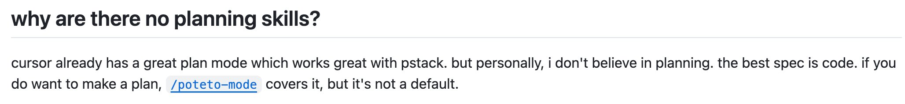
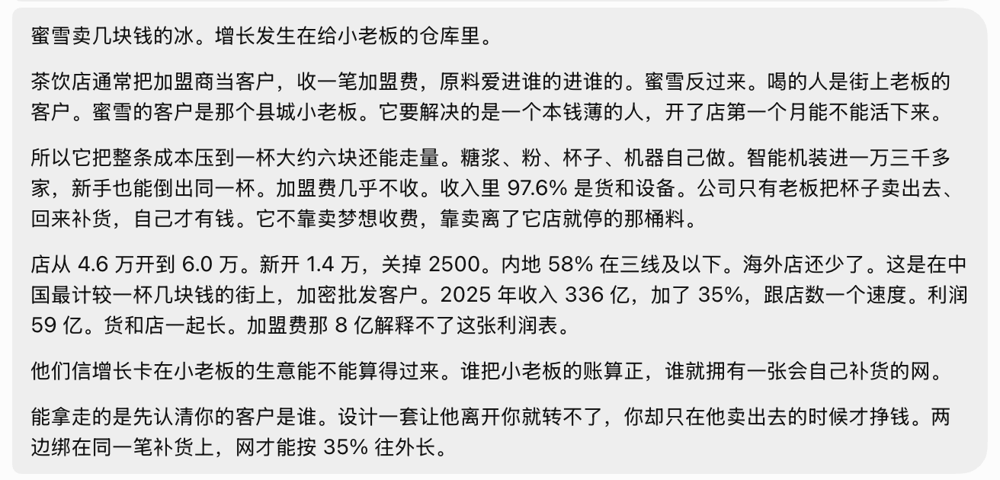

## Summary
[[MaiYang]] uses a failed [[GrokBot]] Growth Researcher routine to argue for [[DeliverableFirstAgentDesign]]: define one observable outcome, constrain sources and escalation points, obtain a gradable artifact, and only then encode a Skill or recurring schedule. The case also connects narrow bot roles to [[TaskContingentAICollaboration]] and treats email, publishing, spending, deletion, and overwrite as authority that should remain gated under [[AgentPermissionModel]] until repeated use justifies a narrower grant. The evidence is a first-person retrospective and three retained screenshots, not a comparative study of Grok Bot or planning methods.

## Key Claims
- [[LaurenTan]] does not reject all planning: the cited pstack text says Cursor Plan Mode works well, but long-form planning should not be the default and “the best spec is code.”

- [[DeliverableFirstAgentDesign]] replaces an elaborate bot job description with one outcome, explicit material boundaries, a defined return-for-confirmation point, and an initial artifact that a user can score.
- Mai Yang's Growth Researcher produced long research memos, screening frameworks, and changing company examples, but she found the output hard to understand and unable to guide a concrete product or plan.

- Skills specify how work is performed and routines specify when it runs; both should follow accepted examples because required source dates, error behavior, and partial-completion reporting become clearer through real review.
- A bot should begin with a narrow result rather than imitate a whole department; stable specialization can justify additional bots and channels later.
- On September 5, Mai Yang disabled the daily growth-research routine after deciding that its content was not what she wanted.

- Sending email, publishing publicly, spending money, deleting, and overwriting data should not receive blanket first-day authorization; an approval can stop the next action but cannot reverse one already completed.

## Key Quotes
> “The best spec is code.” — [[LaurenTan]], as reproduced from pstack.

> “最好的 spec 是已经验收过的交付物。” — [[MaiYang]]'s translation of the principle from code into bot work.

> “Skill 管怎么做。定时管什么时候做。” — on separating process instructions from scheduling.

## Connections
- [[MaiYang]] - author and operator reporting the failed Growth Researcher experiment.
- [[LaurenTan]] - source of the cited argument against making planning the default.
- [[GrokBot]] - agent product used for the Growth Researcher, AICon, routine, Skill, and permission examples.
- [[DeliverableFirstAgentDesign]] - central workflow derived from the failed scheduled research role.
- [[TaskContingentAICollaboration]] - clear outputs, constraints, acceptance checks, and escalation points determine when work can be delegated or automated.
- [[AgentPermissionModel]] - high-impact real-world actions remain gated until the operator has evidence for a narrower authorization.
- [[ActionBiasInAI]] - accepted artifacts and real feedback prevent planning documents from becoming a substitute for work.
- [[Cursor]] - the cited pstack passage treats Cursor Plan Mode as useful while rejecting it as the default workflow.

## Contradictions
- The article qualifies planning-heavy agent workflows but does not establish that planning is generally harmful. It explicitly retains planning for complex work when boundaries are unclear, and existing sources support planning for architecture, maintenance, high-risk work, and shared coordination.
- The retained Growth Researcher memo contains concrete Mixue claims and figures, so the failure is not absence of content; it is the author's judgment that the research product was difficult to use and insufficiently connected to her decisions. The article does not independently verify the memo's figures or compare it against a narrower prompt.
- The source is one operator's retrospective, without preserved job instructions, full bot transcripts, scored outputs, a restarted workflow, or outcome measurements. It supports a practical gate for experimentation, not a universal staffing ratio, scheduling threshold, or claim that several specialist bots always outperform one broad agent.
- All four remote images were opened. The title banner was omitted as decorative and duplicative; the pstack excerpt, research memo, and disabled-routine screenshot were retained at their semantic positions because they document evidence not fully repeated in the prose.
