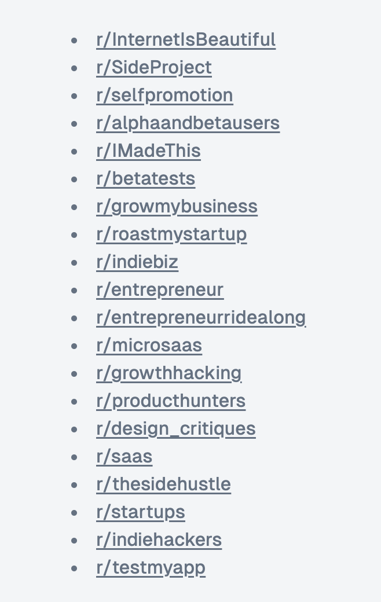

## Summary
[[Constantin]] proposes a simple [[RedditMarketing]] routine for a SaaS product with no users: study the highest-performing posts in a relevant subreddit, imitate the local content pattern without violating promotion rules, engage with every response, and repeat across communities at a non-spammy cadence. The retained image extends the post with a 20-subreddit prospecting list spanning side projects, self-promotion, beta testing, entrepreneurship, growth, design critique, SaaS, and indie-hacker communities. The advice gives [[SaaSMarketing]] a low-cost first-customer tactic, but the source reports engagement on X rather than resulting SaaS customers and provides no conversion, retention, moderation, or labor data.

## Key Claims
- Founders with a zero-user SaaS should temporarily prioritize customer discovery and distribution over further coding.
- A subreddit-specific strategy begins by studying its top posts over monthly, yearly, and all-time windows to infer which formats and topics fit that community.
- Posts should respect each subreddit's promotional rules and need not mention the product when self-promotion is forbidden.
- Replying to everyone under a post turns publishing into conversation and potential customer learning rather than one-way promotion.
- Posting about once per day across relevant communities is presented as a sustainable alternative to spam.
- The retained image identifies 20 candidate communities, including r/SideProject, r/selfpromotion, r/alphaandbetausers, r/betatests, r/roastmystartup, r/microsaas, r/saas, r/startups, and r/indiehackers.

## Key Quotes
> "Uninstall your code editor. Open Reddit and start posting." - the post's deliberately sharp switch from building to distribution.

> "Post once a day, don't spam." - the proposed cadence and behavioral boundary.

## Connections
- [[Constantin]] - author of the X post and its Reddit marketing checklist.
- [[Reddit]] - community platform where the proposed research, posting, and engagement happen.
- [[RedditMarketing]] - source-specific method of learning subreddit norms before participating and prospecting.
- [[SaaSMarketing]] - broader customer-discovery and acquisition work to which the tactic contributes.
- [[CustomerLedProductDevelopment]] - comment engagement can expose audience language, needs, objections, and feedback.

## Contradictions
- No direct contradiction found. The source sharpens the wiki's distribution material by making community fit and rule compliance explicit, but its promise of first customers is unsupported by customer-outcome evidence and should not be generalized across products or subreddits.
