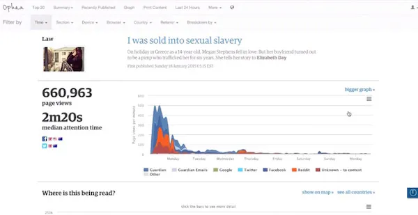
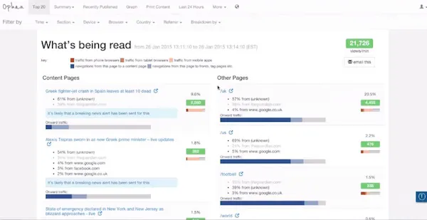
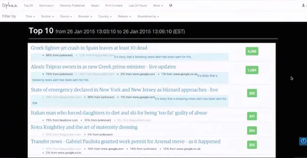
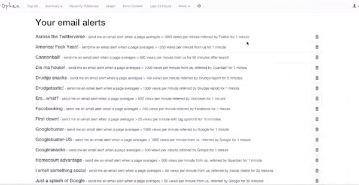
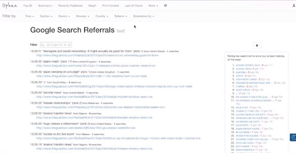

## Summary
Joseph Lichterman reports how [[TheGuardian]] spread its in-house [[Ophan]] analytics system across more than 900 newsroom staff by emphasizing understandable, real-time feedback rather than expert-only analysis. Editors used article, referral, attention-time, and site-wide views to test small editorial changes, while audience and development teams evolved the tool through frequent user feedback, minimum viable releases, mobile access, alerts, and experimental search-term visibility. The case connects accessible [[NewsroomAnalytics]] to both [[DataInformedCulture]] and [[AgileSoftwareDevelopment]], while the mistaken presentation of an old Chris Kyle article as current shows that traffic-led action can create editorial risk.

## Key Claims
- Broad newsroom adoption depended on making live analytics easy to access and interpret, including bookmarklets, mobile access, and a small set of legible measures such as page views and attention time.
- Ophan let staff connect headline, linking, front-page, and promotion changes to real-time audience response instead of relying only on intuition.
- Editors used referral sources and renewed interest to adapt distribution and add context, but re-promoting old material without clear temporal framing could confuse readers.
- Ophan grew from a 2011 hack-day prototype retaining three minutes of traffic into article-, section-, and site-level views through regular editorial feedback and minimum-first iteration.
- Configurable threshold alerts reduced monitoring effort by pushing exceptional traffic conditions to staff instead of requiring prolonged dashboard inspection.
- A live Google-referral ticker made aggregate search traffic feel like individual audience intent, although Google exposed only 10-20 percent of search terms.

The article view pairs 660,963 page views and 2m20s median attention time with a colored referral-source graph, giving editors both an outcome and a time-and-source explanation.

The live breakdown makes each story's current traffic rate and referral composition visible, supporting fast comparison rather than a single undifferentiated site total.

The Top 10 screen compresses newsroom attention into a ranked live list while retaining the traffic-source context beneath each story.

The alert screen shows that staff could maintain many named rules keyed to sources such as Twitter, Drudge Report, Facebook, Google, and unknown referrers, with different traffic thresholds and durations.

The search-referral screen links individual query strings to timestamps and destination articles, turning an aggregate channel into a stream of specific information needs.

## Key Quotes
> "They can test out a gut instinct and see what happens, rather than just flying purely on that instinct." - Mary Hamilton on real-time editorial feedback.

> "we always have gone toward the minimum possible thing and then iterated on that thing" - Hamilton on Ophan's development approach.

## Connections
- [[TheGuardian]] - newsroom organization that developed and deployed Ophan across the United States, United Kingdom, and Australia.
- [[Ophan]] - internal analytics product at the center of the article and retained interface screenshots.
- [[NewsroomAnalytics]] - practice of making audience evidence actionable inside everyday editorial work.
- [[DataInformedCulture]] - Ophan supplements editorial instinct with shared evidence rather than claiming to automate judgment.
- [[AgileSoftwareDevelopment]] - editorial feedback, minimum viable delivery, and repeated iteration shaped the product.

## Contradictions
- No direct contradiction found. The mistaken presentation of a re-promoted 2013 article as new qualifies any simple claim that higher traffic or faster reaction necessarily improves reader value.
