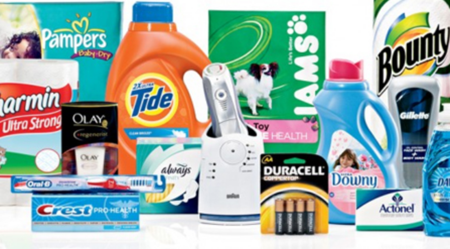

## Summary
[[LightspeedVenturePartners]] argues that consumer-packaged-goods incumbents are exposed to changing demand for personalization, ingredient transparency, and identity-rich brands, while startups gain from multi-channel distribution, measurable digital acquisition, and shorter product cycles. The essay links that thesis to Lightspeed's investment in [[Brandable]] and its portfolio exposure to modern consumer brands. Its strategic framework reinforces [[MicroBrandCommerce]], [[CorporateGiantFragility]], and [[StartupExecutionSpeed]], but the evidence is an investor's 2018 practitioner account rather than comparative market or company-performance data.

## Key Claims
- Younger consumers increasingly seek products and brands that feel personalized rather than interchangeable.
- Product-ingredient transparency and knowledge of what goes into consumer goods are becoming purchase expectations.
- Friends, celebrities, influencers, and a brand's stated identity shape product discovery and trust.
- Established CPG companies are portrayed as slow to innovate, distant from emerging customers, and increasingly reliant on acquisitions to remain relevant.
- New brands can distribute across retailers, boutiques, marketplaces, and their own channels instead of depending exclusively on one retailer.
- Digital channels make one-to-one targeting and channel-level acquisition-cost comparison more measurable than broad magazine advertising.
- The source reports that a large CPG company may need 12-24 months to move from idea to customer, while a startup may do so in under 12 weeks.

## Key Quotes
> "CPG is a sector ripe for disruption" - the essay's investment thesis.

> "Knowledge is power in marketing." - claim that measurable channel acquisition improves entrant decision-making.

> "This can be <12 weeks for startups." - contrast with the reported 12-24-month incumbent product cycle.

## Connections
- [[LightspeedVenturePartners]] - investor and publisher presenting the CPG thesis through its portfolio interests.
- [[Brandable]] - newly announced investment described as representing where the author expected CPG companies to head.
- [[MicroBrandCommerce]] - combines differentiated brands, digital targeting, multi-channel selling, and fast product experimentation.
- [[CorporateGiantFragility]] - incumbent R&D inertia, customer distance, and acquisition dependence are offered as openings for entrants.
- [[StartupExecutionSpeed]] - the source gives an anecdotal consumer-product cycle comparison between a conglomerate and startups.
- [[CustomerAcquisitionCost]] - Facebook and Instagram acquisition prices are presented as measurable inputs to marketing allocation.
- [[BrandDistinctiveness]] - personalization, stated values, social proof, and influencer affiliation make brands more legible and identity-bearing.

## Contradictions
- No direct contradiction was found. The source complements the micro-brand thesis with consumer-demand, distribution, and speed mechanisms, while its positive framing is qualified by Lightspeed's disclosed portfolio exposure.
- The essay provides no product-launch sample, R&D comparison, cohort economics, retention, repeat-purchase, margin, market-share, or acquisition-outcome data. Its reported cycle times come from an unnamed CPG conglomerate, and the more-than-$300-billion 2017 retail and consumer M&A figure is not sourced in the article.
- Both unique local image files were opened. The 60-by-33-pixel file is a duplicate thumbnail of the full incumbent-brand montage; the full montage was retained once and the thumbnail was omitted.
