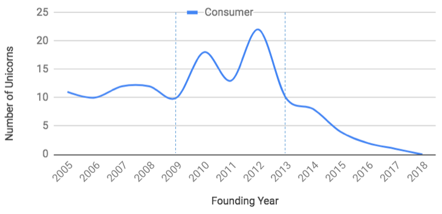

## Summary
This 2018 investor essay argues that the smartphone platform shift produced an unusually strong 2009-2012 cohort of consumer companies, after which network effects, distribution, capital, and technical talent increasingly reinforced established leaders. Its retained chart shows consumer-unicorn counts peaking around the 2012 founding cohort and falling sharply after 2013, although the newest cohorts are right-censored. The author nevertheless argues that startups can still break out by coexisting with incumbents, exploiting the remaining app-discovery window, and using cheaper product-development infrastructure.

## Key Claims
- The App Store and rapid smartphone adoption created a 2009-2012 "golden age" in which multiple enduring consumer companies were founded, while consumer-unicorn formation weakened after 2013 even as enterprise-unicorn formation reportedly held up.
- Post-2013 smartphone growth disproportionately strengthened existing leaders such as Facebook, Apple, Amazon, Netflix, Google, Uber, Pinterest, and Snapchat rather than creating an equivalent number of new category leaders.
- Incumbents compound advantage through direct, indirect, and two-sided network effects; owned distribution; retention; cross-promotion; capital; engineering talent; and privileged platform access.
- A challenger need not displace a dominant service if users comfortably use several social, shopping, messaging, or video products at once; coexistence can bypass a head-on network-effects contest.
- App Store discovery became much less open between 2013 and 2018, but occasional new number-one apps show that distribution was constrained rather than completely closed.
- Cloud infrastructure, open source, service-based architecture, and faster product-development tools reduce the team size and capital needed to test consumer products, partially offsetting incumbent resource scale.

## Key Quotes
> "Whereas 2009 to 2012 created new market leaders, 2013 to 2018 reinforced established market leaders." - the essay's central periodization of mobile competition.

> "A startup can avoid the direct battle and exist alongside the incumbent" - the proposed response to incumbent network effects.

## Connections
- [[ConsumerStartupCompetition]] - combines the essay's account of incumbent reinforcement with its coexistence, residual-discovery, and low-cost-building counterstrategies.
- [[MobileEcosystem]] - smartphone scale and the App Store are treated as the platform shift behind the initial consumer-startup wave.
- [[CorporateGiantFragility]] - qualifies incumbent power by arguing that dominant technology companies can still be displaced over time.
- [[PlatformDistributionDependence]] - App Store rankings and incumbent-owned channels illustrate how access to users becomes a competitive bottleneck.
- [[StartupDefensibility]] - network effects are presented as a compounding incumbent defense rather than merely a product feature.
- [[CrowdedMarketEntry]] - users' willingness to maintain several services creates room for differentiated entrants beside established products.

## Contradictions
- The export metadata labels the publication date as 2018-07-22, while the captured article link displays Jul 23, 2018; the source note uses the displayed article date and preserves this discrepancy here.
- The argument is a July 2018 market snapshot, so its company valuations, App Store rankings, smartphone counts, churn figures, staffing estimates, and claim that the distribution opening had stabilized are not current evidence.
- The retained chart has labeled axes and a single consumer series but no visible sample definition, raw observations, uncertainty, enterprise comparison, or adjustment for valuation lag. Its 2015-2018 decline is heavily exposed to right-censoring, which the prose acknowledges but does not quantify.
- Unicorn counts and valuations are financing outcomes, not direct measures of product quality, user welfare, profitability, or the total rate of consumer innovation.
- The essay selects breakout apps and small successful teams without supplying the base rate of failed products, so it establishes that entry remained possible rather than estimating a newcomer's probability of durable success.
