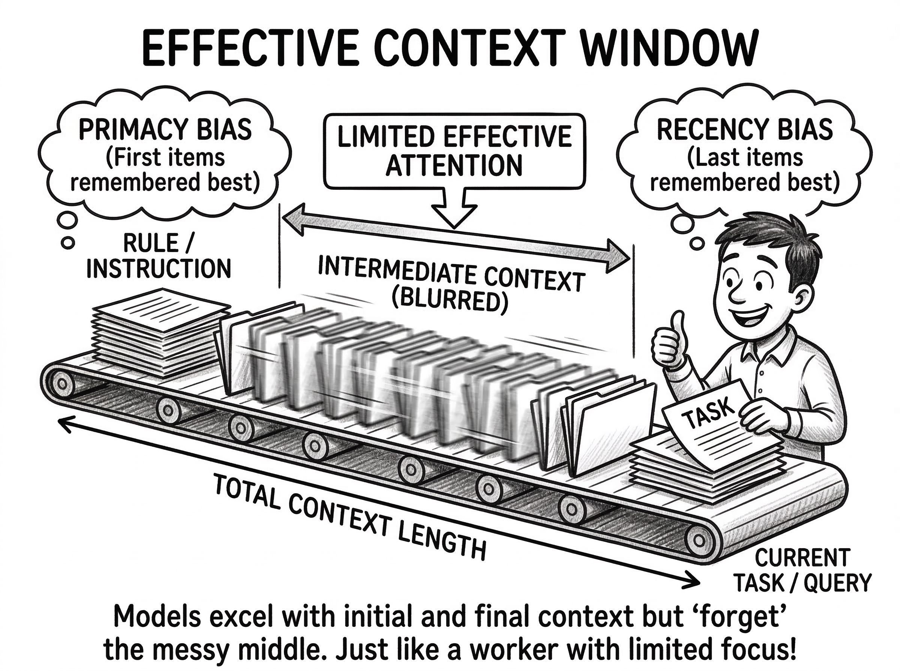
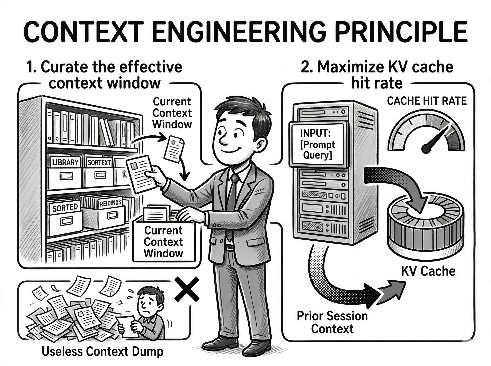
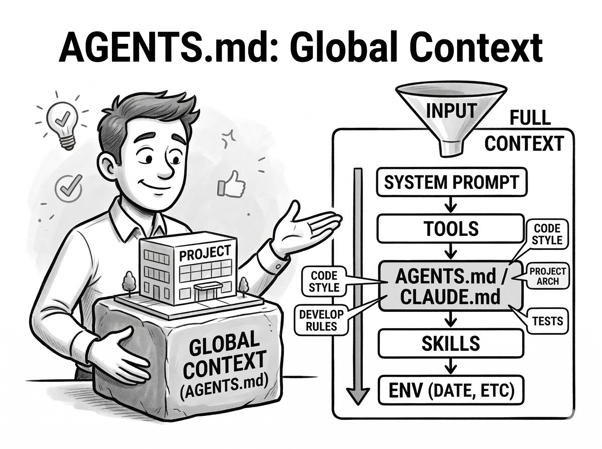
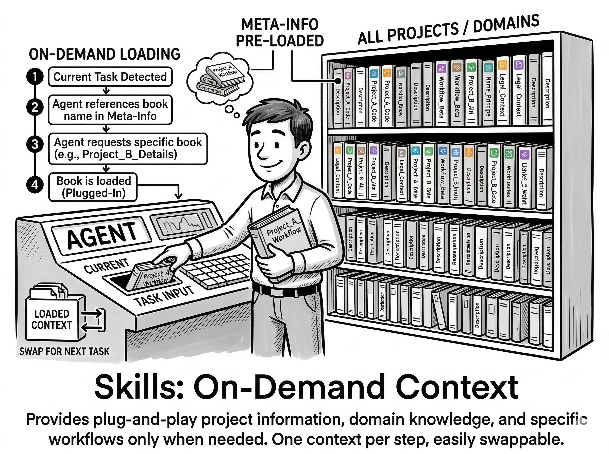
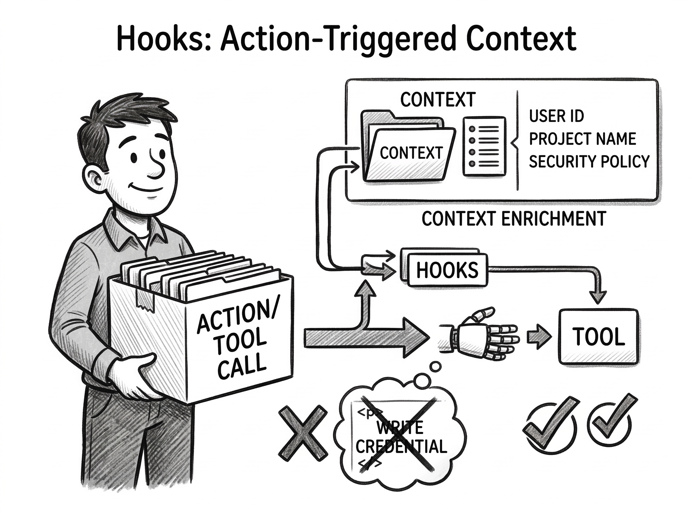
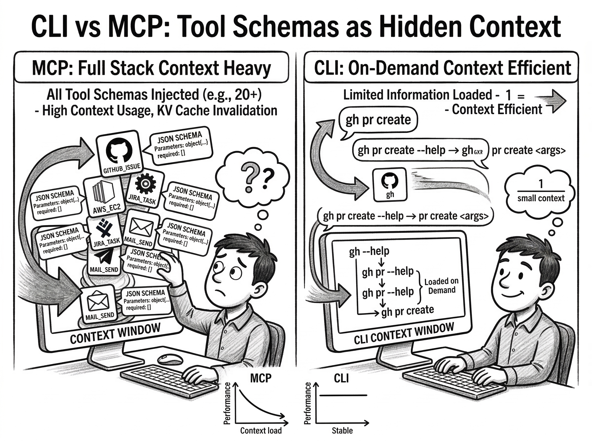
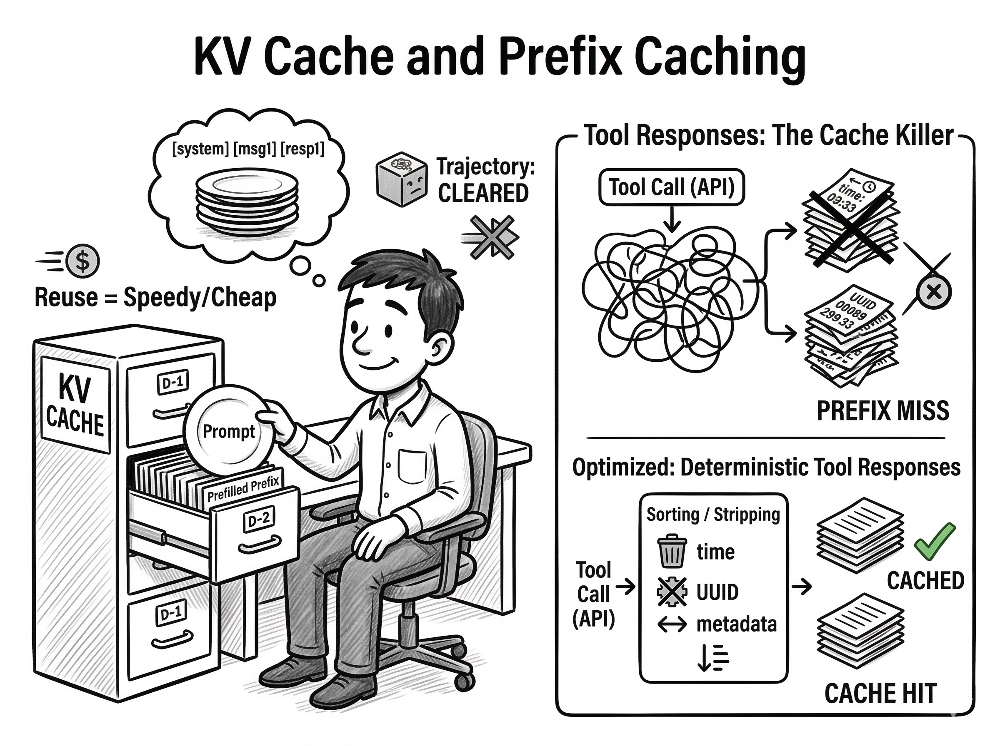
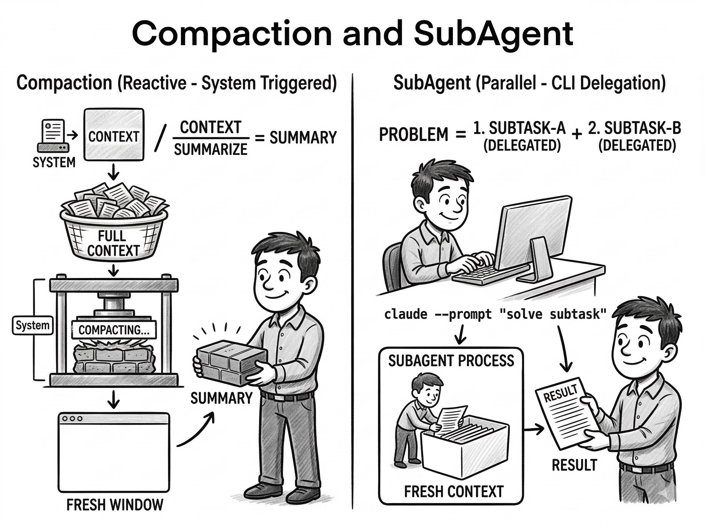

## Summary
This practitioner essay defines [[LLMContextManagement|context engineering]] as deciding what enters an agent's context, where it appears, and when it is removed. It unifies project instruction files, [[LLMToolingSkills|skills]], hooks, tool interfaces, [[PromptCaching]], compaction, and subagents around two goals: protect the model's effective attention from noise and preserve reusable prompt prefixes for lower latency and cost. A six-version enterprise tagging case study reports that focused workflow decomposition and on-demand domain context improved self-reported accuracy more than prompt cleanup, schema shortening, larger models, or custom training.

## Key Claims
- Nominal context capacity is not the same as effective attention: relevant material at the beginning and end tends to receive more useful attention than material in the middle.
- Context engineering must jointly curate relevant information and preserve stable prefixes for [[PromptCaching]]; bloat, copied bad patterns, and nondeterministic tool output undermine those goals.

- `CLAUDE.md` and `AGENTS.md` are best reserved for concise, broadly applicable project context because they occupy a privileged, always-loaded position.

- Skills keep only discovery metadata always loaded and inject complete task-specific procedures on demand, reducing interference from irrelevant workflows.

- Hooks place constraints or supplemental information immediately around a matching action, using recency to reinforce safeguards when they matter.

- Large tool catalogs are hidden context. The author argues that recursive CLI discovery can be more context-efficient than always-loaded MCP schemas for broad tool ecosystems, while MCP remains useful for small focused sets and structured I/O.

- Cross-request cache reuse requires identical prefixes; stable ordering and removal of irrelevant timestamps, UUIDs, and changing metadata can make tool results more deterministic.

- Compaction and subagents both exchange context capacity for lossy handoff: compaction continues sequentially from a summary, while subagents investigate in separate windows and return compressed results.

- In the author's tagging-agent case study, structured output removed format failures, workflow decomposition raised reported accuracy to about 85%, and on-demand pattern loading plus triggered hints raised it to a reported 95-100%; these are project-local observations rather than controlled benchmarks.
- Failed interventions included broad input cleaning, a shorter renamed tool-response schema that reportedly reduced accuracy by five points, stronger models or more reasoning effort, and months of specialized-model training that only matched closed-model performance.

## Key Quotes
> "Context isn't just information, it's instruction by example." — on models reproducing patterns present in their working context.

> "Both approaches share the same fundamental trade-off: information is lost during handoff." — on compaction and subagents.

## Connections
- [[LLMContextManagement]] - central discipline tying attention placement, selective loading, context removal, and cache stability together.
- [[PromptCaching]] - stable prompt and tool prefixes reduce repeated inference work, while nondeterministic responses reduce cross-request reuse.
- [[LLMToolingSkills]] - task-relevant instructions are discovered through metadata and loaded only when needed.
- [[ModelContextProtocol]] - structured tool schemas provide useful integration but also consume always-loaded context.
- [[BashAsMetaTool]] - recursive CLI help offers an on-demand alternative for broad tool ecosystems.
- [[ClaudeCode]] - project files, hooks, skills, compaction, subagents, and cache-aware request shaping are discussed through Claude Code-like agent design.
- [[TapeAndAnchors]] - proactive handoff preserves searchable history but requires the model to decide when to compact and retrieve.

## Contradictions
- The essay's CLI-over-MCP preference is qualified rather than absolute: it retains MCP for focused tool sets, structured I/O, and easy integration, and supplies no controlled reliability, security, or latency comparison.
- The tagging-agent accuracy figures are self-reported for one enterprise workflow without dataset size, evaluation protocol, uncertainty, or independent replication.
- The claim that previous thinking tokens are cleared and do not affect later context is implementation-dependent and should not be generalized to every provider or agent runtime.
